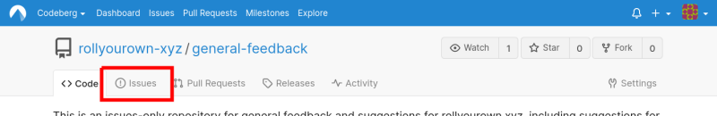
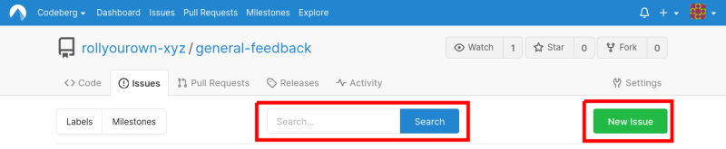
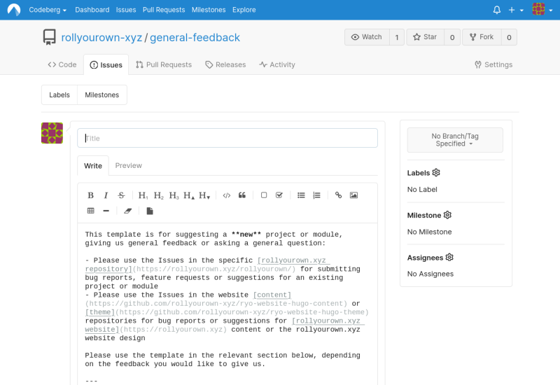
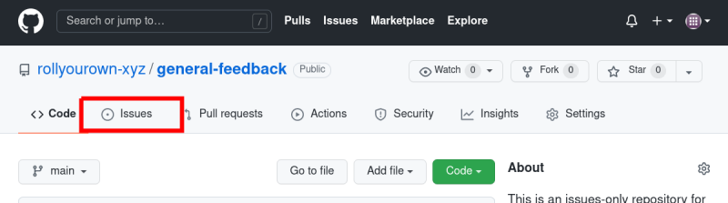
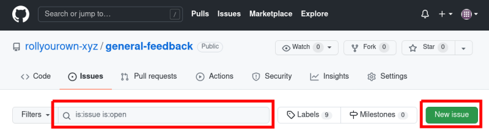
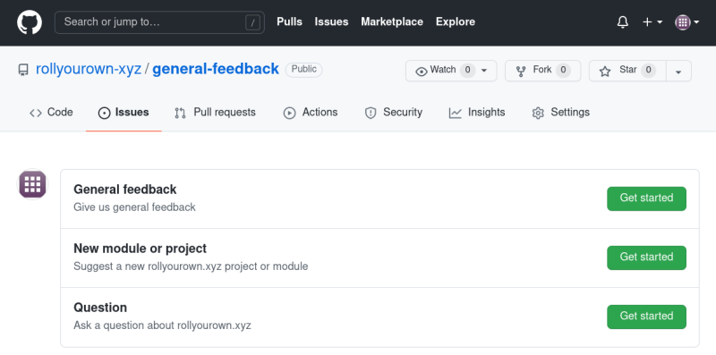

The easiest way to contribute to one of our projects or modules is to suggest an improvement or tell us about a bug. This is done via the Issues in the repositories for the project or module on our own Git repository server, or in the mirror repositories [on Codeberg](https://codeberg.org/rollyourown-xyz) or [on GitHub](https://github.com/rollyourown-xyz/).

<!--more-->

## Where to raise an Issue

Issues can be raised in the various rollyourown.xyz repositories and repository mirrors:

- Members of our organisation can raise issues on our own Git repository server
- Issues can be raised in the mirror repositories [on Codeberg](https://codeberg.org/rollyourown-xyz)
- Issues can be raised in the mirror repositories [on GitHub](https://github.com/rollyourown-xyz/)

For the wider community, [Codeberg](https://codeberg.org/) is our preferred collaboration space. If you don't already have an account on Codeberg, we would encourage you to [open an account](https://codeberg.org/) to collaborate with us there.

The repository to use for raising issues depends on the scope of the issue:

- For a specific [project or module](https://rollyourown.xyz/rollyourown/), please use the Issues in the associated repository. A link to the repository can be found on the dedicated page for the [project](https://rollyourown.xyz/rollyourown/projects/) or [module](https://rollyourown.xyz/rollyourown/project_modules/).

- For the content of the website, please use the Issues in the repository for our website content -- [on Codeberg](https://codeberg.org/rollyourown-xyz/ryo-website-hugo-content/issues) or [on GitHub](https://github.com/rollyourown-xyz/ryo-website-hugo-content/issues).

- In case of general feedback and ideas for rollyourown.xyz that are not specific to a [project or module](https://rollyourown.xyz/rollyourown/) or the [website](https://rollyourown.xyz) content, please use the Issues in the general feedback repository -- [on Codeberg](https://codeberg.org/rollyourown-xyz/general-feedback/issues) or [on GitHub](https://github.com/rollyourown-xyz/general-feedback/issues).

## Before raising an Issue

Before submitting an Issue, please search the existing issues [on Codeberg](https://codeberg.org/rollyourown-xyz) and [on GitHub](https://github.com/rollyourown-xyz/) in case the topic has already been addressed.

## Raising Issues on Codeberg

To raise an issue [on Codeberg](https://codeberg.org/rollyourown-xyz), log in to your Codeberg account and navigate to the "Issues" tab for the applicable repository:

Existing issues can be searched via the search bar on the issues page and new issues can be opened via the "New issue" button:

A template Issue is opened with a structure for adding information for different purposes. Please use the relevant section for filling in the requested information and delete the other sections:

## Raising Issues on GitHub

To raise an issue [on GitHub](https://github.com/rollyourown-xyz/), log in to your GitHub account and navigate to the "Issues" tab for the applicable repository:

Existing issues can be searched via the search bar on the issues page and new issues can be opened via the "New issue" button:

Choose the relevant template, selecting the relevant "Get started" button, and fill in the requested information. Here, for example, are the templates available in the general feedback repository:

## After raising an Issue

After raising an issue, the repository maintainer will be notified. Feedback and discussion can be seen in the timeline of the issue.
