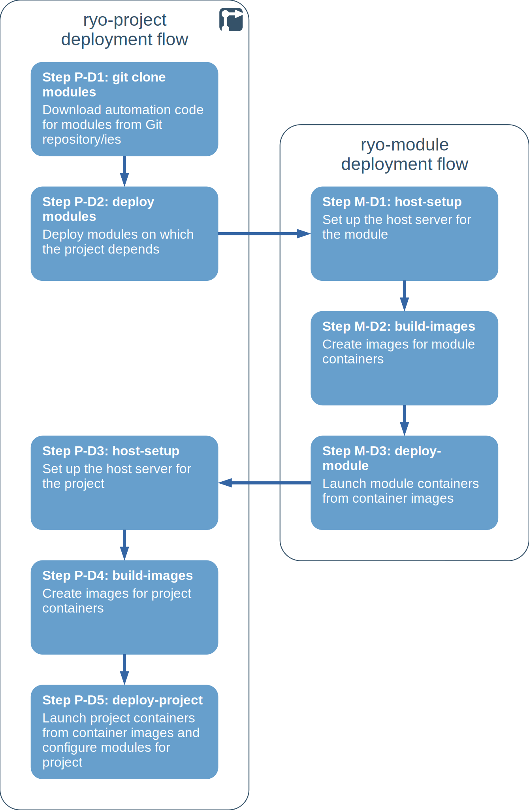
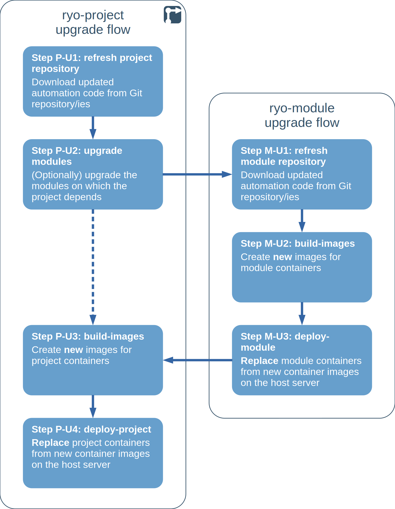
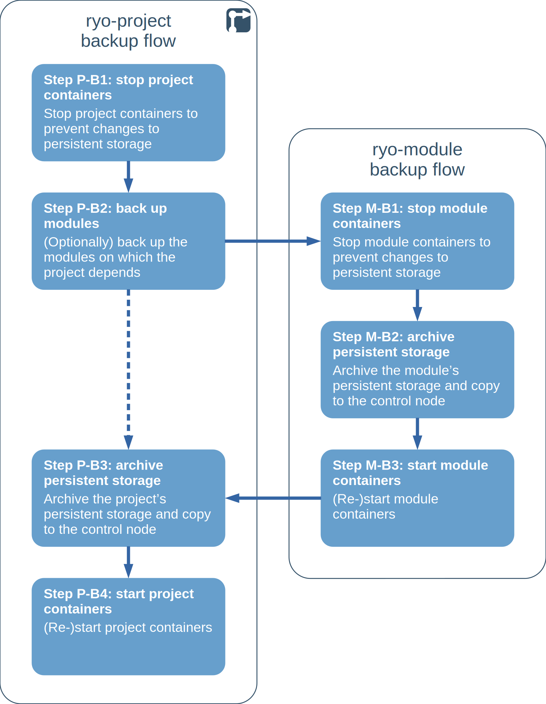
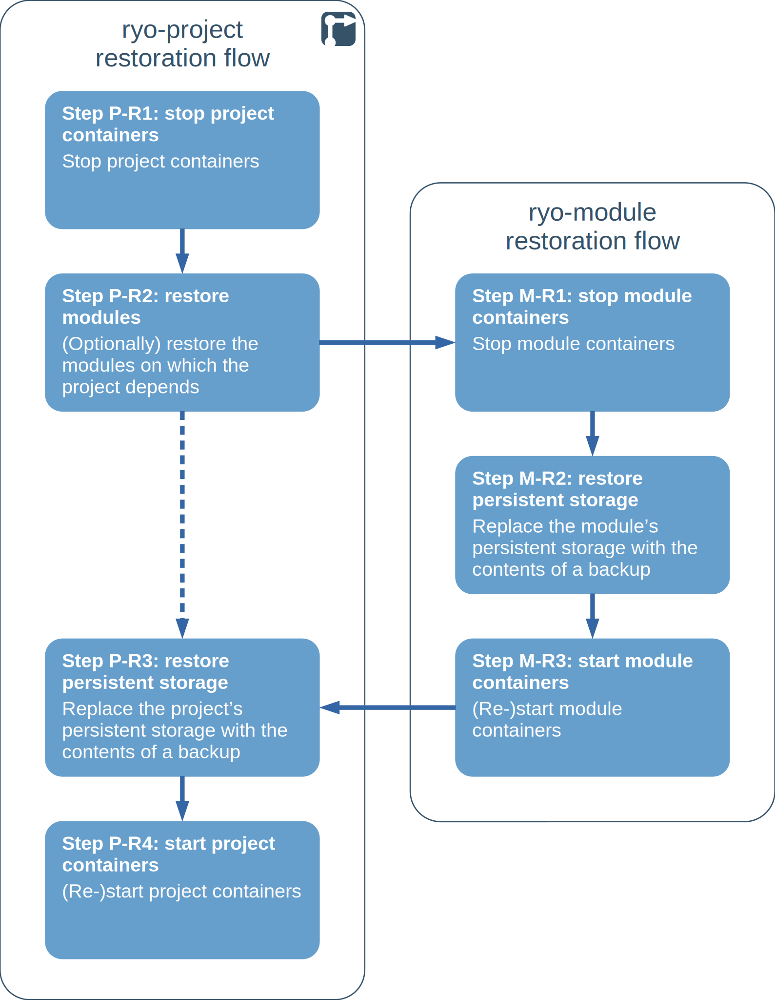
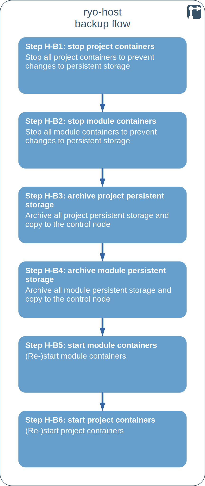
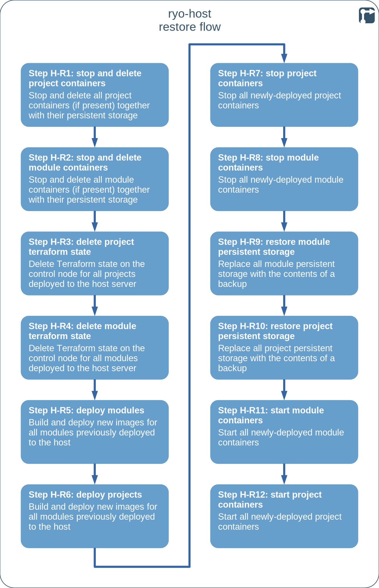

<!--
SPDX-FileCopyrightText: 2022 Wilfred Nicoll <xyzroller@rollyourown.xyz>
SPDX-License-Identifier: CC-BY-SA-4.0
-->

A rollyourown.xyz deployment has a defined architecture and each project is deployed, updated, backed up and restored with a defined flow.

<!--more-->

## Deployment architecture

A rollyourown.xyz deployment has a defined architecture, illustrated in the following diagram:



- Automation code is stored in the rollyourown.xyz Git repositories

- The 'ryo-control-node' repository is cloned/copied to a control node (1). [Ansible](https://ansible.com) playbooks (2) in the repository are used to configure the control node and, later, to maintain it

- The 'ryo-host' repository is cloned/copied to the control node (3). [Ansible](https://ansible.com) playbooks (4) in the repository are used to install basic software on the host server, configure a non-root user and set up a wireguard tunnel for the control node to control the host server

- Further [Ansible](https://ansible.com) playbooks (5) are used via the wireguard tunnel to complete configuration of the host server, setting up Consul for service discovery and dynamic container configuration, and LXD for launching containers on the host server. Later, [Ansible](https://ansible.com) is used to upgrade the host and backup/restore project deployments

- One or more project repositores ('ryo-project') are downloaded to the control node (6). Automation scripts are included in the repository to:
  - Fetch further repositories (7) for modules that are needed for the project deployment
  - Build container images with [Packer](https://packer.io) and [Ansible](https://ansible.com), and deploy them for the respective modules (8) and projects (9) with [Terraform](https://terraform.io)
  - Later, maintain modules and projects, back them up and restore them

## Deployment flows

Each rollyourown.xyz project includes a `deploy.sh` script to orchestrate the deployment of the project on a host server. Each project uses the same flow to deploy services, as illustrated in the following diagram. All steps are carried out from the control node:

- **Step P-D1:** The project may depend on the deployment of one or more modules. These are defined in the project's configuration file. For each module, the automation code for the module is cloned from the module's Git repository

- **Step P-D2:** Before deploying the project, the `deploy.sh` script triggers the deployment of each required module via the module's own `deploy.sh` script

- **Step M-D1:** The host server may need module-specific configuration, usually the creation of directories for persistent storage of module data. This configuration is carried out by [Ansible](https://ansible.com) playbooks

- **Step M-D2:** One or more container images are built for the module. [Packer](https://www.packer.io/) is used to launch a minimal container on the control node, install and configure software on it via [Ansible](https://ansible.com) and then publish and upload the container image(s) to the host server for deployment in the next step

- **Step M-D3:** Once the module's container images are available on the host server, [Terraform](https://www.terraform.io/) is used to launch them on the host server, with [cloud-init](https://cloud-init.io/) used to trigger bootstrapping procedures if necessary. In addition to launching the containers, Terraform configures network interfaces and mounts host server directories, if needed, for persistent data storage

- **Step P-D3:** After all required modules have been deployed, the project's `deploy.sh` script continues to orchestrate the deployment of the project. The host server may need project-specific configuration, usually the creation of directories for persistent storage of module data. This configuration is carried out by [Ansible](https://ansible.com) playbooks

- **Step P-D4:** One or more container images are built for the project. [Packer](https://www.packer.io/) is used to launch a minimal container on the control node, install and configure software on it via [Ansible](https://ansible.com) and then publish and upload the container image(s) to the host server for deployment in the next step

- **Step P-D5:** Once the project's container images are available on the host server, [Terraform](https://www.terraform.io/) is used to launch them on the host server, with [cloud-init](https://cloud-init.io/) used to trigger bootstrapping procedures if necessary. In addition to launching the containers, Terraform configures network interfaces and mounts host server directories, if needed, for persistent data storage. Furthermore, Terraform pushes configuration data to the Consul key-value store on the host server, from which modules are configured dynamically for the project being deployed

## Upgrade flows

Upgrade flows are similar to deployment flows. Since project and module containers are ephemeral, with persistent storage mounted at launch, an upgrade consists of **replacing** each applicable container with a newer version. Already-deployed containers are never changed or re-configured in place, being discarded and replaced.

Each rollyourown.xyz project includes an `upgrade.sh` script to orchestrate the upgrade of the project on a host server. Each project uses the same flow to upgrade services, as illustrated in the following diagram. All steps are carried out from the control node:

- **Step P-U1:** The automation code for the project is updated by pulling any changes from the project's repository

- **Step P-U2:** Before upgrading project containers, the `upgrade.sh` script optionally triggers the upgrade of each associated module via the module's own `upgrade.sh` script

- **Step M-U1:** The automation code for the module is updated by pulling any changes from the module's repository

- **Step M-U2:** New container images are built for the module, using new versions of the software if defined in the repository. As for the deployment flow, [Packer](https://www.packer.io/) is used to launch a minimal container on the control node, install and configure software on it via [Ansible](https://ansible.com) and then publish and upload the new container image(s) to the host server for deployment in the next step

- **Step M-U3:** Once the module's new container images are available on the host server, [Terraform](https://www.terraform.io/) destroys the old container(s) and launches new container(s) on the host server to replace them, with [cloud-init](https://cloud-init.io/) used to trigger bootstrapping procedures if necessary. In addition to launching the new containers, Terraform changes other configuration, if so defined in an updated module repository

- **Step P-U3:** After all required modules have optionally been upgraded, the project's `upgrade.sh` script continues to orchestrate the upgrade of the project's container(s). New container images are built for the project, using new versions of the software if defined in the repository. As for the deployment flow, [Packer](https://www.packer.io/) is used to launch a minimal container on the control node, install and configure software on it via [Ansible](https://ansible.com) and then publish and upload the new container image(s) to the host server for deployment in the next step

- **Step P-U4:** Once the project's new container images are available on the host server, [Terraform](https://www.terraform.io/) destroys the old container(s) and launches new container(s) on the host server to replace them, with [cloud-init](https://cloud-init.io/) used to trigger bootstrapping procedures if necessary. In addition to launching the new containers, Terraform changes other configuration, if so defined in an updated project repository

## Project backup and restore flows

Being ephemeral, deployed project or module containers do not themselves need to be backed up. New containers can be launched to replace failed containers at any time. Only the persistent data stored in mounted directories on the host server need to be backed up.

Each rollyourown.xyz project includes a `backup.sh` script to orchestrate the backup of the project on a host server. Each project uses the same flow to back up services, as illustrated in the following diagram. All steps are carried out from the control node:

- **Step P-B1:** Project containers are stopped on the host server to prevent any further changes to the project's persistent storage

- **Step P-B2:** Before backing up the project, the `backup.sh` script optionally triggers the backup of each associated module via the module's own `backup.sh` script

- **Step M-B1:** Module containers are stopped on the host server to prevent any further changes to the module's persistent storage

- **Step M-B2:** The module's persistent storage is archived on the host server and the archive is copied to the control node

- **Step M-B3:** After the module's persistent storage has been archived, the module's containers are re-started

- **Step P-B3:** After all required modules have optionally been backed up, the project's `backup.sh` script continues to orchestrate the backup of the project. The project's persistent storage is archived on the host server and the archive is copied to the control node

- **Step P-B4:** After the project's persistent storage has been archived, the project's containers are re-started

Restoration of a project involves replacing the project's persistent storage, and optionally associated modules' persistent storage, with the contents of a previous backup.

Each rollyourown.xyz project includes a `restore.sh` script to orchestrate the restoration of a project on a host server. Each project uses the same flow to restore services, as illustrated in the following diagram. All steps are carried out from the control node:

- **Step P-R1:** Project containers are stopped on the host server

- **Step P-R2:** Before restoring up the project, the `restore.sh` script optionally triggers the restoration associated modules via the modules' own `restore.sh` scripts

- **Step M-R1:** Module containers are stopped on the host server

- **Step M-R2:** A backup archive for the module is uploaded from the control node to the host server and the module's persistent storage is deleted and replaced with the contents of the archive

- **Step M-R3:** After the module's persistent storage has been restored, the module's containers are re-started

- **Step P-R3:** After all required modules have optionally been restored, the project's `restore.sh` script continues to orchestrate the restoration of the project. A backup archive for the project is uploaded from the control node to the host server and the project's persistent storage is deleted and replaced with the contents of the archive

- **Step P-R4:** After the project's persistent storage has been restored, the project's containers are re-started

## Host backup flow

As an alternative to backing up individual projects, all deployed projects and modules can be backed up in one operation. This is useful, for example, to mitigate potential server failure or to move an entire deployment to a new server.

The 'ryo-host' repository includes a `host-backup.sh` script to orchestrate the backup of all projects and modules on a host server, with the flow illustrated in the following diagram. All steps are carried out from the control node:

- **Step H-B1:** All project containers are stopped on the host server to prevent any further changes to project persistent storage

- **Step H-B2:** All module containers are stopped on the host server to prevent any further changes to module persistent storage

- **Step H-B3:** All project persistent storage is archived on the host server and the archives are copied to the control node

- **Step H-B4:** All module persistent storage is archived on the host server and the archives are copied to the control node

- **Step H-B5:** All module containers are re-started

- **Step H-B6:** All project containers are re-started

## Host restore flow

The 'ryo-host' repository includes a `host-restore.sh` script to orchestrate the restoration of all projects and modules on a host server. This operation is destructive and should normally only be used on a freshly-deployed host server -- for example following a complete loss of a host server or to move an entire deployment to a different server.

The `host-restore.sh` script orchestrates restoration with the flow illustrated in the following diagram. All steps are carried out from the control node:

- **Step H-R1:** If present, all project containers are stopped on the host server and their persistent storage is deleted

- **Step H-R2:** If present, all module containers are stopped on the host server and their persistent storage is deleted

- **Step H-R3:** The [Terraform state](https://www.terraform.io/language/state) for all projects deployed to the host is deleted on the control node

- **Step H-R4:** The [Terraform state](https://www.terraform.io/language/state) for all modules deployed to the host is deleted on the control node

- **Step H-R5:** All modules are deployed as in the [module deployment flow](#deployment-flows)

- **Step H-R6:** All projects are deployed as in the [project deployment flow](#deployment-flows)

- **Step H-R7:** All project containers are stopped on the host server

- **Step H-R7:** All module containers are stopped on the host server

- **Step H-R8:** A backup archive for each deployed module is uploaded from the control node to the host server and the module persistent storage is deleted and replaced with the contents of the archives

- **Step H-R9:** A backup archive for each deployed project is uploaded from the control node to the host server and the project persistent storage is deleted and replaced with the contents of the archives

- **Step H-R10:** All module containers are re-started

- **Step H-R11:** All project containers are re-started
