<!--
SPDX-FileCopyrightText: 2022 Wilfred Nicoll <xyzroller@rollyourown.xyz>
SPDX-License-Identifier: CC-BY-SA-4.0
-->

This section describes the basic collaboration model for working on code or website content for rollyourown.xyz, by forking a repository and submitting a pull request.

<!--more-->

## TODOs on this page



- [ ] Links
- [ ] Illustration of forking from source repo to personal account and then to a computer for editing
- [ ] Refer to Issue and Pull Request Templates



## General collaboration workflow

The basic collaboration model for working on code or website content for rollyourown.xyz follows the forking workflow used in many open source projects. Two good overviews of this workflow are:

- [Bitbucket guide to the forking workflow](https://www.atlassian.com/git/tutorials/comparing-workflows/forking-workflow)
- [GitHub guide to the forking workflow](https://docs.github.com/en/get-started/quickstart/contributing-to-projects)

In this workflow:

  1. A contributor forks the applicable repository (which means cloning/copying the project repository to a repository in their personal account)
  2. The contributor creates a feature branch in their copy of the repository and makes changes in this branch
  3. When the changes proposed are ready, the contributor issues a "Pull Request" back to the source repository
  4. The repository maintainer reviews the Pull Request and, when happy with it, merges it into the main branch of the source repository

[**TODO: ADD AN ILLUSTRATION of forking from source repo to personal account and then to a computer for editing**]

## Which repository to fork

Which repository is used as the source for forking and collaborating depends on where a collaborator has an account -- either in the repositories on our own Git repository server, or in our mirror repositories [on Codeberg](https://codeberg.org/rollyourown-xyz) or [on GitHub](https://github.com/rollyourown-xyz/). [Our workflow](/collaborate/working_with_git/what_is_git/#rollyourown-workflow) allows us to manage Issues and Pull Requests in multiple environments.

Ideally, we would manage our projects entirely in our own environment. However, since this would require all collaborators to have an account on our servers, we also enable collaboration [on Codeberg](https://codeberg.org/rollyourown-xyz) and [on GitHub](https://github.com/rollyourown-xyz/) for many of our repositories and use the tools there to manage collaboration:

- For rollyourown.xyz projects and modules, Issues and Pull Requests are managed on our servers, on Codeberg and on GitHub
- For the rollyourown.xyz website content, Issues and Pull Requests are managed on our servers, on Codeberg and on GitHub
- For all other repositories (especially non-public repositories or those not mirrored), we use our own repository server to manage Issues and Pull Requests

## Forking

To collaborate on Codeberg or on GitHub, you will need an account on [Codeberg](https://codeberg.org) or [GitHub](https://github.com/). Our own repository system uses the same technology ([Gitea](https://gitea.io/)) as Codeberg, so the process for our members to fork our primary repositories is identical.

For the wider community, Codeberg is our preferred collaboration space. If you don't already have an account on Codeberg, we would encourage you to [open an account](https://codeberg.org/) to collaborate with us there.

The first step in the collaboration process is to fork a repository to your personal account.



You will be forking the default `main` branch of the source repository, which contains is the current, published version of the code or content.



### Forking on Codeberg

Log in to Codeberg and fork the repository you would like to collaborate on. The easiest way to do this is via the "Fork" button at the top right of the repository's page:

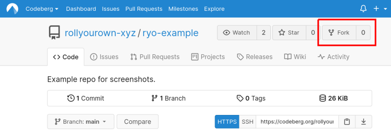

### Forking on GitHub

Log in to GitHub and fork the repository you would like to collaborate on. The easiest way to do this is via the "Fork" button at the top right of the repository's page:

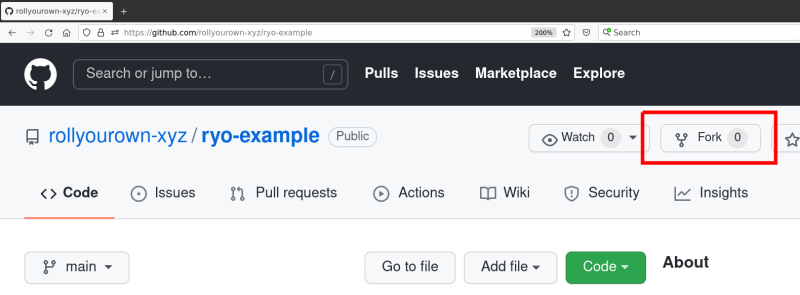

## Making changes

The next steps depend on whether you are comfortable working with the command line, or prefer a graphical user interface. If you are only making small changes, this can be done directly from the Codeberg or GitHub website. For larger changes and changes across multiple files, it is recommended to clone your copy of the repository to your computer and make changes there.

### Making changes on Codeberg

Small changes in individual files can be done directly from the Codeberg website by selecting the file and using the "Edit" button.

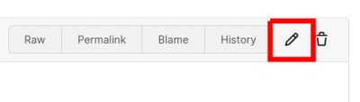

When you save your changes, please add a "commit message" that describes briefly what has changed. This will help reviewers and the repository maintainer to review your work later.

### Making changes on GitHub

Small changes in individual files can be done directly from the GitHub website by selecting the file and using the "Edit" button.

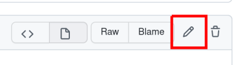

When you save your changes, please add a "commit message" that describes briefly what has changed. This will help reviewers and the repository maintainer to review your work later.

### Making changes on your computer

A few steps are needed to make changes on your computer, synchronise them to your forked repository and then prepare for making a Pull Request to the original repository:

- Your forked copy of the repository is cloned to your computer
- A "feature branch" is created for the changes you are about to make
- Changes are made to the files on your computer
- Changes are committed to the feature branch on your computer, with a short description of what has changed
- The changes made on your computer are pushed back to your personal copy of the forked repository

How you do these steps will depend on whether you are comfortable working with the command line, or prefer working with graphical user interfaces. Step-by-step examples of both are below.

#### Cloning

Just as, by forking the repository, you cloned the source repository to your personal, your next step is to clone the forked repository to your computer so that you can work on it there.

#### Creating a feature branch

To bundle your changes and enable them to be reviewed and merged more easily by the source repository's maintainer, you create a "feature branch". This is a separate branch in your repository containing only the changes you are making.

Choose a name for your branch that reflects the purpose of the changes you are about to make and also, if applicable, reference the Issue (by number) that you are addressing - for example `123-add-something`.

#### Making and committing changes

Once your repository is cloned to your computer and you are working in a new feature branch, you are ready to make changes to the files in the repository.

Changes can be made using any editor you choose, although it is convenient to use an editor with helpful features such as code highlighting, bracket matching etc. In the examples below, we use [Atom](https://atom.io/) (a cross-platform, open source editor with Git integration) for illustration. Other editors, such as [VSCode](https://code.visualstudio.com/), provide similar features.

When you are finished working, or to bundle related changes as you progress with your work, commit your changes to your feature branch. You may want to commit multiple times as different, discrete steps are completed. For each commit, add a "commit message" that describes briefly what has changed. This will help reviewers and the repository maintainer to review your work later.



A good overview of best practices for committing work in Git can be found here: [Git Best Practices](https://community.atlassian.com/t5/Bitbucket-articles/Git-Best-Practices/ba-p/1628803).

An amusing guide to good commit messages is here: [How to Write a Git Commit Message](https://cbea.ms/git-commit/)



#### Preparing to submit a Pull Request

When you have finished your changes (and tested them if necessary), you are nearly ready to submit a Pull Request to the original "upstream" repository. However, before submitting you should pull the most recent version from the original "upstream" repository to make sure that your changes are compatible with any other changes that have been added in the original repository in the meantime.

### Making changes on your computer using the CLI

Click on this button for step-by-step instructions for using the CLI to make your changes:



#### Cloning to your computer using the CLI

To clone a repository (for example `https://codeberg.org/<YOUR_USERNAME>/ryo-example.git`) from your personal Codeberg (or GitHub) account to your local computer using the command line interface:

1. Create and change to a directory in which you would like to work on your projects, for example:

    ```bash
    mkdir ~/ryo-projects
    cd ~/ryo-projects
    ```

2. Clone the forked repository to your local computer, by entering:

    ```bash
    git clone https://codeberg.org/<YOUR_USERNAME>/ryo-example.git
    ```

3. Add the original repository as `upstream` so that your local copy is kept up to date in case other changes are made while you are working on your change. Enter, for example:

    ```bash
    git remote add upstream https://codeberg.org/rollyourown-xyz/ryo-example.git
    ```

4. You can verify the result by entering:

    ```bash
    git remote -v
    ```

Here, we used a Codeberg repository as an example. The process for cloning from a personal GitHub account is the same, just substituting `github.com` for `codeberg.org`.

#### Creating a feature branch using the CLI

To create a new feature branch via the command line, enter the project's directory and use the `git checkout` command with the `-b` option to create a new feature branch, for example to create the new feature branch `123-add-something`:

```bash
cd ~/ryo-projects/ryo-example
git checkout -b 123-add-something
```

#### Committing changes using the CLI

When you have made some changes and are ready to commit them, add your changes to your feature branch and commit:

```bash
cd ~/ryo-projects/ryo-example
git add .
git commit
```

The `git commit` command will open a text editor, where you can enter your commit message. Please add a short description of the change in the first line and, if necessary, further details in a second paragraph including a link to any Issue addressed by the changes.

#### Preparing to submit a Pull Request using the CLI

When your changes are finished, and you are ready to submit a Pull Request, pull the latest version of the code from the original source repository using the `git pull` command, specifying the main branch of the upstream repository, for example:

```bash
cd ~/ryo-projects/ryo-example
git pull upstream main
```

Now check that your changes are still working with the latest version of the code. If so, then push the changes in your new feature branch to your fork of the repository. Use the `git push` command, specifying the "origin" repository (i.e. the forked repository in your personal Codeberg account) and the feature branch you created, for example:

```bash
cd ~/ryo-projects/ryo-example
git push origin 123-add-something
```

Here, we used a Codeberg repository as an example. The process for pushing back to a personal GitHub account is the same.



### Making changes on your computer using a graphical editor

The following uses the [Atom](https://atom.io/) editor as an example. Other editors, such as [VSCode](https://code.visualstudio.com/), provide similar features.

Click on this button for a step-by-step illustration of using the Atom editor to make your changes:



#### Cloning to your computer using the Atom editor

The [Atom](https://atom.io/) editor is developed by GitHub. As such, the integration with GitHub (to log in, clone and work with repositories) is built-in.

1. Log in to your GitHub account directly from the Atom editor.

2. After logging in, select "Clone an existing GitHub repository", entering the path to your personal copy of the repository to clone from and the directory on your computer you wish to clone to:

    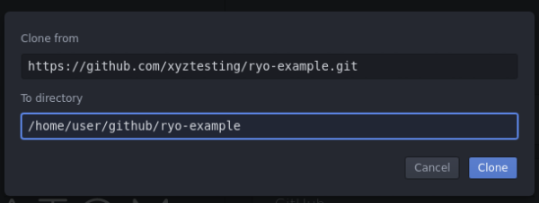

3. Make sure your "Git Identity" in Atom matches your GitHub username and email address. Go to the "Git" panel by clicking on the "Git" button at the bottom right of the Atom window:

    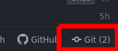

    and then clicking on the user icon:

    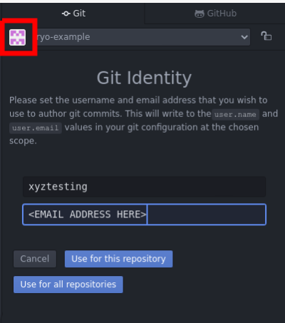

4. The forked repository has now been cloned to your computer and you can begin working on the files

    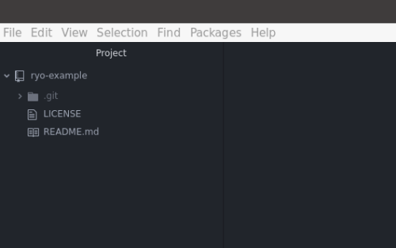

#### Creating a feature branch using the Atom editor

To create a new feature branch with the Atom editor, click the `main` label at the bottom right (the default branch in a rollyourown.xyz repository is called `main`) and click "New Branch", entering the name of your new feature branch:

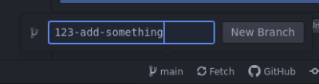

The label at the bottom right will change to the name of your new branch, indicating that you will now be working in this branch of the repository.

#### Committing changes using the Atom editor

When you have made some changes in the Atom editor and are ready to commit them, open the Git panel by clicking on the "Git" button at the bottom right:


In the git panel, select the changed file(s) you would like to add to the commit from the "Unstaged Changes" section, either by right-clicking on them and selecting "Stage" or using the "Stage All" button:

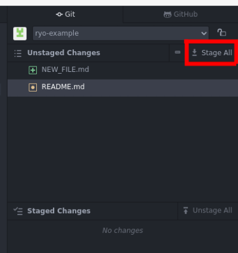

Once the changes are staged, add a commit message and select "Commit to..." (check that your feature branch name is here):

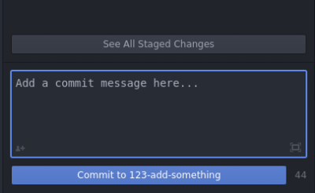

As you work, you can push your committed changes to your repository on GitHub, with the "Push" button at the bottom right:

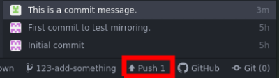

#### Preparing to submit a Pull Request using the Atom editor

When you are ready, push all of your changes to your repository, using the "Push" button.

Log in to your GitHub account and go to your forked repository. Use the "Fetch Upstream" button to pull the latest version of the code from the original source repository and make sure there are no conflicts.

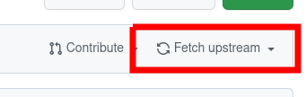

If there are conflicts, solve them by using Atom to edit further, committing and pushing further changes to your feature branch as above.



## Submitting a Pull Request

The final step is to submit a Pull Request to the original "upstream" repository.

### Submitting a Pull Request on Codeberg

Log back into your account on Codeberg, go to your forked repository and use the "New Pull Request" button to submit your pull request to the original rollyourown.xyz repository:

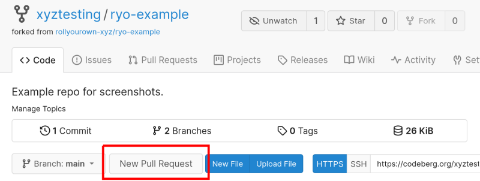

Make sure the pull request will be opened in the original rollyourown.xyz repository from your feature branch:

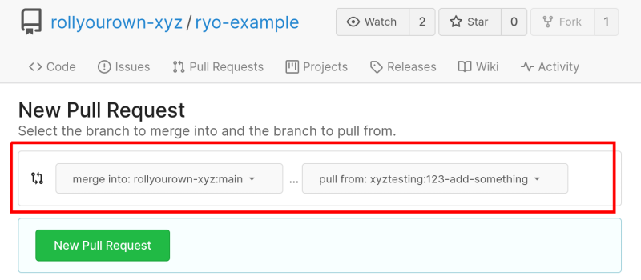

In the Pull Request, please describe what you have done in the comment field and reference any issues / feature requests related to the changes made, to help the maintainer assess the pull request.

### Submitting a Pull Request on GitHub

Log back in to your account on GitHub, go to your forked repository and use the "Compare & pull request" button to submit your pull request to the original rollyourown.xyz repository:

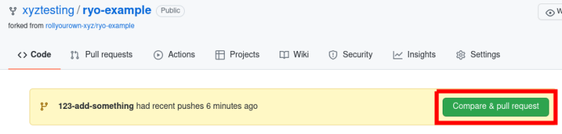

Make sure the pull request will be opened in the original rollyourown.xyz repository from your feature branch:

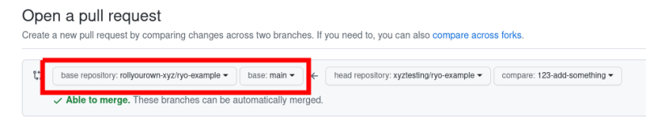

In the Pull Request, please describe what you have done in the comment field and reference any issues / feature requests related to the changes made, to help the maintainer assess the pull request.

## After submitting a Pull Request

After you have submitted the Pull Request, the maintainer will be notified and can review it. The maintainer may discuss the change with you and, for example, request a review from other collaborators or request further changes. When the maintainer is happy with the change, then it can be merged into the main branch in the rollyourown.xyz repository.
