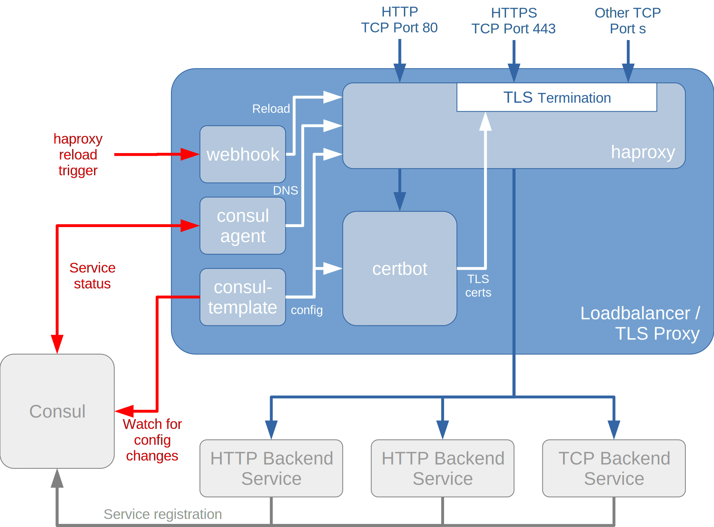

The Load Balancer and TLS Proxy module is a re-usable module for other [rollyourown.xyz](https://rollyourown.xyz) projects and is used to terminate HTTPS and route traffic to the project's containers.

<!--more-->

## Introduction

This module deploys an [HAProxy](https://www.haproxy.org/) loadbalancer / TLS proxy together with [Certbot](https://certbot.eff.org/) for certificate management. Consul-Template is used to dynamically configure both HAProxy and Certbot, based on kev-values from the [Service Registry and Key-Value Store](/rollyourown/project_modules/service_registry_kv_store/) and [Consul](https://www.consul.io/) provides DNS-based routing information from the service registry to HAProxy backends.

## Repository links

The [github](https://github.com/) mirror repository for this module is here: [https://github.com/rollyourown-xyz/ryo-loadbalancer-tls-proxy](https://github.com/rollyourown-xyz/ryo-loadbalancer-tls-proxy)

The [rollyourown.xyz](https://rollyourown.xyz/) repository for this project is here: [https://git.rollyourown.xyz/ryo-projects/ryo-loadbalancer-tls-proxy](https://git.rollyourown.xyz/ryo-projects/ryo-loadbalancer-tls-proxy)

## Dependencies

This module depends on the [rollyourown.xyz](https://rollyourown.xyz) [Service Registry and Key-Value Store](/rollyourown/project_modules/service_registry_kv_store/) module to provide configuration key-values and service discovery.

## Module components

This project module deploys a container with multiple services as shown in the following diagram:



### HAProxy and Certbot

The [HAProxy](https://www.haproxy.org/) load-balancer / TLS proxy listens on defined ports, terminates incoming connections and distributes this traffic to specified backends, based on rules specified in [Access Control Lists (ACLs)](https://www.haproxy.com/blog/introduction-to-haproxy-acls/). Depending on the project, backends can be scaled across multiple instances.

In addition, HAProxy terminates TLS / SSL connections (typically, HTTPS), using certificates obtained by [Certbot](https://certbot.eff.org/), so that certificates can be provisioned in a single element and do not need to be distributed across backend applications.

The [Certbot](https://certbot.eff.org/) application uses the [ACME protocol](https://tools.ietf.org/html/rfc8555) to request and renew [Let's Encrypt](https://letsencrypt.org/) certificates for the project domain(s). Certificates are stored in persistent storage mounted to the container and are available for HAProxy to terminate HTTPS requests for the project. In addition, other containers requiring certificates (for example, if running non-HTTP services) can also access the certificates via mounted storage.

For [Let's Encrypt](https://letsencrypt.org/) domain validation via the [Let's Encrypt HTTP-01 challenge](https://letsencrypt.org/docs/challenge-types/#http-01-challenge), traffic to the ACME client `.well-known/acme-challenge` link is routed by HAProxy to Certbot. Any other traffic to the project domain(s) is routed to backends or rejected, as defined in the HAProxy ACLs.

HAProxy ACLs and backend rules are dynamically configured based on Key-Values retrieved from an external Consul container (deployed by the [Service Registry and Key-Value Store](/rollyourown/project_modules/service_registry_kv_store/) module). The domains for Certbot to aquire and manage certificates for are also retrieved from the external Consul container. This allows the Loadbalancer/TLS container to be deployed as a generic container, with the project-specific configuration provisioned to the Consul KV-store during project deployment.

### Consul

[Consul](https://www.consul.io/) is a [distributed service registry and key-value store](https://www.consul.io/docs/architecture). A Consul agent is deployed on the load-balancer / TLS proxy and joins the Consul cluster in client mode. This enables, on the one hand, services on the container to be registered in the service registry and, on the other hand, for the service registry and KV-store to be queried.

The Consul agent then provides [service discovery](https://www.consul.io/docs/discovery/dns) for [HAProxy](#haproxy-and-certbot) via DNS and [configuration discovery and update](https://learn.hashicorp.com/tutorials/consul/consul-template) via [key-value lookup](https://www.consul.io/docs/dynamic-app-config/kv) for [Consul-Template](#consul-template).

### Consul-Template

On container start, the [Consul-Template](https://github.com/hashicorp/consul-template/) application obtains service configuration information from an external Consul key-value store (deployed by the [Service Registry and Key-Value Store](/rollyourown/project_modules/service_registry_kv_store/) module) and uses it to populate configuration files for HAProxy and Certbot. In addition, Consul-Template listens for changes to the configuration key-values and updates configuration files on-the-fly, reloading HAProxy and/or Certbot when configuration has changed.

### Webhook

The [Webhook](https://github.com/adnanh/webhook) application creates an HTTP endpoint on the container and exposes a web service for triggering HAProxy reloads from external containers.

## How to deploy this module in a project

The [repository for this module](https://github.com/rollyourown-xyz/ryo-loadbalancer-tls-proxy) contains a number of resources for including the module in a [rollyourown.xyz](https://rollyourown.xyz) project. The steps for including the module are:

1. A prerequisite for using the Loadbalancer / TLS proxy module is the deployment of the [Service Registry and Key-Value Store](/rollyourown/project_modules/service_registry_kv_store/) module. Details of this module are provided on the module's [page](/rollyourown/project_modules/service_registry_kv_store/).

2. Add the Loadbalancer / TLS proxy module to the `get-modules.sh` script in the project:

    ```bash
    ## Loadbalancer / TLS Proxy module
    echo "Executing 'git submodule add' for ryo-loadbalancer-tls-proxy"
    git submodule add https://github.com/rollyourown-xyz/ryo-loadbalancer-tls-proxy modules/ryo-loadbalancer-tls-proxy
    ```

3. To ensure persistence of letsencrypt account data and certificates across module upgrades, host directories **must** be created for mounting to the module's container. Add the following snippet to the `host-setup.sh` script in the project:

    ```bash
    # Module-specific host setup for ryo-loadbalancer-tls-proxy
    echo "Executing module-specific host setup playbooks for ryo-loadbalancer-tls-proxy"
    ansible-playbook -i configuration/inventory modules/ryo-loadbalancer-tls-proxy/host-setup-module/main.yml
    ```

4. Add the module component snippets from `build-images-module.sh` to the `build-images.sh` script in the project to build the module's container images:

    ```bash
    ## The help message for the project needs to include options for webhook_version and consul-template_version
    echo -e "-w webhook_version \t(Optional) Webhook version to use for the loadbalancer-tls-proxy image, e.g. 2.8.0 (default)"
    echo -e "-c consul_template_version \t(Optional) consul-template version to use for the loadbalancer-tls-proxy image, e.g. 0.25.2 (default)"
    
    ## Default for consul_template_version needs to be added for this module, e.g.
    consul_template_version=0.25.2
    
    ## getopts options for this module need to include options for webhook_version and consul_template_version
    w) webhook_version=${OPTARG};;
    c) consul_template_version=${OPTARG};;
    
    ## and
    if [ -z "$version" ] || [ -z "$webhook_version" ] || [ -z "$consul_template_version" ]
    
    ## Add the following snippets to the project's build-images.sh script
    
    echo "Building images with version $version, Webhook version $webhook_version and consul-template version $consul_template_version"
    
    [...]
    
    echo "Building Loadbalancer-TLS-Proxy image"
    echo "Executing command: packer build -var \"version=$version\" -var \"webhook_version=$webhook_version\" -var \"consul_template_version=$consul_template_version\" modules/ryo-loadbalancer-tls-proxy/image-build/loadbalancer-tls-proxy.pkr.hcl"
    echo ""
    packer build -var "version=$version" -var "webhook_version=$webhook_version" -var "consul_template_version=$consul_template_version" modules/ryo-loadbalancer-tls-proxy/image-build/loadbalancer-tls-proxy.pkr.hcl
    echo ""
    ```

5. Ports for the project (other than HTTP port 80 and HTTPS port 443, which are already opened) need to be opened in the Loadbalancer / TLS proxy container firewall. This is done on container start via cloud-init. Copy the file `cloud-init/cloud-init-loadbalancer-tls-proxy.yml` to the project's `project-deployment/cloud-init` directory and modify as needed:

    ```yaml
    #cloud-config
    package_upgrade: false
    write_files:
    - path: /usr/local/bin/iptables-rules-project.sh
      content: |
        #!/bin/sh
        IPT="/sbin/iptables"
        #
        # HTTP and HTTPS already allowed in module setup. Add further ports here if needed for the project
        #
        # E.g. Allow TCP port XXX
        #$IPT -A INPUT -p tcp -m tcp --dport XXX -j ACCEPT
        #
      permissions: '0770'
      owner: root:root
    ```

6. The container for this module **must** be deployed as a container with a **static** IP address and depends on the deployment of the [Service Registry and Key-Value Store](https://rollyourown.xyz/rollyourown/project_modules/service_registry_kv_store/) module. A host directory **must** be mounted for the module's persistent data and LXD proxy devices for HTTP and HTTPS ports must be added. Add the following code to the project's terraform files in `project-deployment` to deploy the module:

    ```tf
    module "deploy-loadbalancer-tls-proxy" {
      source = "./modules/deploy-container-static-ip"
      
      depends_on = [ module.deploy-consul ]
      
      lxd_remote                 = local.lxd_remote_name
      host_external_ipv4_address = local.lxd_host_public_ipv4_address
      container_image            = join("-", [ local.project_id, "loadbalancer-tls-proxy", var.image_version ])
      container_name             = join("-", [ local.project_id, "loadbalancer-tls-proxy" ])
      container_profiles         = ["default"]
      container_network          = "lxdbr0"
      container_ipv4_address     = join(".", [ local.lxd_br0_network_part, "11" ])
      
      # Add additional ports in cloud-init for the container firewall if needed for the project
      container_cloud-init       = file("cloud-init/cloud-init-loadbalancer-tls-proxy.yml")
      
      # Add additional proxies if needed for the project
      container_proxies = [
        {name = "proxy0", protocol = "tcp", listen = "80", connect = "80"},
        {name = "proxy1", protocol = "tcp", listen = "443", connect = "443"}
      ]
    
      container_mounts = [
        {name = "certbot-data", host_path = join("", ["/var/containers/", local.project_id, "/certbot"]), mount_path = "/etc/letsencrypt", mount_readonly = false},
        {name = "haproxy-ssl", host_path = join("", ["/var/containers/", local.project_id, "/tls/concatenated"]), mount_path = "/etc/haproxy/ssl", mount_readonly = false},
        {name = "non-concat-certs", host_path = join("", ["/var/containers/", local.project_id, "/tls/non-concatenated"]), mount_path = "/var/certs", mount_readonly = false}
      ]
    }
    ```

## How to use this module in a project

Resources for using the Loadbalancer / TLS proxy module in a project are provided in the [rollyourown.xyz](https://rollyourown.xyz) [project template repository](https://github.com/rollyourown-xyz/ryo-project-template). Configuration of [HAProxy](https://www.haproxy.org/) and Certbot is done by provisioning Consul key-values during project deployment.

### Terraform modules

The terraform modules `deploy-cert-domains`, `deploy-haproxy-backend-services` and `deploy-haproxy-configuration` from the `project-deployment-resources/modules` directory can be copied into the project's `project-deployment/modules` directory and provide a simpler way of provisioning the Consul key-values for HAProxy and Certbot configuration.



The modules use the official terraform [consul provider](https://registry.terraform.io/providers/hashicorp/consul/) to provision key-values to the Consul container deployed by the [Service Registry and Key-Value Store](/rollyourown/project_modules/service_registry_kv_store/) module.

Certbot configuration is provisioned to key-value store in the `/service/certbot/` folder.

HAProxy configuration is provisioned to the key-value store in multiple folders:

- HAProxy backend services are provisioned to the key-value folder `service/haproxy/backends/ssl/` if the backend service is listening on an HTTPS port
- HAProxy backend services are provisioned to the key-value folder `service/haproxy/backends/no-ssl/` if the backend service is listening on a plain HTTP port
- HAProxy TCP Listeners are provisioned to the key-value folder `service/haproxy/tcp-listeners/`
- HAProxy ACLs are provisioned to the key-value folder `service/haproxy/acl/<ACL name>/`
- HAProxy HTTP deny rules are provisioned to the key-value folder `service/haproxy/deny/`
- HAProxy use-backend rules are provisioned to the key-value folder `service/haproxy/use-backend/`



### Certbot-related configuration

Using the `deploy-cert-domains` terraform module, the configuration for the project's domains and subdomains requiring Let's Encrypt certificates can be deployed to the Consul key-value store.

For example:

```tf
module "deploy-<COMPONENT_NAME>-cert-domains" {
  source = "./modules/deploy-cert-domains"
  
  depends_on = [ module.deploy-consul ]
  
  certificate_domains = {
    domain_1 = {domain = local.project_domain_name, admin_email = local.project_admin_email},
    domain_2 = {domain = join("", [ "www.", local.project_domain_name]), admin_email = local.project_admin_email}
  }
}
```


Certbot configuration is provisioned to key-value store in the `/service/certbot/` folder. Each key-value pair is of the form `<key,value>` where:

- The `key` is the domain or subdomain for which a Let's Encrypt certificate is required
- The `value` is an administrator email address for requesting the certificate from the Let's Encrypt certificate authority

The Consul-Template application reads the key-values in the `/service/certbot/` folder and generates certbot configuration for each required certificate, along with a deploy script to copy generated certificates into mounted storage for use by other containers:

```bash
certbot certonly -n --standalone --agree-tos --preferred-challenges http --http-01-port 8080 --deploy-hook /usr/local/bin/cert-deploy.sh -m {{.Value}} -d {{.Key}}
```

where `cert-deploy.sh` is:

```bash
cat /etc/letsencrypt/live/{{.Key}}/fullchain.pem /etc/letsencrypt/live/{{.Key}}/privkey.pem > /etc/haproxy/ssl/{{.Key}}.pem
cp /etc/letsencrypt/live/{{.Key}}/cert.pem /var/certs/{{.Key}}.cert.pem
chmod 644 /var/certs/{{.Key}}.cert.pem
cp /etc/letsencrypt/live/{{.Key}}/privkey.pem /var/certs/{{.Key}}.key.pem
chmod 644 /var/certs/{{.Key}}.key.pem
```




Every domain and sub-domain for which a certificate is required for the project - for example, `example.com`, `www.example.com` and `auth.example.com` should all be added individually to the configuration.


### HAProxy-related configuration

#### Backend services

Using the `deploy-haproxy-backend-services` terraform module, the key-values for HAProxy backend service configuration can be deployed to the Consul key-value store.

For example, a backend service can be deployed with the following code:

```tf
module "deploy-<COMPONENT_NAME>-haproxy-backend-service" {
  source = "./modules/deploy-haproxy-backend-services"

  depends_on = [ module.deploy-consul ]

  non_ssl_backend_services = [ join("-", [ local.project_id, "<COMPONENT_NAME>" ]) ]
}
```



Configuration for HAProxy backend services are provisioned to the key-value folder `service/haproxy/backends/ssl/` if the backend service is listening on an HTTPS port and to the key-value folder `service/haproxy/backends/no-ssl/` if the backend service is listening on a plain HTTP port. In both cases, each key-value pair is of the form `<key,value>` where:

- The `key` is the backend service name
- The `value` is empty.

The Consul-Template application reads the key-values in the `service/haproxy/backends/ssl/` folder and generates a backed definition in the HAProxy configuration file for each backend service found:

```bash
backend {{.Key}}
   redirect scheme https code 301 if !{ ssl_fc }
   http-request set-header X-SSL %[ssl_fc]
   balance roundrobin
   server-template {{.Key}} 1 _{{.Key}}._tcp.service.consul resolvers consul resolve-prefer ipv4 init-addr none ssl verify none check
```

For each key-value in the `service/haproxy/backends/no-ssl/` folder, a backend definition is generated as follows:

```bash
backend {{.Key}}
   redirect scheme https code 301 if !{ ssl_fc }
   http-request set-header X-SSL %[ssl_fc]
   balance roundrobin
   server-template {{.Key}} 1 _{{.Key}}._tcp.service.consul resolvers consul resolve-prefer ipv4 init-addr none check
```



#### HAProxy TCP listeners

The `deploy-haproxy-configuration` terraform module can be used to deploy key-values to Consul for configuring TCP listeners.

For example, TCP listeners can be deployed with the following code:

```tf
module "deploy-<COMPONENT_NAME>-haproxy-tcp-listener-configuration" {
  source = "./modules/deploy-haproxy-configuration"

  depends_on = [ module.deploy-<COMPONENT_NAME>-haproxy-backend-service ]

  haproxy_tcp_listeners = {
    22   = {backend_service = join("-", [ local.project_id, "<COMPONENT_NAME>" ])},
    3022 = {backend_service = join("-", [ local.project_id, "<COMPONENT_NAME>" ])}
  }
}
```



Configuration for HAProxy TCP listeners is provisioned to the key-value folder `service/haproxy/tcp-listeners/`. Each entry is a key-value pair of the form `<key,value>` where:

- the `key` is the TCP port to listen on
- the `value` is the name of the backend service to use.

For each TCP port found in the `service/haproxy/tcp-listeners/` folder in the KV store, the Consul-Template application generates a TCP listener entry in the HAProxy configuration file.

```bash
listen tcp_{{.Key}}
   bind :::{{.Key}} v4v6
   mode tcp
   option tcplog
   option tcpka
   option clitcpka
   option srvtcpka
   timeout connect 5s
   timeout client  60s
   timeout server  60s
   balance leastconn
   server-template {{.Value}} 1 _{{.Value}}._tcp.service.consul resolvers consul resolve-prefer ipv4 init-addr none check
```



#### HAProxy ACLs

The `deploy-haproxy-configuration` terraform module can be used to deploy key-values to Consul for configuring HAProxy ACLs.

For example, ACLs can be deployed with the following code:

```tf
module "deploy-<COMPONENT_NAME>-haproxy-acl-configuration" {
  source = "./modules/deploy-haproxy-configuration"

  depends_on = [ module.deploy-<COMPONENT_NAME>-haproxy-backend-service ]

  haproxy_host_only_acls = {
    domain     = {host = local.project_domain_name},
    domain-www = {host = join("", [ "www.", local.project_domain_name])}
  }

  haproxy_host_path_acls = {
    domain-admin = {host = local.project_domain_name, path = "/admin"},
  }
```



Configuration for HAProxy ACLs are provisioned to the key-value folder `service/haproxy/acl/<ACL name>/`. One or two keys are provisioned to each folder:

- If the ACL only includes a host match, then only one key-value pair of the form `<host,value>` is provisioned, where `value` is the host to match
- If the ACL includes both a host an path, then two key-value pairs are provisioned:
  - a key-value pair of the form `<host,value>`, where `value` is the host to match
  - a key-value pair of the form `<path,value>`, where `value` is the path to match

The ACL key-value configuration is then used to generate [HAProxy HTTP deny](#haproxy-http-deny-rules) and [use-backed](#haproxy-use-backed-rules) rules.




For using the Loadbalancer/TLS proxy module, all ACLs should include a host match. Path-only ACLs are not supported. If a path is to be used to match traffic for multiple hosts, then each host/path pair should be configured as a single ACL.


#### HAProxy HTTP deny rules

The `deploy-haproxy-configuration` terraform module can be used to deploy key-values to Consul for configuring HTTP deny rules.

For example, HTTP deny rules can be deployed with the following code:

```tf
module "deploy-<COMPONENT_NAME>-haproxy-http-deny-configuration" {
  source = "./modules/deploy-haproxy-configuration"

  depends_on = [ module.deploy-<COMPONENT_NAME>-haproxy-backend-service ]

  haproxy_acl_denys = [ "domain-admin" ]
}
```



Configuration for HAProxy HTTP deny rules is provisioned to the key-value folder `service/haproxy/deny/`. Each entry is a key-value pair of the form `<key,value>` where:

- the `key` is an [ACL name](#haproxy-acls)
- the `value` is empty.

For each `<ACL NAME>` found in the `service/haproxy/deny/` folder in the KV store, the Consul-Template application generates a HTTP deny rule in the HTTPS frontend section of the HAProxy configuration file by looking up the configuration in the `service/haproxy/acl/<ACL NAME>/` folder.

For a host-only ACL:

```bash
http-request deny deny_status 403 if { hdr(host) -i <HOST KEY> }
```

For a host-path ACL:

```bash
http-request deny deny_status 403 if { hdr(host) -i <HOST KEY> } { path_beg -i <PATH KEY>} 
```



#### HAProxy `use-backed` rules

The `deploy-haproxy-configuration` terraform module can be used to deploy key-values to Consul for configuring HAProxy `use-backend` rules.

For example, `use-backend` rules can be deployed with the following code:

```tf
module "deploy-<COMPONENT_NAME>-haproxy-backend-configuration" {
  source = "./modules/deploy-haproxy-configuration"

  depends_on = [ module.deploy-<COMPONENT_NAME>-haproxy-backend-service ]

  haproxy_acl_use-backends = {
    domain     = {backend_service = join("-", [ local.project_id, "<COMPONENT_NAME>" ])},
    domain-www = {backend_service = join("-", [ local.project_id, "<COMPONENT_NAME>" ])}
  }
}
```



The configuration for HAProxy use-backend rules is provisioned to the key-value folder `service/haproxy/use-backend/`. Each entry is a key-value pair of the form `<key,value>` where:

- the `key` is an [ACL name](#haproxy-acls)
- the `value` is the name of the backend service to use.

For each `<ACL NAME>` found in the `service/haproxy/use-backend/` folder in the KV store, the Consul-Template application generates a `use-backed` rule in the HTTPS frontend section of the HAProxy configuration file by looking up the configuration in the `service/haproxy/acl/<ACL NAME>/` folder.

For a host-only ACL:

```bash
use_backend <BACKEND SERVICE NAME> if { hdr(host) -i <HOST KEY> }
```

For a host-path ACL:

```bash
use_backend <BACKEND SERVICE NAME> if { hdr(host) -i <HOST KEY> } { path_beg -i <PATH KEY>} 
```



## Software deployed

The open source components used in this module are:



| Project | What is it? | Homepage | License |
| :------ | :---------- | :------- | :------ |
| Certbot | Open source [letsencrypt](https://letsencrypt.org/) certificate manager | [https://certbot.eff.org/](https://certbot.eff.org/) | [Apache 2.0](https://raw.githubusercontent.com/certbot/certbot/master/LICENSE.txt) |
| Consul | Open source service registry and key-value store | [https://www.consul.io/](https://www.consul.io/) | [Mozilla Public License 2.0](https://github.com/hashicorp/consul/blob/master/LICENSE) |
| Consul-Template | Tool to create dynamic configuration files based on Consul Key-Value store or service registry queries | [https://github.com/hashicorp/consul-template/](https://github.com/hashicorp/consul-template/) | [Mozilla Public License 2.0](https://github.com/hashicorp/consul-template/blob/master/LICENSE) |
| HAProxy | Open source load balancer, TCP and HTTP proxy | [https://www.haproxy.org/](https://www.haproxy.org/) | [GPL/LGPL](https://github.com/haproxy/haproxy/blob/master/LICENSE) |
| Webhook | Open source, light-weight, general purpose webhook server | [https://github.com/adnanh/webhook](https://github.com/adnanh/webhook) | [MIT](https://github.com/adnanh/webhook/blob/master/LICENSE) |



The integration of haproxy with consul to provide dynamic haproxy configuration was inspired by [this](https://www.haproxy.com/blog/haproxy-and-consul-with-dns-for-service-discovery/), [this](https://www.haproxy.com/blog/dns-service-discovery-haproxy/) and [this](https://learn.hashicorp.com/tutorials/consul/load-balancing-haproxy).
