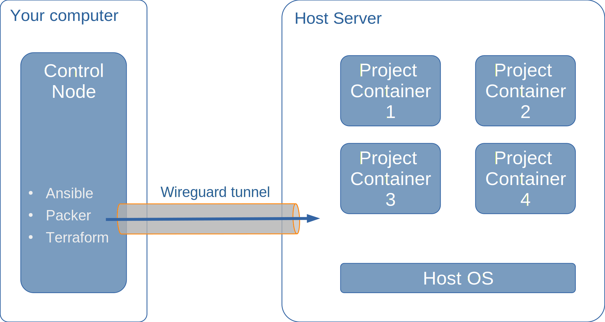

A control node is needed for executing automation scripts that set up a host server, building container images for the project and for deploying the containers and services on the host server. A control node can be used to deploy multiple projects, or you a dedicated control node per project can be used.

<!--more-->

## TODOs on this page



- [ ] Link to collaboration page for "Guide for control node setup: MacOS" and for Windows 10 VMWare networking issue
- [ ] Add links in the text



## Control node introduction

To prevent the settings, software and configuration needed for the control node from interfering or otherwise conflicting with the software and configuration of your local computer, a [rollyourown.xyz](https://rollyourown.xyz) control node should be set up in a virtual machine on your computer, or on a completely separate, dedicated computer (such as an Intel NUC, an old laptop or a desktop computer). This keeps the [rollyourown.xyz](https://rollyourown.xyz) configuration separate from other software installed on your computer and also ensures that the automation scripts and configuration of the control node are not affected by system upgrades or other software installed on the host computer. Furthermore, this allows us to develop and test the [rollyourown.xyz](https://rollyourown.xyz) configuration scripts and guides on a single operating system (currently Ubuntu 20.04 LTS).



With the exception of the very first configuration steps for the host server, which are carried out over a plain SSH connection to the host server's public IP address, the control node interacts with the host server via a [wireguard](https://www.wireguard.com/) tunnel. This tunnel provides a permanent, exncrypted connection to the host server and enables all communication between the container and host server to run via private IP addresses.

## Repository links

The [github](https://github.com/) mirror repository for the control node automation scripts is here: [https://github.com/rollyourown-xyz/ryo-control-node](https://github.com/rollyourown-xyz/ryo-control-node).

The [rollyourown.xyz](https://rollyourown.xyz/) repository for the control node automation scripts is here: [https://git.rollyourown.xyz/ryo-projects/ryo-control-node](https://git.rollyourown.xyz/ryo-projects/ryo-control-node).

## Control node setup

The steps for setting up a control node depend on your computer's operating system. The following sections describe the setup for [Windows](#control-node-setup-windows), [Linux](#control-node-setup-linux) and [MacOS](#control-node-setup-macos).



Based on the [rollyourown.xyz](https://rollyourown.xyz) project (or projects) you want to deploy, consider whether to use a terminal-based control node or a control node with a graphical desktop.

The terminal-based control node is suitable for projects that either do not include any browser-based administrative interfaces for project components, or where the adminsitrative interfaces are exposed on the public internet. The terminal-based control node is more resource-friendly and may be faster to set up.

For more advanced projects, a control node with a graphical desktop is needed, since administrative interfaces for project components are typically only accessible via the wireguard tunnel between control node and host server (making sure that they are not exposed on the public internet).

Using virtual machines for the control node, it is possible to have a dedicated control node for each project deployed, starting each control node only when the project needs to be managed or administered. However, it is also possible to have a single control node for multiple projects, in which case a control node with a graphical desktop would be recommended so that projects requiring a graphical interface are supported even if the first project doesn't require this.

The individual project pages indicate whether a control node with a graphical desktop is required.



### Control node setup: Linux

A terminal-based control node or a control node with a graphical desktop can be run on a Linux computer in a virtual machine. There are a number of ways to run virtual machines on Linux, such as:

- [KVM](https://www.linux-kvm.org/), the native Linux kernel hypervisor, which can be managed with
  - [Multipass](https://multipass.run/), a lightweight, command-line VM launcher, for **terminal-based** control nodes only
  - [Gnome Boxes](https://wiki.gnome.org/Apps/Boxes), a simple desktop GUI VM manager
  - [virt-manager](https://virt-manager.org/), a more advanced desktop GUI VM manager
- [VirtualBox](https://www.virtualbox.org/)
- [VMware Workstation Player](https://www.vmware.com/products/workstation-player/workstation-player-evaluation.html) - free only for non-commercial, personal and home use

Once you have chosen, activated/installed your virtual machine environment, install a Ubuntu 20.04 LTS virtual machine (server version for a terminal-based control node, desktop version for a control node with a graphical interface) as described in the relevant hypervisor documentation.

### Control node setup: Windows

A terminal-based control node or a control node with a graphical desktop can be run on Windows in a virtual machine. There are a number of ways to run virtual machines on Windows, depending on your Windows version, such as:

- [Hyper-V](https://docs.microsoft.com/en-us/virtualization/hyper-v-on-windows/), available in Windows 10 Enterprise, Pro, or Education versions, which can be managed from the Windows UI or, for **terminal-based** control nodes only, using [Multipass](https://multipass.run/), a lightweight, command-line VM launcher
- [VirtualBox](https://www.virtualbox.org/)

Once you have chosen, activated/installed your virtual machine hypervisor, install a Ubuntu 20.04 LTS virtual machine (server version for a terminal-based control node, desktop version for a control node with a graphical interface) as described in the relevant hypervisor documentation.



On Windows 10, testing has shown that the free, personal, non-commercial use version of [VMware Workstation Player](https://www.vmware.com/products/workstation-player/workstation-player-evaluation.html) **does not work** with rollyourown.xyz due to networking issues for containers within a virtual machine preventing the image build process from succeeding. With the VMWare Player Pro version, these problems *may* be solved by setting promiscuous mode on virtual network bridge, but we have been unable to test this. If you can verify this and provide step-by-step instructions how to solve these issues, please contribute [LINK TO CONTRIBUTION PAGE].



### Control node setup: macOS



We have currently been unable to test any of the macOS-based virtual machine options for compatibility with a rollyourown.xyz control node and scripts.Please consider contributing [LINK TO RELEVANT PAGE HERE] if you can help us with this.



A terminal-based control node or a control node with a graphical desktop can be run on an Apple computer in a virtual machine. There are a number of ways to run virtual machines on macOS, such as:

- [Multipass](https://multipass.run/), a lightweight, command-line VM launcher using the macOS native hypervisor, for **terminal-based** control nodes only
- [VirtualBox](https://www.virtualbox.org/)
- [VMware Fusion](https://www.vmware.com/products/fusion.html) - free only for non-commercial, personal and home use

### Control node setup on a dedicated machine



Currently, only the x86 or amd64 architectures are supported (for control machine and host server). This means, for example, that a Raspberry Pi cannot be used as a control node. Even though all control node software can be installed, container images built on an ARM architecture will not run on an x86/amd64 host server.



Depending on the available hardware (e.g. with or without a monitor), a terminal-based control node or a control node with a graphical desktop can be run on a dedicated computer running Ubuntu 20.04 LTS. This could, for example, be an old Laptop or desktop computer, an [Intel NUC](https://www.intel.com/content/www/us/en/products/boards-kits/nuc.html) or other mini PC or barebones computer. Prerequisite is that the computer is running [Ubuntu 20.04 server](https://ubuntu.com/download/server) (for a terminal-based control node) or [Ubuntu 20.04 desktop](https://ubuntu.com/download/desktop) (for a control node with graphical desktop).

## Automated control node configuration

Once a [control node is up and running with Ubuntu 20.04 LTS](#control-node-setup), the control node needs to be configured and software needs to be installed to run your rollyourown.xyz project automation scripts. This software installation and configuration is itself automated.



During setup of Ubuntu 20.04 LTS, you will either have been asked to specifiy a username and password for a non-root user, or Ubuntu is already pre-setup with the non-root user `ubuntu`, typically with password `ubuntu`. This non-root user account should be used for executing the rollyourown.xyz scripts and the user-name and password are needed to configure the scripts, being entered in the "Local user configuration" section of the `configuration.yml` file (Step 4 below).



### Step-by-step control node setup

1. Log in to the control node as the non-root user, upgrade the system and then reboot to apply any system changes:

    ```bash
    sudo apt update && sudo apt upgrade -y
    sudo reboot -n
    ```

2. Log back in to the control node as the non-root user and install `ansible`, `ansible-core`, `python3-packaging`, `python3-distutils`, `git` and `nano`:

    ```bash
    sudo apt install software-properties-common
    sudo apt-add-repository --yes --update ppa:ansible/ansible
    sudo apt install ansible ansible-core python3-packaging python3-distutils git nano -y
    ```

3. Log in to the control node as the non-root user, create a working directory, enter the directory and clone the **control node repository** to your control node:

    ```bash
    mkdir ~/ryo-projects
    cd ~/ryo-projects
    git clone https://github.com/rollyourown-xyz/ryo-control-node
    ```

4. Copy the file `~/ryo-projects/ryo-control-node/configuration/configuration_TEMPLATE.yml` to a new file `~/ryo-projects/ryo-control-node/configuration/configuration.yml`

    ```bash
    cd ~/ryo-projects/ryo-control-node
    cp configuration/configuration_TEMPLATE.yml configuration/configuration.yml
    ```

5. Edit the file `~/ryo-projects/ryo-control-node/configuration/configuration.yml` and add the non-root username and password. If you aren't familiar with a different linux editor, use nano to edit the file with:

    ```bash
    cd ~/ryo-projects/ryo-control-node
    nano configuration/configuration.yml
    ```

6. Run the control node setup automation script `local-setup.sh` from the `ryo-control-node` directory to prepare the control node and its secure connection to the host server:

    ```bash
    cd ~/ryo-projects/ryo-control-node/
    ./local-setup.sh
    ```

7. After running the local-setup script, **reboot the control node**. This is a prerequisite for running the project automation scrips.

After setting up the control node, you are ready to clone the project repository and run the automation scrips to set up the host server, build images and deploy the project.



The `local-setup.sh` script prepares the control node for managing project deployments. This script simply calls an [ansible](https://www.ansible.com/) playbook that executes tasks on the control node itself.

In detail, the following tasks are performed by the local-setup playbook:

- SSH keys are generated on the control node so that [ansible](https://www.ansible.com/) can log in securely to the host server and execute the commands triggered in the `host-setup-sh` step

- A Certificate authority is set up on the Control Node for signing host SSL certificates in later steps

- [Wireguard](https://www.wireguard.com/) is installed on the control node. A wireguard tunnel is used for the majority of the provisioning commands triggered in the `host-setup.sh` step as well as for uploading container images to the host (in the `build-images.sh` step) and deploying the project (in the `deploy-project.sh` step). In some projects, the wireguard tunnel can also be used for admin access from the control node to various remote project components, so that admin interfaces do not need to be exposed on the open internet

- [LXD](https://linuxcontainers.org/lxd/) is installed on the control node to support the build process for LXD container images (in the `build-images.sh` step) and provide the mechanism for uploading them to the host server. Snapd channel pinning is used to avoid unexpected upgrading in a running project

- [Packer](https://www.packer.io/) is installed on the control node to build the container images for each project component (in the `build-images.sh` step) and upload them to the host server

- [Terraform](https://www.terraform.io/) is installed on the control node to deploy the project to the host server



## Control node deletion



After a project is deployed, the control node for the project is used to keep the project's applications up to date. Therefore, the control node may be shut down but **should not be deleted** until the project is no longer needed. It is recommended to back up the control node VM (see the relevant online documentation for the hypervisor technology you are using for the control node) at least after deployment or after updates to the deployed project.



## Control node using WSL or container technology on Linux



If you consider running a control node on [Windows Subsystem for Linux (WSL)](https://docs.microsoft.com/en-us/windows/wsl/about) or as an [LXD container](https://linuxcontainers.org/lxd/) on Linux, please be aware that **this is currently unsupported**, due to limitations of the two technologies:

- In WSL, missing systemd functionality prevents the wireguard interface from starting automatically and prevents snapd from working which in turn prevents the installation of LXD via snap
- With LXD containers, container nesting prevents the control node from working correctly for some projects. One of the roles of a control node is to build container images, which is done on the control node using LXD containers. The rollyourown.xyz image building playbooks do not always work reliably with nested containers

It is our goal to eventually support a control node running as a WSL app on Windows or as an LXD container on Linux, to provide a simple and fast setup of a control node. We will revisit this if and when the technologies have been updated to resolve these problems.


