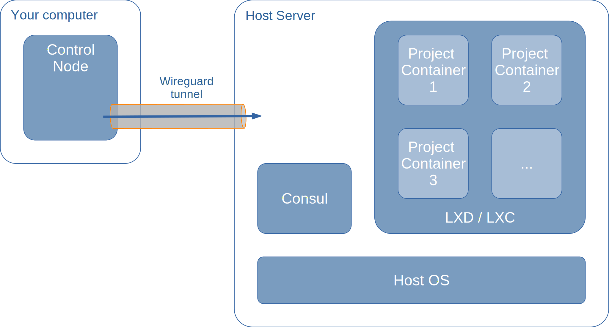

A host server is needed to run the various containers making up a project deployment. A single host server can host multiple projects, or a dedicated host server can be used per project.

<!--more-->

## TODOs on this page



- [ ] Add links in the text
- [ ] Diagram of host including tunnel to control-node, consul and some containers



## Host server introduction

A [rollyourown.xyz](https://rollyourown.xyz) project needs to run on a server and the server needs to be reachable via a public IP address.

A host server is usually a server or virtual private server (VPS) hosted by a hosting provider, but may also be a server or virtual machine hosted in your home or office. The host server must be reachable via a public IP address and should be running Ubuntu 20.04 LTS as operating system. [Rollyourown.xyz](https://rollyourown.xyz) projects are written and tested to set up and deploy to a Ubuntu 20.04 LTS Linux server.

A [rollyourown.xyz](https://rollyourown.xyz) host server is controlled from a [control node](/rollyourown/project_modules/control_node/) via a secure [wireguard](https://www.wireguard.com/) tunnel. Usually, no manual management of the host server is needed and the host server command line does not need to be accessed. However, users familiar with the Linux command line can log in to the server *from the control node*, for example for advanced diagnostics. A few useful commands can be found [here](/rollyourown/project_modules/control_node_advanced/).

### Host server components

The basic components of a host server are illustrated in the following diagram:



On top of the base operating system, the [rollyourown.xyz](https://rollyourown.xyz) [automated host server setup script](#automated-host-server-setup) configures the server, installs basic packages and installs two key components for enabling a [rollyourown.xyz](https://rollyourown.xyz) project deployment:

- [Consul](https://www.consul.io/) is installed to support service discovery and dynamic configuration of project components
- [LXD](https://linuxcontainers.org/lxd/) is installed as container management system to launch and manage project components

The project build and deployment scripts run on the control node can then build project container images, upload them to the host server, launch them and provide configuration via the Consul Key-Value store.



[Consul](https://www.consul.io/) is a [distributed service registry and key-value store](https://www.consul.io/docs/architecture) and includes a [service registry](https://www.consul.io/docs/discovery/services) and a [key-value store](https://www.consul.io/docs/dynamic-app-config/kv).

A Consul agent is deployed on project containers and joins the Consul server in client mode. This enables, on the one hand, services on the container to be registered in the service registry and, on the other hand, for the service registry and KV-store to be queried.

#### Service registry

The Consul service registry provides a register of available and running services on the host server. As a new project container is deployed, a consul agent running in client mode on the container registers the presence of the service provided by the container with the Consul service registry, along with the container's IP address and the port on which the service is available. Other components can then discover the service (usually via DNS), without needing static configuration in advance of the hostname or IP address of the service.

This feature is used, for example, by [HAProxy](/rollyourown/project_modules/ryo-service-proxy/#haproxy-and-certbot) to distribute traffic to backend servers and enables the [Service Proxy module](/rollyourown/project_modules/ryo-service-proxy) to be a generic module that can be used in any project.

#### Key-value store

The Consul key-value store provides a store of configuration data for services that can be provisioned at deploy-time. If a container is dynamically configured, then a consul-template agent running on the container retrieves key-values and generates the container service's configuration file(s). This can be done at boot or at a later stage, as the consul-template agent monitors for changes in the specified branches of the key-value tree.

This feature is used, for example, by [Certbot](/rollyourown/project_modules/ryo-service-proxy/#haproxy-and-certbot) to dynamically load the configuration for certificates needed for a project and by [HAProxy](/rollyourown/project_modules/ryo-service-proxy/#haproxy-and-certbot) to load ACLs and backend configuration for a project's backend servers. A consul-template agent running on the [Service Proxy module](/rollyourown/project_modules/ryo-service-proxy) modifies the Haproxy and Cerbot configuration as project-specific services are added during project deployment.



## Repository links

The [github](https://github.com/) mirror repository for the host server automation scripts is here: [https://github.com/rollyourown-xyz/ryo-host](https://github.com/rollyourown-xyz/ryo-host).

The [rollyourown.xyz](https://rollyourown.xyz/) repository for the host server automation scripts is here: [https://git.rollyourown.xyz/ryo-projects/ryo-host](https://git.rollyourown.xyz/ryo-projects/ryo-host).

## Host server setup

The recomended way of running a [rollyourown.xyz](https://rollyourown.xyz) project is on a server or virtual private server (VPS) hosted by a hosting provider.

### A hosted server or Virtual Private Server (VPS)

There are many, many hosting providers in different countries offering servers and VPS at varying cost, starting at a couple of Euros or Dollars per month (or whatever your local currency may be) with the cost usually depending on the resources available (CPUs, RAM, storage).

We cannot provide any hostsing provider recommendations at this time, so if you don't already have a preferred hoster in your region, do an internet search for "VPS" and your country to find providers and compare prices.



#### External firewall

Some hosting providers operate a firewall function in front of their VPS offerings. If this is the case, make sure that the necessary ports are opened before running the [rollyourown.xyz](https://rollyourown.xyz) automation scripts.

For communication between the control node and the host server, these are:

- TCP Port 22 for initial SSH connections (this can be removed after host server setup)
- TCP Port 2222 for SSH connections after host server setup
- UDP Port 52222 for the wireguard tunnel between control node and host server

TCP ports 2222 and 52222 are the default port numbers used by [rollyourown.xyz](https://rollyourown.xyz) projects. Change these if you have made manual changes in your configuration files.

Additional ports (e.g. TCP ports 80 and 443 for HTTP/HTTPS) will also need to be opened for the specific project you are deploying - see the project description for further details.

#### Initial root user

Some hosting providers require that a server's initial root password is changed on first login. This step will prevent the [rollyourown.xyz](https://rollyourown.xyz) [host setup script](#automated-host-server-setup) from executing. To avoid this, log in once to the server (via SSH or via the hosting provider's web-based console) and change the initial root password before running the [host setup script](#automated-host-server-setup).



### Your own server

[Rollyourown.xyz](https://rollyourown.xyz) projects can run on a server hosted in your home or office. However, the server must be reachable via a public IP address.



Unless you know what you are doing, it is **not recommended** to expose servers or computers in your home or office network on the open internet as this can open your network and computers to attack by various malicious actors. In an office environment, you may be violating company policy by doing so, even if you do find a way around the technical defenses put in place by your employer's IT department.





If your internet connection has a **static** public IP address, then you can set up your internet router to direct traffic to the relevant ports to your server.

If your internet connection has a **dynamic** public IP address that changes at regular intervals, then you will additionally need to set up Dynamic DNS (DynDNS) to keep your service available when the IP address changes.

If your internet connection does not have a public IP address (e.g. your provider uses Carrier Grade NAT), then you could, for example, set up a VPN server on a hosted VPS and proxy traffic via a VPN from the VPS public IP address to your home/office network. However, in this case you would need a VPS from a hoster and could just as well deploy your project there.



### Host server resources

The "size" of the host server needed for a [rollyourown.xyz](https://rollyourown.xyz) project depends on a number of parameters:

- The number of different projects you intend to deploy on the host server
- The complexity of the project(s) you want to deploy - the project page should give you an idea of the minimum resources the project needs to run well
- The number of users of the service deployed by your project. The resources needed for a project providing a service for multiple people (e.g. a messaging server, a cloud service) will depend on the number of persons you want to support with your deployment. A project providing a service for a family or small group of friends will need fewer resources than a large deployment for hundreds or even thousands of people
- The traffic you expect. This will depend on the number of people you want to support or, for a blog or internet site, on the number of visitors you expect

The first projects published on [rollyourown.xyz](https://rollyourown.xyz) are simple projects intended for a small number of users. In future, we plan to publish more complex projects with architectures that can scale up, to larger numbers of users or for higher traffic, by using multiple servers.

With most hosting providers, you can start small and upgrade your VPS if needed.

### Operating system

Unless stated otherwise on the project page, all [rollyourown.xyz](https://rollyourown.xyz) projects are written and tested to deploy to an Ubuntu Linux server, so unless you are sure you know what you are doing, make sure that your host server is running **Ubuntu 20.04 LTS**.

## Automated host server setup

Once a host server has been set up, you should have a public IP address for the server and an initial root login (either provided to you by your hosting provider when the host server was ordered or configured by you during the operating system installation procedure on your own machine). The host server now needs to be prepared for the deployment of [rollyourown.xyz](https://rollyourown.xyz) projects. The control node needs to be configured to communicate securely with the host server and the host server needs to be set up with all necessary software and configuration to host your project.

Server configuration and software installation is automated by the `host-setup.sh` script in the [rollyourown.xyz](https://rollyourown.xyz) [host server repository](https://git.rollyourown.xyz/ryo-projects/ryo-host).



The `host-setup.sh` script uses the host server's initial root password to secure the server and then set it up to be controlled by the control node and to host [LXD](https://linuxcontainers.org/lxd/) containers for a project deployment. This script calls [ansible](https://www.ansible.com/) playbooks that execute tasks on the host server.

In detail, the following tasks are performed by the host-setup playbooks:

- A non-root user account is created. The SSH public key created on the control machine during [control node setup](/rollyourown/project_modules/control_node/) is added to the non-root user account, the account is added to the sudo group and the account is configured for password-less sudo. The non-root user account is then used with [SSH public key authetication](https://help.ubuntu.com/community/SSH/OpenSSH/Keys) for all further communication to the server and all further setup steps

- All packages on the system are upgraded

- [Wireguard](https://www.wireguard.com/) is installed on the system, wireguard configuration files for both control node and host server are generated and wireguard interfaces are enabled to start automatically so that the wireguard tunnel can be used as a permanent, logical direct network connection between control node and the host server. All further host setup steps and project deployment are then carried out via the wireguard tunnel

- The hostname is set (to the name defined in the host server's configuration file)

- [Chrony](https://en.wikipedia.org/wiki/Chrony) is installed to keep the host server's clocks synchronised and [nano](https://www.nano-editor.org/) and [glances](https://github.com/nicolargo/glances/) are installed to allow basic manual system administration and observation if needed by advanced users

- IPv4 packet forwarding is enabled

- The SSH daemon is configured to change the internet-facing port, disallow root login and allow only the non-root user account to log in only via SSH public key authentication. If set in the host server's configuration file, [two-factor authetication (2FA)](https://en.wikipedia.org/wiki/Multi-factor_authentication) with [time-based one-time passwords (TOTP)](https://en.wikipedia.org/wiki/Multi-factor_authentication) is configured for access via the public internet. Login via the wireguard tunnel is excluded from 2FA so that automation scripts run on the control node can manage the host via the tunnel without manual intervention

- The host server's firewall is configured to allow communication between control node and host server with no other internet-facing ports opened. Ports required by a [rollyourown.xyz](https://rollyourown.xyz) project are opened if needed by the LXD container management agent during project deployment. Also, NAT is enabled for outbound communication from [LXD containers](https://linuxcontainers.org/lxd/) deployed on the server and DNS resolution via Consul is enabled

- [LXD](https://linuxcontainers.org/lxd/) is installed and configured on the host server so that container images can be uploaded to the host server and launched by project automation scripts. Snapd channel pinning is used to avoid unexpected upgrading of LXD in a running project

- Host kernel settings are configured for LXD as [recommended by the LXD project](https://linuxcontainers.org/lxd/docs/master/production-setup)

- Directories are created on the host so that project containers can be launched with mounted storage to enable component configuration and data to persist across container re-starts and replacements

- To enable image uploading and and container management from the control node, the project host is configured as an [LXD remote server](https://linuxcontainers.org/lxd/advanced-guide/#remote-servers) for the control node, using [PKI-based TLS certificate authentication and authorization](https://linuxcontainers.org/lxd/docs/master/security#adding-a-remote-with-a-tls-client-in-a-pki-based-setup) and with the [control node as trusted TLS client](https://linuxcontainers.org/lxd/docs/master/security#managing-trusted-tls-clients)

- Finally, [Consul](https://www.consul.io/) is installed on the host server and configured as a server in the host server "datacenter". In addition, the [Consul](https://www.consul.io/) servers on the host and on the control node are configured as federated remote datacenters

For some projects, further project-specific host configuration may be performed by the projects automation scripts



### Step-by-step host server setup

1. Log in to the **control node** as the non-root user, enter the `ryo-projects` directory and clone the host server repository to your control node:

    ```bash
    cd ~/ryo-projects
    git clone https://github.com/rollyourown-xyz/ryo-host
    ```

2. Choose a name (e.g. "host-1") for the host server, enter the `ryo-host` directory and copy the file `configuration/configuration_TEMPLATE.yml` to a new file `configuration/configuration_<HOST_NAME>.yml`, replacing <HOST_NAME> with the name chosen:

    ```bash
    cd ~/ryo-projects/ryo-host
    cp configuration/configuration_TEMPLATE.yml configuration/configuration_<HOST_NAME>.yml
    ```

3. Edit the new file `configuration_<HOST_NAME>.yml` and add the host server's public IP address, the root username and password provided by your hosting provider (or configured yourself if you have set up your own server). Also choose a non-root username and password for the host server. If you aren’t familiar with a different linux editor, use nano to edit the file with:

    ```bash
    cd ~/ryo-projects/ryo-host
    nano configuration/configuration_<HOST_NAME>.yml
    ```

4. In the `ryo-host` directory, copy the file `configuration/inventory_TEMPLATE` to a new file `configuration/inventory_<HOST_NAME>`, replacing <HOST_NAME> with the name chosen above:

    ```bash
    cd ~/ryo-projects/ryo-host
    cp configuration/inventory_TEMPLATE configuration/inventory_<HOST_NAME>
    ```

5. Edit the new file `inventory_<HOST_NAME>` and add the host server's public IP address:

    ```bash
    cd ~/ryo-projects/ryo-host
    nano configuration/inventory_<HOST_NAME>
    ```

6. If this is not the first host server configured with the control node, then check additional settings in `configuration_<HOST_NAME>.yml` and `inventory_<HOST_NAME>` and change as described in the comments in those files

7. Run the host server setup automation script `host-setup.sh` from the ryo-host directory, passing the name of the host chosen above via the flag `-n`, to set up a secure connection from the control node to the host server and to set up the host server for deploying [rollyourown.xyz](https://rollyourown.xyz) projects:

    ```bash
    cd ~/ryo-projects/ryo-host
    ./host-setup.sh -n <HOST_NAME>
    ```

After setting up the host server, you are now ready to [deploy a rollyourown.xyz project](/rollyourown/single_server_projects/how_to_deploy) on the server.



After setting up a [control node](rollyourown/project_modules/control_node/) and [host server](rollyourown/project_modules/host_server/), you now have a permanent, secure connection from the control node to the host server via a wireguard tunnel. Users familiar with the Linux command line can log in to the server for advanced diagnostics. A few useful commands can be found [here](/rollyourown/project_modules/host_server_advanced/).


