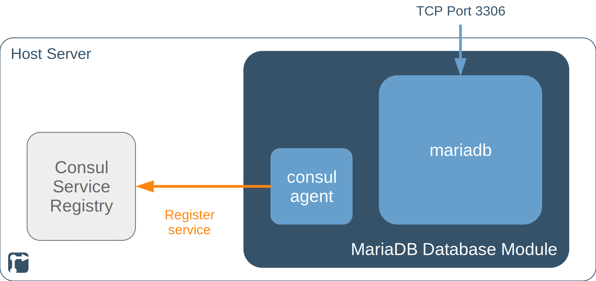

The MariaDB Database module is a re-usable module for other [rollyourown.xyz](https://rollyourown.xyz) projects. The module provides a MariaDB relational database server.

<!--more-->

## TODOs on this page



- [ ] Image configuration: Consul service discovery
- [ ] Image configuration: General deployment configuration
- [ ] Links in text



## Introduction

This module deploys a [MariaDB](https://mariadb.org/) relational database system.

[MariaDB](https://mariadb.org/) is an open source, MySQL-compatible relational database system.

## Repository links

The [github](https://github.com/) mirror repository for this module is here: [https://github.com/rollyourown-xyz/ryo-mariadb](https://github.com/rollyourown-xyz/ryo-mariadb)

The [rollyourown.xyz](https://rollyourown.xyz/) repository for this project is here: [https://git.rollyourown.xyz/ryo-projects/ryo-mariadb](https://git.rollyourown.xyz/ryo-projects/ryo-mariadb)

## Dependencies

This module depends on the [rollyourown.xyz](https://rollyourown.xyz) [Service Proxy](/rollyourown/project_modules/service_proxy/) module to provide service discovery for database clients.

## Module components

This project module deploys a container with multiple services as shown in the following diagram:



The MariaDB database module contains two applications, together providing a mariadb database server to be used in other [rollyourown.xyz](https://rollyourown.xyz) projects.

### MariaDB

The mariadb application is deployed from the [mariadb.org](https://mariadb.org) repositories and [`mysql_secure_installation`](https://mariadb.com/kb/en/mysql_secure_installation/) configuration is carried out to prevent root account access from outside the local host, remove anonymous user accounts and remove the test database. A dedicated database user is created so that further databases and users can be provisioned by terraform scripts from the control node as part of [rollyourown.xyz](https://rollyourown.xyz) project deployment.

### Consul

A Consul agent is deployed on the MariaDB database module and joins the Consul cluster in client mode. The Consul agent registers mariadb as a service in the Consul service registry, so that other containers can discover its internal network IP address.

## How to deploy this module in a project or module

The [repository for this module](https://github.com/rollyourown-xyz/ryo-mariadb) contains a number of resources for including the module in a [rollyourown.xyz](https://rollyourown.xyz) project. The steps for including the module are:

1. Add the MariaDB Database module as well as the [Service Proxy module](/rollyourown/project_modules/service_proxy/) dependency to the `get-modules.sh` script in the project:

    ```bash
    ## Service proxy module
    if [ -d "../ryo-service-proxy" ]
    then
       echo "Module ryo-service-proxy already cloned to this control node"
    else
       echo "Cloning ryo-service-proxy repository. Executing 'git clone' for ryo-service-proxy repository"
       git clone https://github.com/rollyourown-xyz/ryo-service-proxy ../ryo-service-proxy
    fi
    ## MariaDB Database module
    if [ -d "../ryo-mariadb" ]
    then
       echo "Module ryo-mariadb already cloned to this control node"
    else
       echo "Cloning ryo-mariadb repository. Executing 'git clone' for ryo-mariadb repository"
       git clone https://github.com/rollyourown-xyz/ryo-mariadb ../ryo-mariadb
    fi
    ```

2. Add the MariaDB Database module as well as the [Service Proxy module](/rollyourown/project_modules/service_proxy/) dependency to the project's `host-setup.sh` script:

    ```bash
    ## Module-specific host setup for ryo-service-proxy
    if [ -f ""$SCRIPT_DIR"/../ryo-service-proxy/configuration/"$hostname"_playbooks_executed" ]
    then
       echo "Host setup for ryo-service-proxy module has already been done on "$hostname""
       echo ""
    else
       echo "Running module-specific host setup script for ryo-service-proxy on "$hostname""
       echo ""
       "$SCRIPT_DIR"/../ryo-service-proxy/host-setup.sh -n "$hostname"
    fi
    ## Module-specific host setup for ryo-mariadb
    if [ -f ""$SCRIPT_DIR"/../ryo-mariadb/configuration/"$hostname"_playbooks_executed" ]
    then
       echo "Host setup for ryo-mariadb module has already been done on "$hostname""
       echo ""
    else
       echo "Running module-specific host setup script for ryo-mariadb on "$hostname""
       echo ""
       "$SCRIPT_DIR"/../ryo-mariadb/host-setup.sh -n "$hostname"
    fi
    ```

3. Add the MariaDB Database module as well as the [Service Proxy module](/rollyourown/project_modules/service_proxy/) dependency to the project's `build-images.sh` script:

    ```bash
    # Build Service Proxy module images if -m flag is present
    if [ $build_modules == 'true' ]
    then
       echo "Running build-images script for ryo-service-proxy module on "$hostname""
       echo ""
       "$SCRIPT_DIR"/../ryo-service-proxy/build-images.sh -n "$hostname" -v "$version"
    else
       echo "Skipping image build for the Service Proxy module"
       echo ""
    fi
    # Build MariaDB Database module images if -m flag is present
    if [ $build_modules == 'true' ]
    then
       echo "Running build-images script for ryo-mariadb module on "$hostname""
       echo ""
       "$SCRIPT_DIR"/../ryo-mariadb/build-images.sh -n "$hostname" -v "$version"
    else
       echo "Skipping image build for the MariaDB Database module"
       echo ""
    fi
    ```

4. Add the MariaDB Database module as well as the [Service Proxy module](/rollyourown/project_modules/service_proxy/) dependency to the `deploy-project.sh` script in the project (with the Service Proxy module **before** the MariaDB Database module):

    ```bash
    # Deploy Service Proxy module if -m flag is present
    if [ $deploy_modules == 'true' ]
    then
       echo "Deploying ryo-service-proxy module on "$hostname" using images with version "$version""
       echo ""
       "$SCRIPT_DIR"/../ryo-service-proxy/deploy-module.sh -n "$hostname" -v "$version"
       echo ""
    else
       echo "Skipping Service Proxy module deployment"
       echo ""
    fi
    # Deploy MariaDB Database module if -m flag is present
    if [ $deploy_modules == 'true' ]
    then
       echo "Deploying ryo-mariadb module on "$hostname" using images with version "$version""
       echo ""
       "$SCRIPT_DIR"/../ryo-mariadb/deploy-module.sh -n "$hostname" -v "$version"
       echo ""
    else
       echo "Skipping MariaDB Database module deployment"
       echo ""
    fi
    ```

## How to use this module in a project

A project module that uses a MySQL database needs to be configured to access the mariadb database provided by this module.

### Image configuration

**TODO** Consul service discovery...

### General deployment configuration

**TODO** The MariaDB Database module uses a special 'terraform' user to provision databases and users to the mariadb database for use by project components. The terraform user password for the MariaDB database is generated when building the mariadb container image and is stored in the file `/ryo-projects/ryo-mariadb/configuration/mariadb_terraform_user_password_<HOST_ID>.yml` on the control node.

To use this secret in a project Terraform file, the configuration terraform user password needs to be added as a terraform variable. This is done by adding the following to the project's terraform files:

```tf
# MariaDB module variables
locals {
  mariadb_terraform_user_password_file = join("", ["${abspath(path.root)}/../../ryo-mariadb/configuration/mariadb_terraform_user_password_", var.host_id, ".yml"])
  mariadb_terraform_user_password      = sensitive(yamldecode(file(local.mariadb_terraform_user_password_file))["mariadb_terraform_user_password"])
}
```

Then the variable `mariadb_terraform_user_password` is availabe for ....

## Software deployed

The open source components deployed by this module are:



| Project | What is it? | Homepage | License |
| :------ | :---------- | :------- | :------ |
| Consul | Open source service registry and key-value store | [https://www.consul.io/](https://www.consul.io/) | [Mozilla Public License 2.0](https://github.com/hashicorp/consul/blob/master/LICENSE) |
| MariaDB | Open source relational database | [https://mariadb.org/](https://mariadb.org/) | [GPL v2 / LGPL](https://mariadb.com/kb/en/mariadb-license/) |


