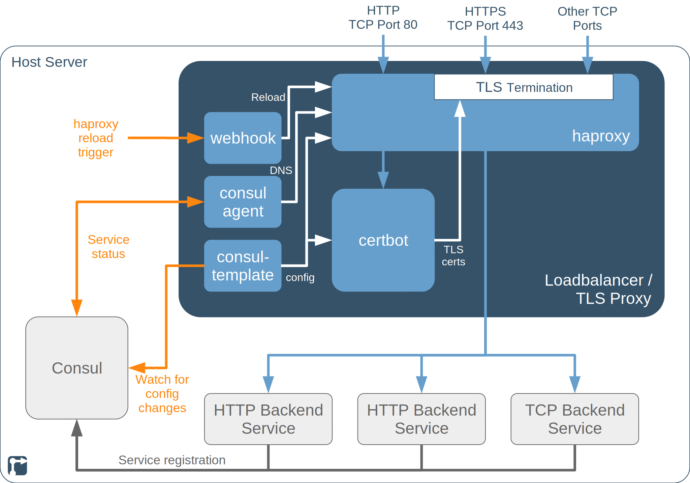

The Service Proxy module is a re-usable module for other [rollyourown.xyz](https://rollyourown.xyz) projects which is used to terminate HTTPS and TCP connections and route traffic to the project's containers.

<!--more-->

## TODOs on this page



- [ ] Add links in the text



## Introduction

This module deploys an [HAProxy](https://www.haproxy.org/) loadbalancer / TLS proxy together with [Certbot](https://certbot.eff.org/) for certificate management.

[Consul-Template](https://github.com/hashicorp/consul-template/) is used to dynamically load HAProxy and Certbot configuration from kev-values in the [Consul](https://www.consul.io/) Key-Value Store running on the [host server](/rollyourown/projects/host_server/).

## Repository links

The [Codeberg](https://codeberg.org/) mirror repository for this module is here: [https://codeberg.org/rollyourown-xyz/ryo-ingress-proxy](https://codeberg.org/rollyourown-xyz/ryo-ingress-proxy)

The [Github](https://github.com/) mirror repository for this module is here: [https://github.com/rollyourown-xyz/ryo-service-proxy](https://github.com/rollyourown-xyz/ryo-service-proxy)

The [rollyourown.xyz](https://rollyourown.xyz/) repository for this project is here: [https://git.rollyourown.xyz/ryo-projects/ryo-service-proxy](https://git.rollyourown.xyz/ryo-projects/ryo-service-proxy) (not publicly accessible)

## Dependencies

This module has no dependencies to other [rollyourown.xyz](https://rollyourown.xyz) modules.

## Module components

This project module deploys a container with multiple services as shown in the following diagram:



### HAProxy

The [HAProxy](https://www.haproxy.org/) load-balancer / TLS proxy listens on defined ports, terminates incoming connections and distributes this traffic to specified backends, based on rules specified in [Access Control Lists (ACLs)](https://www.haproxy.com/blog/introduction-to-haproxy-acls/). Depending on the project, backends can be scaled across multiple instances.

HAProxy ACLs and backend rules are dynamically configured based on Key-Values retrieved from the [Consul server running on the host](/rollyourown/projects/host_server/). This allows the Service Proxy to be deployed as a generic module, with the project-specific backed and ACL configuration provisioned to the Consul KV-store during project deployment.

In addition, HAProxy terminates TLS / SSL connections (typically, HTTPS), using certificates obtained by [Certbot](https://certbot.eff.org/), so that certificates can be provisioned in a single element and do not need to be distributed across backend applications.

### Certbot

The [Certbot](https://certbot.eff.org/) application uses the [ACME protocol](https://tools.ietf.org/html/rfc8555) to request and renew [Let's Encrypt](https://letsencrypt.org/) certificates for the project domain(s). Certificates are stored in persistent storage mounted to the container and are available for HAProxy to terminate HTTPS requests for the project. In addition, other containers requiring certificates (for example, if running non-HTTP services) can also access the certificates via mounted storage.

For [Let's Encrypt](https://letsencrypt.org/) domain validation via the [Let's Encrypt HTTP-01 challenge](https://letsencrypt.org/docs/challenge-types/#http-01-challenge), traffic to the ACME client `.well-known/acme-challenge` link is routed by HAProxy to Certbot. Any other traffic to the project domain(s) is routed to backends or rejected, as defined in the HAProxy ACLs.

The domains for which Certbot aquires and manages certificates are retrieved from the [Consul server running on the host](/rollyourown/projects/host_server/). This allows the Service Proxy to be deployed as a generic module, with the project-specific domains provisioned to the Consul KV-store during project deployment.

### Consul-Template

On container start, the [Consul-Template](https://github.com/hashicorp/consul-template/) application obtains service configuration information from the [Consul key-value store](#key-value-store) and uses it to populate configuration files for HAProxy and Certbot. In addition, Consul-Template listens for changes to the configuration key-values and updates configuration files on-the-fly, reloading HAProxy and/or Certbot when configuration has changed.

### Webhook

The [Webhook](https://github.com/adnanh/webhook) application creates an HTTP endpoint on the container and exposes a web service for triggering HAProxy reloads from external containers.

## How to deploy this module in a project

The [repository for this module](https://github.com/rollyourown-xyz/ryo-service-proxy) contains a number of resources for including the module in a [rollyourown.xyz](https://rollyourown.xyz) project. The steps for including the module are:

1. Add the Service Proxy module to the `get-modules.sh` script in the project:

    ```bash
    ## Service proxy module
    if [ -d "../ryo-service-proxy" ]
    then
       echo "Module ryo-service-proxy already cloned to this control node"
    else
       echo "Cloning ryo-service-proxy repository. Executing 'git clone' for ryo-service-proxy repository"
       git clone https://github.com/rollyourown-xyz/ryo-service-proxy ../ryo-service-proxy
    fi
    ```

2. Add the Service Proxy module to the project's `host-setup.sh` script:

    ```bash
    ## Module-specific host setup for ryo-service-proxy
    if [ -f ""$SCRIPT_DIR"/../ryo-service-proxy/configuration/"$hostname"_playbooks_executed" ]
    then
       echo "Host setup for ryo-service-proxy module has already been done on "$hostname""
       echo ""
    else
       echo "Running module-specific host setup script for ryo-service-proxy on "$hostname""
       echo ""
       "$SCRIPT_DIR"/../ryo-service-proxy/host-setup.sh -n "$hostname"
    fi
    ```

3. Add the Service Proxy module to the project's `build-images.sh` script:

    ```bash
    # Build module images if -m flag is present
    if [ $build_modules == 'true' ]
    then
       echo "Running build-images script for ryo-service-proxy module on "$hostname""
       echo ""
       "$SCRIPT_DIR"/../ryo-service-proxy/build-images.sh -n "$hostname" -v "$version"
    else
       echo "Skipping image build for modules"
       echo ""
    fi
    ```

4. Add the Service Proxy module to the `deploy-project.sh` script in the project:

    ```bash
    # Deploy modules if -m flag is present
    if [ $deploy_modules == 'true' ]
    then
       echo "Deploying ryo-service-proxy module on "$hostname" using images with version "$version""
       echo ""
       "$SCRIPT_DIR"/../ryo-service-proxy/deploy-module.sh -n "$hostname" -v "$version"
       echo ""
    else
       echo "Skipping modules deployment"
       echo ""
    fi
    ```

## How to use this module in a project

A project component using [HAProxy](https://www.haproxy.org/) for TLS termination must register with the Consul server running on the host so that HAProxy can resolve the IP address of the container providing the component and direct traffic to it.

Furthermore, [Certbot](https://certbot.eff.org/) needs to be configured to obtain Letsencrypt certificates.

### Image configuration

The [ryo-project-template repository](https://github.com/rollyourown-xyz/ryo-service-proxy) includes Ansible roles for deploying and configuring the Consul agent and configuring the project component to register with the Consul server:

- The role `install-consul` installs the consul agent
- The role `set-up-consul` configures the consul agent to join the Consul server running on the host and enable local application name resolution via Consul
- The role `set-up-TEMPLATE` contains a template service defintion `TEMPLATE-service.hcl` for configuring the service name for registering in the Consul service registry

The `install-consul` and `set-up-consul` roles do not need to be modified.

The template configuration file `TEMPLATE-service.hcl.j2` provides an example of a component-specific consul service configuration to register the specific component with the service registry:

```hcl
## Modify for this component's purpose

services {
  name = "TEMPLATE"
  tags = [ "TEMPLATE" ]
  port = SERVICE_PORT
}
```

This must be modified and copied to the directory `/etc/consul.d/` during component provisioning. An Ansible task for copying this file is, for example:

```yaml
- name: Copy TEMPLATE-service consul service configuration file
  copy:
    mode: 0640
    owner: consul
    group: consul
    dest: /etc/consul.d/TEMPLATE-service.hcl
    src: TEMPLATE-service.hcl
    force: yes
```

The service name is then used during the project deployment step to provide HAProxy backend configuration via the consul key-value store.

### General deployment configuration

Configuration of [HAProxy](https://www.haproxy.org/) and [Certbot](https://certbot.eff.org/) is done during the project deployment step by provisioning Consul key-values.

#### Terraform configuration for provisioning Consul key-values

During a rollyourown.xyz project deployment, the official terraform [consul provider](https://registry.terraform.io/providers/hashicorp/consul/) is used to provision key-value configuration for HAProxy and Certbot to the Consul server running on the host.

To enable this, the consul server's IP address must be made available within the project's terraform code. This is done by adding a Terraform variable for the consul server's IP address on the host:

```tf
# Consul variables
locals {
  consul_ip_address  = join("", [ local.lxd_host_network_part, ".1" ])
}
```

Then the terraform consul provider is added to the project's terraform configuration:

```tf
terraform {
  required_version = ">= 0.14"
  required_providers {
    lxd = {
      source  = "terraform-lxd/lxd"
      version = "~> 1.5.0"
    }
    consul = {
      source = "hashicorp/consul"
      version = "~> 2.12.0"
    }
  }
}
```

Finally, the IP address variable is used to configure the provider:

```tf
provider "consul" {
  address    = join("", [ local.consul_ip_address, ":8500" ])
  scheme     = "http"
  datacenter = var.host_id
}
```

#### Terraform modules for provisioning Consul key-values

The Service Proxy module repository includes terraform modules for provisioning the necessary configuration to the Consul key-value store in the correct key-value structure for use by HAProxy and Certbot.



Certbot configuration is provisioned to key-value store in the `/service/certbot/` folder.

HAProxy configuration is provisioned to the key-value store in multiple folders:

- HAProxy backend services are provisioned to the key-value folder `service/haproxy/backends/ssl/` if the backend service is listening on an HTTPS port
- HAProxy backend services are provisioned to the key-value folder `service/haproxy/backends/no-ssl/` if the backend service is listening on a plain HTTP port
- HAProxy TCP Listeners are provisioned to the key-value folder `service/haproxy/tcp-listeners/`
- HAProxy ACLs are provisioned to the key-value folder `service/haproxy/acl/<ACL name>/`
- HAProxy HTTP deny rules are provisioned to the key-value folder `service/haproxy/deny/`
- HAProxy use-backend rules are provisioned to the key-value folder `service/haproxy/use-backend/`



#### Certbot-related configuration

Certbot configuration is provisioned to the Consul key-value store in the `/service/certbot/` folder.


Each key-value pair is of the form `<key,value>` where:

- The `key` is the domain or subdomain for which a Let's Encrypt certificate is required
- The `value` is an administrator email address for requesting the certificate from the Let's Encrypt certificate authority

The Consul-Template application reads the key-values in the `/service/certbot/` folder and generates certbot configuration for each required certificate, along with a deploy script to copy generated certificates into mounted storage for use by other containers:

```bash
certbot certonly -n --standalone --agree-tos --preferred-challenges http --http-01-port 8080 --deploy-hook /usr/local/bin/cert-deploy.sh -m {{.Value}} -d {{.Key}}
```

where `cert-deploy.sh` is:

```bash
cat /etc/letsencrypt/live/{{.Key}}/fullchain.pem /etc/letsencrypt/live/{{.Key}}/privkey.pem > /etc/haproxy/ssl/{{.Key}}.pem
cp /etc/letsencrypt/live/{{.Key}}/cert.pem /var/certs/{{.Key}}.cert.pem
chmod 644 /var/certs/{{.Key}}.cert.pem
cp /etc/letsencrypt/live/{{.Key}}/privkey.pem /var/certs/{{.Key}}.key.pem
chmod 644 /var/certs/{{.Key}}.key.pem
```




Every domain and sub-domain for which a certificate is required for the project - for example, `example.com`, `www.example.com` and `auth.example.com` should be added **individually** to the configuration.


Certbot configuration can be deployed to the consul key-value store using the ryo-service-proxy terraform `deploy-cert-domains` module, for example:

```tf
module "deploy-<PROJECT_ID>-cert-domains" {
  source = "../../ryo-service-proxy/module-deployment/modules/deploy-cert-domains"

  certificate_domains = {
    domain_1 = {domain = "example.com", admin_email = "admin@example.com"},
    domain_2 = {domain = "www.example.com", admin_email = "admin@example.com"},
    domain_3 = {domain = "auth.example.com", admin_email = "admin@example.com"}
  }
}
```

#### HAProxy-related configuration

HAproxy configuration is provisioned to the Consul key-value store in various folders.

##### HAProxy TCP listeners

The terraform module `deploy-haproxy-configuration` can be used to deploy key-values to Consul for configuring TCP listeners.



Configuration for HAProxy TCP listeners is provisioned to the key-value folder `service/haproxy/tcp-listeners/`. Each entry is a key-value pair of the form `<key,value>` where:

- the `key` is the TCP port to listen on
- the `value` is the name of the backend service to use.

For each TCP port found in the `service/haproxy/tcp-listeners/` folder in the KV store, the Consul-Template application generates a TCP listener entry in the HAProxy configuration file.

```bash
listen tcp_{{.Key}}
   bind :::{{.Key}} v4v6
   mode tcp
   option tcplog
   option tcpka
   option clitcpka
   option srvtcpka
   timeout connect 5s
   timeout client  60s
   timeout server  60s
   balance leastconn
   server-template {{.Value}} 1 _{{.Value}}._tcp.service.consul resolvers consul resolve-prefer ipv4 init-addr none check
```



For example, a TCP listener for a [Gitea server](/rollyourown/projects/single_server_projects/ryo-gitea/) can be deployed with the following code:

```tf
module "deploy-gitea-ssh-haproxy-tcp-listener-configuration" {
  source = "../../ryo-service-proxy/module-deployment/modules/deploy-haproxy-configuration"

  haproxy_tcp_listeners = {
    3022 = {service = "gitea-ssh"}
  }
}
```

##### Backend services

Using the terraform module `deploy-haproxy-backend-services`, the key-values for HAProxy backend service configuration can be deployed to the Consul key-value store.



Configuration for HAProxy backend services are provisioned to the key-value folder `service/haproxy/backends/ssl/` if the backend service is listening on an HTTPS port and to the key-value folder `service/haproxy/backends/no-ssl/` if the backend service is listening on a plain HTTP port. In both cases, each key-value pair is of the form `<key,value>` where:

- The `key` is the backend service name
- The `value` is empty.

The Consul-Template application reads the key-values in the `service/haproxy/backends/ssl/` folder and generates a backed definition in the HAProxy configuration file for each backend service found:

```bash
backend {{.Key}}
   redirect scheme https code 301 if !{ ssl_fc }
   http-request set-header X-SSL %[ssl_fc]
   balance roundrobin
   server-template {{.Key}} 1 _{{.Key}}._tcp.service.consul resolvers consul resolve-prefer ipv4 init-addr none ssl verify none check
```

For each key-value in the `service/haproxy/backends/no-ssl/` folder, a backend definition is generated as follows:

```bash
backend {{.Key}}
   redirect scheme https code 301 if !{ ssl_fc }
   http-request set-header X-SSL %[ssl_fc]
   balance roundrobin
   server-template {{.Key}} 1 _{{.Key}}._tcp.service.consul resolvers consul resolve-prefer ipv4 init-addr none check
```



For example, a backend service for a [Matrix server](/rollyourown/projects/single_server_projects/ryo-matrix/) can be deployed with the following code:

```tf
module "deploy-synapse-backend-service" {
  source = "../../ryo-service-proxy/module-deployment/modules/deploy-haproxy-backend-services"
a [Gitea server](/rollyourown/projects/single_server_projects/ryo-gitea/)
  non_ssl_backend_services = [ "synapse" ]
}
```

##### HAProxy ACLs

The terraform module `deploy-haproxy-configuration` can be used to deploy key-values to Consul for configuring HAProxy ACLs.



Configuration for HAProxy ACLs are provisioned to the key-value folder `service/haproxy/acl/<ACL name>/`. One or two keys are provisioned to each folder:

- If the ACL only includes a host match, then only one key-value pair of the form `<host,value>` is provisioned, where `value` is the host to match
- If the ACL only includes a path match, then only one key-value pair of the form `<path,value>` is provisioned, where `value` is the path to match
- If the ACL includes both a host and path, then two key-value pairs are provisioned:
  - a key-value pair of the form `<host,value>`, where `value` is the host to match
  - a key-value pair of the form `<path,value>`, where `value` is the path to match

The ACL key-value configuration is then used to generate [HAProxy HTTP deny](#haproxy-http-deny-rules) and [use-backed](#haproxy-use-backed-rules) rules.



For example, ACLs for a [Matrix server](/rollyourown/projects/single_server_projects/ryo-matrix/) can be deployed with the following code:

```tf
module "deploy-matrix-haproxy-acl-configuration-for-synapse" {
  source = "../../ryo-service-proxy/module-deployment/modules/deploy-haproxy-configuration"

  haproxy_path_only_acls = {
    path-synapse-admin  = {path = "/_synapse/admin"}
    path-synapse-client = {path = "/_synapse/client"}
    path-matrix         = {path = "/_matrix"}
  }
}
```

##### HAProxy HTTP deny rules

The terraform module `deploy-haproxy-configuration` can be used to deploy key-values to Consul for configuring HTTP deny rules.



Configuration for HAProxy HTTP deny rules is provisioned to the key-value folder `service/haproxy/deny/`. Each entry is a key-value pair of the form `<key,value>` where:

- the `key` is an [ACL name](#haproxy-acls)
- the `value` is empty.

For each `<ACL NAME>` found in the `service/haproxy/deny/` folder in the KV store, the Consul-Template application generates an HTTP deny rule in the HTTPS frontend section of the HAProxy configuration file by looking up the configuration in the `service/haproxy/acl/<ACL NAME>/` folder.

- For a host-only ACL:

    ```bash
    http-request deny deny_status 403 if { hdr(host) -i <HOST KEY> }
    ```

- For a path-only ACL:

    ```bash
    http-request deny deny_status 403 if { path_beg -i <PATH KEY> }
    ```

- For a host-path ACL:

    ```bash
    http-request deny deny_status 403 if { hdr(host) -i <HOST KEY> } { path_beg -i <PATH KEY>} 
    ```



For example, HTTP deny rules for a [Matrix server](/rollyourown/projects/single_server_projects/ryo-matrix/) can be deployed with the following code:

```tf
module "deploy-matrix-haproxy-deny-configuration-for-synapse" {
  source = "../../ryo-service-proxy/module-deployment/modules/deploy-haproxy-configuration"

  haproxy_acl_denys = [ "path-synapse-admin" ]
}
```

##### HAProxy 'use-backed' rules

The terraform module `deploy-haproxy-configuration` can be used to deploy key-values to Consul for configuring HAProxy `use-backend` rules.



The configuration for HAProxy use-backend rules is provisioned to the key-value folder `service/haproxy/use-backend/`. Each entry is a key-value pair of the form `<key,value>` where:

- the `key` is an [ACL name](#haproxy-acls)
- the `value` is the name of the backend service to use.

For each `<ACL NAME>` found in the `service/haproxy/use-backend/` folder in the KV store, the Consul-Template application generates a `use-backed` rule in the HTTPS frontend section of the HAProxy configuration file by looking up the configuration in the `service/haproxy/acl/<ACL NAME>/` folder.

- For a host-only ACL:

    ```bash
    use_backend <BACKEND SERVICE NAME> if { hdr(host) -i <HOST KEY> }
    ```

- For a path-only ACL:

    ```bash
    use_backend <BACKEND SERVICE NAME> if { path_beg -i <PATH KEY>}
    ```

- For a host-path ACL:

    ```bash
    use_backend <BACKEND SERVICE NAME> if { hdr(host) -i <HOST KEY> } { path_beg -i <PATH KEY>}
    ```



For example, `use-backend` rules for a [Matrix server](/rollyourown/projects/single_server_projects/ryo-matrix/) can be deployed with the following code:

```tf
module "deploy-matrix-haproxy-backend-configuration-for-synapse" {
  source = "../../ryo-service-proxy/module-deployment/modules/deploy-haproxy-configuration"

  haproxy_acl_use-backends = {
    path-synapse-client = {backend_service = "synapse"},
    path-matrix         = {backend_service = "synapse"}
  }
}
```

## Software deployed

The open source components used in this module are:



| Project | What is it? | Homepage | License |
| :------ | :---------- | :------- | :------ |
| Certbot | [Let's Encrypt](https://letsencrypt.org/) certificate manager | [https://certbot.eff.org/](https://certbot.eff.org/) | [Apache 2.0](https://raw.githubusercontent.com/certbot/certbot/master/LICENSE.txt) |
| Consul | Service registry and key-value store | [https://www.consul.io/](https://www.consul.io/) | [MPL 2.0](https://github.com/hashicorp/consul/blob/master/LICENSE) |
| Consul-Template | Tool to create dynamic configuration files based on Consul Key-Value store or service registry queries | [https://github.com/hashicorp/consul-template/](https://github.com/hashicorp/consul-template/) | [MPL 2.0](https://github.com/hashicorp/consul-template/blob/master/LICENSE) |
| HAProxy | Load balancer, TCP and HTTP proxy | [https://www.haproxy.org/](https://www.haproxy.org/) | [GPL / LGPL](https://github.com/haproxy/haproxy/blob/master/LICENSE) |
| Webhook | Light-weight, general purpose webhook server | [https://github.com/adnanh/webhook](https://github.com/adnanh/webhook) | [MIT](https://github.com/adnanh/webhook/blob/master/LICENSE) |



The integration of haproxy with consul to provide dynamic haproxy configuration was inspired by [this](https://www.haproxy.com/blog/haproxy-and-consul-with-dns-for-service-discovery/), [this](https://www.haproxy.com/blog/dns-service-discovery-haproxy/) and [this](https://learn.hashicorp.com/tutorials/consul/load-balancing-haproxy).
