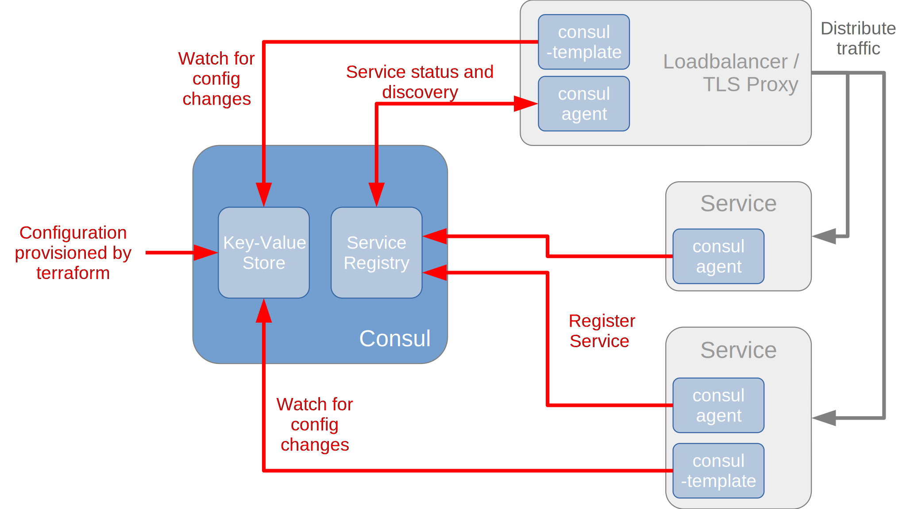

The Service Registry and Key-Value Store module  is a re-usable module for other [rollyourown.xyz](https://rollyourown.xyz) projects and is used to provide a service registry and key-value store.

<!--more-->

## Introduction

This module deploys a [Consul](https://www.consul.io/) [service registry](https://www.consul.io/docs/discovery/services) and [key-value store](https://www.consul.io/docs/dynamic-app-config/kv). The module is used by the [rollyourown.xyz](https://rollyourown.xyz) [Load Balancer and TLS Proxy](https://rollyourown.xyz/rollyourown/project_modules/load_balancer_tls_proxy/) module to:

- Provide service configuration for haproxy and certbot, loaded from the consul key-value store via consul-template
- Provide a service registry for DNS-based service discovery for haproxy backends

The Key-Value store and service registry can also be used by other [rollyourown.xyz](https://rollyourown.xyz) projects and project modules to provide key-value based configuration and service discovery.

## Repository links

The [github](https://github.com/) mirror repository for this module is here: [https://github.com/rollyourown-xyz/ryo-service-registry-kv-store](https://github.com/rollyourown-xyz/ryo-service-registry-kv-store)

The [rollyourown.xyz](https://rollyourown.xyz/) repository for this project is here: [https://git.rollyourown.xyz/ryo-projects/ryo-service-registry-kv-store](https://git.rollyourown.xyz/ryo-projects/ryo-service-registry-kv-store)

## Depenencies

This module has no dependencies to other [rollyourown.xyz](https://rollyourown.xyz) modules.

## Module components

This project module deploys a container running [Consul](https://www.consul.io/) and providing a [service registry](https://www.consul.io/docs/discovery/services) and [key-value store](https://www.consul.io/docs/dynamic-app-config/kv) for use by other modules and containers, as shown in the following diagram:



### Service registry

The Consul service registry provides a register of available and running services. As a new container is deployed, a consul agent running on the container in client mode registers the presence of the service provided with the Consul service registry along with the container's IP address and the port on which the service is available. Other components can then discover the service (usually via DNS), without having to be configured in advance with the hostname, IP address or port of the service.

This feature is used, for example, by the [Load Balancer and TLS Proxy](/rollyourown/project_modules/load_balancer_tls_proxy/) module to distribute traffic to the correct backend server and enables the Load Balancer and TLS Proxy to be a generic module that can be used in any project.

### Key-value store

The key-value store provides a store of configuration data for services that can be provisioned at deploy-time. If a container is dynamically configured, a consul-template agent running on the container retrieves key-values and generates the container service's configuration file(s). This can be done at boot or at a later stage, as the consul-template agent monitors for changes in the specified branches of the key-value tree.

This feature is used, for example, by the [Load Balancer and TLS Proxy](/rollyourown/project_modules/load_balancer_tls_proxy/) module. The loadbalancer / TLS proxy is a generic module, deployed with only a basic configuration, which is then modified dynamically as new containers / services are added during a specific project deployment. A consul-template agent running on the loadbalancer / TLS proxy modifies the Haproxy and Cerbot configuration as project-specific services are added.

## How to deploy this module in a project

The [repository for this module](https://github.com/rollyourown-xyz/ryo-service-registry-kv-store) contains a number of resources for including the module in a [rollyourown.xyz](https://rollyourown.xyz) project. The steps for including the module are:

1. Add the module to the `get-modules.sh` script in the project:

    ```bash
    ## Service Registry / Key-Value Store module
    echo "Executing 'git submodule add' for ryo-service-registry-kv-store repository"
    git submodule add https://github.com/rollyourown-xyz/ryo-service-registry-kv-store modules/ryo-service-registry-kv-store
    ```

2. To ensure persistence of service registration and key-values stored across module upgrades, a host directory **must** be created for mounting to the module's container. Add the following snippet to the `host-setup.sh` script in the project:

    ```bash
    # Module-specific host setup for ryo-service-registry-kv-store
    echo "Executing module-specific host setup playbooks for ryo-service-registry-kv-store"
    ansible-playbook -i configuration/inventory modules/ryo-service-registry-kv-store/host-setup-module/master.yml
    ```

3. Add the module component to the `build-images.sh` script in project:

    ```bash
    echo "Building Consul image"
    echo "Executing command: packer build -var \"version=$version\" modules/ryo-service-registry-kv-store/image-build/consul.pkr.hcl"
    echo ""
    packer build -var "version=$version" modules/ryo-service-registry-kv-store/image-build/consul.pkr.hcl
    ```

4. The module **must** be deployed as a container with a **static** IP address and has no dependencies. A host directory **must** be mounted for the module's persistent data. Add the following code to the project's terraform files in `project-deployment` to deploy the module:

    ```tf
    module "deploy-consul" {
      source = "./modules/deploy-container-static-ip"
      
      depends_on = [ ]
      
      lxd_remote                 = local.lxd_remote_name
      host_external_ipv4_address = local.lxd_host_public_ipv4_address
      container_image            = join("-", [ local.project_id, "consul", var.image_version ])
      container_name             = join("-", [ local.project_id, "consul" ])
      container_profiles         = ["default"]
      container_network          = "lxdbr0"
      container_ipv4_address     = join(".", [ local.lxd_br0_network_part, "10" ])
      container_cloud-init       = file("cloud-init/cloud-init-basic.yml")
    
      container_mounts = [
        {name = "consul-data", host_path = join("", ["/var/containers/", local.project_id, "/consul/data"]), mount_path = "/var/consul/data", mount_readonly = false}
      ]
    }
    ```

## How to use this module in a project

Resources for using the Service Registry and Key-Value Store module in a project are provided in the [rollyourown.xyz](https://rollyourown.xyz) [project template repository](https://github.com/rollyourown-xyz/ryo-project-template).

### Configuration of project component

Ansible roles for installing and setting up a consul agent to register project components with the Consul service registry is provided in the `image-build/playbooks/roles/install-consul` and `image-build/playbooks/roles/set-up-consul` directories. These do not need to be modified.

In the `image-build/playbooks/roles/set-up-TEMPLATE` directory, the file `templates/TEMPLATE-service.hcl.j2` provides an example of a component-specific consul service configuration to register the specific component with the service registry:

```hcl
## Modify for this component's purpose

service {
  name = "{{ project_id }}-TEMPLATE"
  tags = [ "TEMPLATE" ]
  port = 80
}
```

The service given is then used for providing HAProxy configuration via the consul key-value store.

### Loadbalancer / TLS proxy configuration

To configure the Loadbalancer / TLS proxy module to direct traffic to a project-specific component, configuration parameters for the HAProxy configuration file need to be provisioned to the Consul key-value store on component deployment.

Details on how to use the Consul key-value store for dynamically configuring the loadbalancer / TLS proxy are available on that module's [page](/rollyourown/project_modules/load_balancer_tls_proxy/#haproxy-related-configuration)

## Software deployed

The open source components used in this module are:



| Project | What is it? | Homepage | License |
| :------ | :---------- | :------- | :------ |
| Consul | Open source service registry and key-value store | [https://www.consul.io/](https://www.consul.io/) | [Mozilla Public License 2.0](https://github.com/hashicorp/consul/blob/master/LICENSE) |


