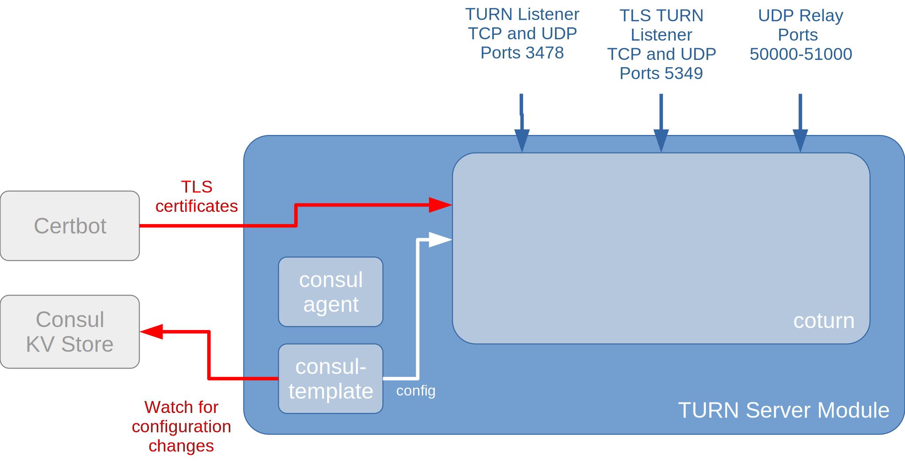

The TURN Server module is a re-usable module for other [rollyourown.xyz](https://rollyourown.xyz) projects and is used to provide [STUN](https://en.wikipedia.org/wiki/STUN), [TURN](https://en.wikipedia.org/wiki/Traversal_Using_Relays_around_NAT) and [ICE](https://en.wikipedia.org/wiki/Interactive_Connectivity_Establishment) services to enable peer-to-peer commmunications (such as [WebRTC](https://webrtc.org/) services or internet voice and video calls) for devices behind a [NAT](https://en.wikipedia.org/wiki/Network_address_translation).

<!--more-->

## TODOs on this page



- [ ] Links in text
- [ ] Add module component descriptions
- [ ] Add "How to deploy"
- [ ] Add "How to use"



## Introduction

This module deploys a [coturn](https://github.com/coturn/coturn) server.

Coturn is and open source [STUN](https://en.wikipedia.org/wiki/STUN) and [TURN](https://en.wikipedia.org/wiki/Traversal_Using_Relays_around_NAT) server that is used by other services, including those deployed by other [rollyourown.xyz](https://rollyourown.xyz) projects, to enable [NAT traversal](https://en.wikipedia.org/wiki/NAT_traversal) for peer-to-peer communications.

## Repository links

The [github](https://github.com/) mirror repository for this module is here: [https://github.com/rollyourown-xyz/ryo-coturn](https://github.com/rollyourown-xyz/ryo-coturn)

The [rollyourown.xyz](https://rollyourown.xyz/) repository for this project is here: [https://git.rollyourown.xyz/ryo-projects/ryo-coturn](https://git.rollyourown.xyz/ryo-projects/ryo-coturn)

## Dependencies

This module depends on the [rollyourown.xyz](https://rollyourown.xyz) [Service Proxy](/rollyourown/project_modules/service_proxy/) module to provide dynamic configuration for coturn via the [Consul](https://www.consul.io/) [key-value store](https://www.consul.io/docs/dynamic-app-config/kv) and certificate management by [Certbot](https://certbot.eff.org/).

## Module components

This project module deploys a container with multiple services as shown in the following diagram:

### Component ABC

TODO...

## How to deploy this module in a project

TODO...

## How to use this module in a project

TODO...

## Software deployed

The open source components used in this module are:



| Project | What is it? | Homepage | License |
| :------ | :---------- | :------- | :------ |
| Coturn  | Open source [STUN](https://en.wikipedia.org/wiki/STUN) and [TURN](https://en.wikipedia.org/wiki/Traversal_Using_Relays_around_NAT) server | [https://github.com/coturn/coturn](https://github.com/coturn/coturn) | [https://github.com/coturn/coturn/blob/master/LICENSE](https://github.com/coturn/coturn/blob/master/LICENSE) |
| Consul | Open source service registry and key-value store | [https://www.consul.io/](https://www.consul.io/) | [Mozilla Public License 2.0](https://github.com/hashicorp/consul/blob/master/LICENSE) |
| Consul-Template | Tool to create dynamic configuration files based on Consul Key-Value store or service registry queries | [https://github.com/hashicorp/consul-template/](https://github.com/hashicorp/consul-template/) | [Mozilla Public License 2.0](https://github.com/hashicorp/consul-template/blob/master/LICENSE) |


