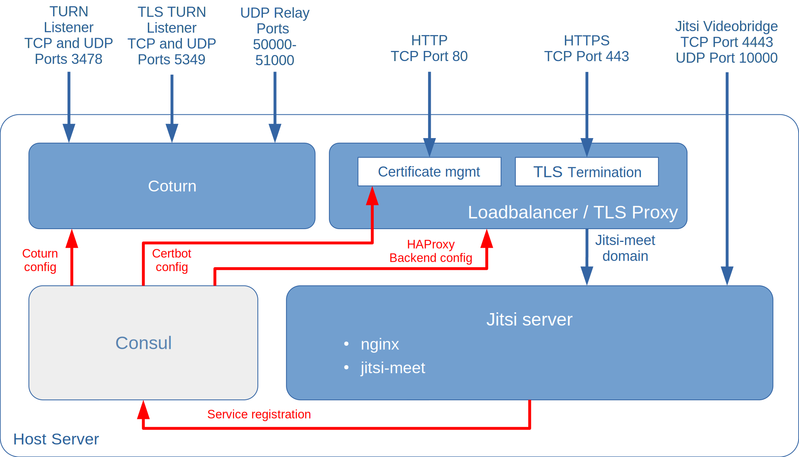

This project deploys a [jitsi](https://jitsi.org/) video conferencing server, together with a [coturn](https://github.com/coturn/coturn) TURN-server, and with [HAProxy](https://www.haproxy.org/) for TLS/SSL termination and [Certbot](https://certbot.eff.org/) for managing your letsencrypt certificates.

<!--more-->

## TODOs on this page



- [ ] Links on the page
- [ ] Add screenshots
- [ ] Project requirements - references? Better indication of number of users?



[Jitsi](https://jitsi.org/) is set of open source components that together provide a web-based video conferencing solution. The components of a jitsi server are described in the [jitsi documentation](https://jitsi.github.io/handbook/docs/architecture). This project installs an [nginx](https://nginx.org/) web server and uses the [jitsi-meet installer](https://jitsi.github.io/handbook/docs/devops-guide/devops-guide-quickstart#install-jitsi-meet) to install the different jitsi components:

- A [Prosody XMPP server](https://prosody.im/) that jitsi uses for inter-component signalling
- The [jitsi-meet](https://github.com/jitsi/jitsi-meet) [WebRTC](https://webrtc.org/) front-end web application, providing the conference user interface
- The [jitsi videobridge](https://github.com/jitsi/jitsi-videobridge) video stream router
- The [jicofo](https://github.com/jitsi/jicofo) conference focus server, that manages sessions within conferences

Components **not** installed by this project are:

- The [jigasi](https://github.com/jitsi/jigasi) SIP gateway
- The [jibri](https://github.com/jitsi/jibri) broadcasting server

In additiona to the components of the jitsi video conferencing system, the project deploys the [rollyourown.xyz coturn module](/rollyourown/project_modules/ryo-coturn/) to enable [NAT traversal](https://en.wikipedia.org/wiki/NAT_traversal) for conference participants and the [rollyourown.xyz service proxy module](/rollyourown/project_modules/ryo-service-proxy/) to provide TLS termination and certificate management.


A [control node](/rollyourown/projects/ryo-control-node/) without a graphical desktop UI is sufficient for this project, as the jitsi conferencing server is configurable only via command line.


## Repository links

The [github](https://github.com/) mirror repository for this project is here: [https://github.com/rollyourown-xyz/ryo-jitsi](https://github.com/rollyourown-xyz/ryo-jitsi)

The [rollyourown.xyz](https://rollyourown.xyz/) repository for this project is here: [https://git.rollyourown.xyz/ryo-projects/ryo-jitsi](https://git.rollyourown.xyz/ryo-projects/ryo-jitsi)

## Project components

The components deployed in this project are shown in the following diagram:



### Host server

The [host server](/rollyourown/projects/ryo-host/) is configured to run [LXD containers](https://linuxcontainers.org/lxd/) and a [Consul server](https://www.consul.io/) and is controlled from your control machine via a [wireguard](https://www.wireguard.com/) tunnel. Each container deployed performs a specific task in the installation.

Further details about the host server building block can be found [here](/rollyourown/projects/ryo-host/).

### Containers

The project installation consists of a number of containers deployed on the host server.

#### Coturn container

The coturn container hosts an [coturn](https://github.com/coturn/coturn/) TURN server, providing NAT traversal for jitsi conference users. This component is provided by the [rollyourown.xyz](https://rollyourown.xyz) TURN server module and is a building block for other rollyourown.xyz projects providing p2p communications services. Further details can be found [here](/rollyourown/project_modules/ryo-coturn/).

#### Loadbalancer / TLS proxy container

The loadbalancer / TLS proxy container terminates HTTP and HTTPS connections and distributes traffic to other containers. This component is provided by the [rollyourown.xyz](https://rollyourown.xyz) Service Proxy module and is a key building block for rollyourown.xyz projects. Further details can be found [here](/rollyourown/project_modules/ryo-service-proxy/).

#### Jitsi server container

The Jitsi server container hosts an [nginx](https://nginx.org/) web server with the [jitsi-meet](https://github.com/jitsi/jitsi-meet) WebRTC video conferencing front-end as well as the jitsi video conferencing suite components [prosody]((https://prosody.im/)), [jitsi videobridge](https://github.com/jitsi/jitsi-videobridge) and [jicofo](https://github.com/jitsi/jicofo).

## How to use this project

### Deploying the project

To deploy the project, follow the generic [project deployment instructions](/rollyourown/projects/how_to_deploy/), using the project's github mirror repository at [https://github.com/rollyourown-xyz/ryo-jitsi/](https://github.com/rollyourown-xyz/ryo-jitsi/).

### After deployment

For a full overview of how to use [jitsi video conferencing](https://jitsi.org/), see the Jitsi [user guide](https://jitsi.github.io/handbook/docs/user-guide/user-guide-start).

Before using the conferencing service, user accounts need to be configured. The [rollyourown.xyz](https://rollyourown.xyz) jitsi project deployment is configured as a private deployment with a [Secure domain setup](https://jitsi.github.io/handbook/docs/devops-guide/secure-domain). This allows only authenticated and authorised users to create conferences and prevents the service from being used by anyone on the internet.

#### Jitsi user management

User accounts can only be configured via the command line. This can be done directly from the control node, using `lxc exec` to the remote host server:

- Add user

    ```bash
    lxc exec <HOST_ID>:<HOST_ID>-ryo-jitsi-jitsi -- prosodyctl register <USERNAME> <DOMAIN> <PASSWORD>
    ```

- Delete user:

    ```bash
    lxc exec <HOST_ID>:<HOST_ID>-ryo-jitsi-jitsi -- prosodyctl deluser <USERNAME>@<DOMAIN>
    ```

- Change a user's password:

    ```bash
    lxc exec <HOST_ID>:<HOST_ID>-ryo-jitsi-jitsi -- prosodyctl passwd <USERNAME>@<DOMAIN>
    ```

### Maintaining the installation

After deploying the project, the installation needs to be maintained over time as, for example, new versions of the project's components are released.

Maintentance is automated via the rollyourown.xyz project scripts. See [here](/rollyourown/projects/how_to_maintain/) for details.

## Project requirements

This project deploys all jitsi components on a single server, which is suitable for a small number of users. In future, we plan a project for a [scalable installation](https://jitsi.github.io/handbook/docs/devops-guide/devops-guide-scalable) with multiple videobridge nodes.

Video conferencing can be a resource-intensive application, with the videobridge component needing resources that scale with the number of parallel simultaneous conference users. For a reasonable user experience, a multi-core server or VPS with multiple, dedicated cores sufficient RAM and bandwidth is needed. Even for a smaller installation, a minimum of 4 VPS and 8GB RAM and internet bandwith of at least 1 Gbps is recommended.

## Software deployed

The open source software deployed by the project is:



| Project | What is it? | Homepage | License |
| :------ | :---------- | :------- | :------ |
| Certbot | Open source [letsencrypt](https://letsencrypt.org/) certificate manager, deployed by the [Service Proxy module](/rollyourown/project_modules/ryo-service-proxy/) | [https://certbot.eff.org/](https://certbot.eff.org/) | [Apache 2.0](https://raw.githubusercontent.com/certbot/certbot/master/LICENSE.txt) |
| Consul | Open source service registry and key-value store, deployed by the [Service Proxy module](/rollyourown/project_modules/ryo-service-proxy/) | [https://www.consul.io/](https://www.consul.io/) | [Mozilla Public License 2.0](https://github.com/hashicorp/consul/blob/master/LICENSE) |
| Consul-Template | Tool to create dynamic configuration files based on Consul Key-Value store or service registry queries, deployed by the [Service Proxy module](/rollyourown/project_modules/ryo-service-proxy/) | [https://github.com/hashicorp/consul-template/](https://github.com/hashicorp/consul-template/) | [Mozilla Public License 2.0](https://github.com/hashicorp/consul-template/blob/master/LICENSE) |
| Coturn  | Open source [STUN](https://en.wikipedia.org/wiki/STUN) and [TURN](https://en.wikipedia.org/wiki/Traversal_Using_Relays_around_NAT) server, deployed by the [TURN server module](/rollyourown/project_modules/ryo-coturn/) | [https://github.com/coturn/coturn](https://github.com/coturn/coturn) | [https://github.com/coturn/coturn/blob/master/LICENSE](https://github.com/coturn/coturn/blob/master/LICENSE) |
| HAProxy | Open source load balancer, TCP and HTTP proxy, deployed by the [Service Proxy module](/rollyourown/project_modules/ryo-service-proxy/) | [https://www.haproxy.org/](https://www.haproxy.org/) | [GPL/LGPL](https://github.com/haproxy/haproxy/blob/master/LICENSE) |
| Jicofo | Opem-source conference focus server, managing sessions within [jitsi](https://jitsi.org/) conferences | [https://github.com/jitsi/jicofo/](https://github.com/jitsi/jicofo/) | [Apache 2.0](https://github.com/jitsi/jicofo/blob/master/LICENSE) |
| Jitsi-Meet | Open source [WebRTC](https://webrtc.org/) video conferening front-end, part of the [jitsi](https://jitsi.org/) installation | [https://github.com/jitsi/jitsi-meet/](https://github.com/jitsi/jitsi-meet/) | [Apache 2.0](https://github.com/jitsi/jitsi-meet/blob/master/LICENSE) |
| Jitsi Videobridge| [SFU](https://webrtcglossary.com/sfu/) video routing server for [jitsi](https://jitsi.org/) conferences  | [https://github.com/jitsi/jitsi-videobridge/](https://github.com/jitsi/jitsi-videobridge/) | [Apache 2.0](https://github.com/jitsi/jitsi-videobridge/blob/master/LICENSE) |
| nginx | Open source webserver for the [jitsi-meet](https://jitsi.org/jitsi-meet/) front-end | [https://nginx.org/](https://nginx.org/) | [2-clause BSD license](http://nginx.org/LICENSE) |
| Prosody | Open source [XMPP](https://xmpp.org/) server, used as the signalling server in the [jitsi](https://jitsi.org/) installation | [https://prosody.im/](https://prosody.im/) | [MIT](https://prosody.im/source/mit) |
| Webhook | Open source, light-weight, general purpose webhook server, deployed by the [Service Proxy module](/rollyourown/project_modules/ryo-service-proxy/) | [https://github.com/adnanh/webhook](https://github.com/adnanh/webhook) | [MIT](https://github.com/adnanh/webhook/blob/master/LICENSE) |


