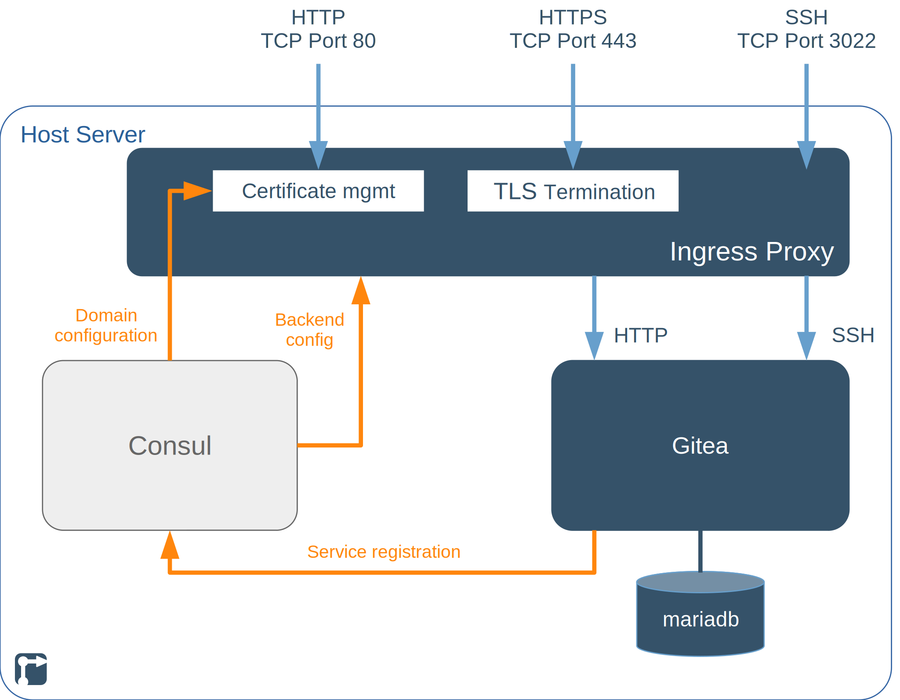

This project deploys a [Gitea](https://gitea.io/) server, with a [MariaDB](https://mariadb.org/) backend database, [HAProxy](https://www.haproxy.org/) for TLS/SSL termination and [Certbot](https://certbot.eff.org/) for managing your [Let's Encrypt](https://letsencrypt.org/) certificate.

<!--more-->

## TODOs on this page



- [ ] Links on the page



## Gitea project introduction

[Git](https://git-scm.com/) is a widely-used, [distributed version control](https://en.wikipedia.org/wiki/Distributed_version_control) system. Git is typically used by software developers to support collaborative code development, but can also be used for developing any text-based content, such as the content of this web-site.

[Gitea](https://gitea.io/) is a lightweight, open source git repository implementation providing a central git instance for managing the canonical version of a project during project development and publishing. In addition to basic git version control, Gitea provides:

- web- and SSH-based access to the repository
- account management for users and organisations
- bug tracking / issue management
- task tracking
- code review, contribution and release management features
- a dashboard of activity.


A [control node](/rollyourown/projects/control_node/) without a graphical desktop UI is sufficient for this project, as the Gitea administration interface is reachable via the public internet.


## Repository links

The [github](https://github.com/) mirror repository for this project is here: [https://github.com/rollyourown-xyz/ryo-gitea-standalone](https://github.com/rollyourown-xyz/ryo-gitea-standalone)

The [rollyourown.xyz](https://rollyourown.xyz/) repository for this project is here: [https://git.rollyourown.xyz/ryo-projects/ryo-gitea-standalone](https://git.rollyourown.xyz/ryo-projects/ryo-gitea-standalone)

## Dependencies

This project depends on and deploys the following [rollyourown.xyz](https://rollyourown.xyz) modules:

- The [Service Proxy module](/rollyourown/project_modules/ryo-service-proxy/) to provide certificate management by [Certbot](https://certbot.eff.org/) and HTTPS proxying by the [HAProxy](https://www.haproxy.org/) load balancer / TLS proxy

- The [MariaDB Database module](/rollyourown/project_modules/ryo-mariadb) to provide a performant database backend

## Project components

The components deployed in this project are shown in the following diagram:

### Host server

The [host server](/rollyourown/projects/host_server/) is controlled from your control machine via a [wireguard](https://www.wireguard.com/) tunnel and is configured to run a [Consul server](https://www.consul.io/) and the [LXD container runtime](https://linuxcontainers.org/lxd/). Each container deployed performs a specific task in the installation.

Further details about the host server building block can be found [here](/rollyourown/projects/host_server/).

### Containers

The project installation consists of a number of containers deployed on the host server.

#### Loadbalancer / TLS proxy container

The loadbalancer / TLS proxy container terminates HTTP, HTTPS and SSH connections and distributes traffic to the Gitea container. This component is provided by the [rollyourown.xyz](https://rollyourown.xyz) Service Proxy module and is a key building block for rollyourown.xyz projects. Further details can be found [here](/rollyourown/project_modules/ryo-service-proxy/).

#### MariaDB container

The MariaDB container provides a MariaDB relational database as backend for the Gitea server container. This component is provided by the [rollyourown.xyz](https://rollyourown.xyz) MariaDB Database module. Further details can be found [here](/rollyourown/project_modules/ryo-mariadb).

#### Gitea container

The Gitea container provides the Gitea server for the project. [Gitea](https://gitea.io/) is a lightweight, open source git repository.

## How to use this project

### Deploying the project

To deploy the project, follow the generic [project deployment instructions](/rollyourown/projects/how_to_deploy/), using the project's github mirror repository at [https://github.com/rollyourown-xyz/ryo-gitea-standalone/](https://github.com/rollyourown-xyz/ryo-gitea-standalone/).

### After deployment

Your first step after deployment will be to create organisations and user accounts for using the Gitea service.

Log in to the Gitea front-end at the domain name provided in your configuration file during project deployment (as the variable `project_git_domain_name`). The admin user's username and password were also defined in your configuration file (as the variables `project_admin_username` and `project_admin_password`).

After login, user accounts can be created from the "Site Administration" item in the user's drop-down menu (along with other settings):

Each user is created from the "Create User Account" button:

Users can then log in to the Gitea front-end or access repositories via SSH (on TCP Port 3022) to create and contribute to projects.

### Maintaining the installation

After deploying the project, the installation needs to be maintained over time as, for example, new versions of the project's components are released.

Maintentance is automated via the rollyourown.xyz project scripts. See [here](/rollyourown/projects/how_to_maintain/) for details.

## Project requirements

For small projects with a few users, [Gitea](https://gitea.io/) does not need huge resources to run. This project can be deployed on smaller, cheaper entry-level virtual servers or home servers.

For example, this project has been successfully deployed on a €2,69/m entry-level Linux VPS with 1 vCore CPU, 2GB RAM and a 20GB SSD. Of course, for larger projects, a higher-spec VPS would be needed.

## Software deployed

The open source components used in this project are:



| Project | What is it? | Homepage | License |
| :------ | :---------- | :------- | :------ |
| Certbot | [Let's Encrypt](https://letsencrypt.org/) certificate manager, deployed by the [Service Proxy module](/rollyourown/project_modules/ryo-service-proxy/) | [https://certbot.eff.org/](https://certbot.eff.org/) | [Apache 2.0](https://raw.githubusercontent.com/certbot/certbot/master/LICENSE.txt) |
| Consul | Service registry and key-value store | [https://www.consul.io/](https://www.consul.io/) | [Mozilla Public License 2.0](https://github.com/hashicorp/consul/blob/master/LICENSE) |
| Consul-Template | Tool to create dynamic configuration files based on Consul Key-Value store or service registry queries | [https://github.com/hashicorp/consul-template/](https://github.com/hashicorp/consul-template/) | [Mozilla Public License 2.0](https://github.com/hashicorp/consul-template/blob/master/LICENSE) |
| Git | Distributed version control system | [https://git-scm.com/](https://git-scm.com/) | [GPL v2](https://github.com/git/git/blob/master/COPYING) |
| Gitea | Self-hosted Git service | [https://gitea.io/](https://gitea.io/) | [MIT](https://github.com/go-gitea/gitea/blob/main/LICENSE) |
| HAProxy | Load balancer, TCP and HTTP proxy, deployed by the [Service Proxy module](/rollyourown/project_modules/ryo-service-proxy/) | [https://www.haproxy.org/](https://www.haproxy.org/) | [GPL / LGPL](https://github.com/haproxy/haproxy/blob/master/LICENSE) |
| MariaDB | Relational database system | [https://mariadb.org/](https://mariadb.org/) | [GPL v2 / LGPL](https://mariadb.com/kb/en/mariadb-license/) |


