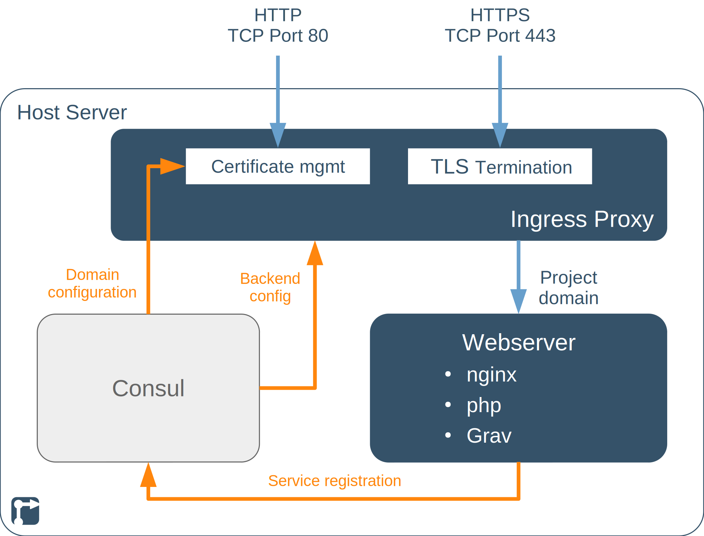

This project deploys a [Grav](https://getgrav.org) flat-file content management system on an [nginx](https://nginx.org/) web server, with [HAProxy](https://www.haproxy.org/) for TLS/SSL termination and [Certbot](https://certbot.eff.org/) for managing your letsencrypt certificate.

<!--more-->

## TODOs on this page



- [x] Update after modularisation
- [ ] Links on the page
- [ ] Add screenshots
- [ ] CHECK: Creation of grav user(s) with editor permissions
- [ ] CHECK: Grav web front-end for editing / managing content
- [ ] CHECK: Grav backups
- [ ] Styling for graphic (with shortcode?)



## Grav CMS project introduction

[Grav](https://getgrav.org) is an open source flat-file content management system (CMS), based on PHP, that uses only files and folders and no database for managing content. Grav provides a fast, more lightweight alternative to database-driven CMSs like [Wordpress](https://wordpress.org/) or [Drupal](https://www.drupal.org/), especially for simpler websites and blogs. Content can either be written directly in [Markdown](https://daringfireball.net/projects/markdown/) format and uploaded to the web server or via Grav's [web-based editor](https://learn.getgrav.org/17/admin-panel/page/editor).


A [control node](/rollyourown/projects/control_node/) without a graphical desktop UI is sufficient for this project, as the Grav admin interface is reachable via the public internet.


## Repository links

The [github](https://github.com/) mirror repository for this project is here: [https://github.com/rollyourown-xyz/ryo-grav-cms](https://github.com/rollyourown-xyz/ryo-grav-cms)

The [rollyourown.xyz](https://rollyourown.xyz/) repository for this project is here: [https://git.rollyourown.xyz/ryo-projects/ryo-grav-cms](https://git.rollyourown.xyz/ryo-projects/ryo-grav-cms)

## Dependencies

This module depends on the [rollyourown.xyz](https://rollyourown.xyz) [Service Proxy](/rollyourown/project_modules/ryo-service-proxy/) module to provide certificate management by [Certbot](https://certbot.eff.org/) and HTTPS proxying by the [HAProxy](https://www.haproxy.org/) loadbalancer / TLS proxy.

## Project components

The components deployed in this project are shown in the following diagram:

### Host server

The [host server](/rollyourown/projects/host_server/) is controlled from your control machine via a [wireguard](https://www.wireguard.com/) tunnel and is configured to run a [Consul server](https://www.consul.io/) and the [LXD container runtime](https://linuxcontainers.org/lxd/). Each container deployed performs a specific task in the installation.

Further details about the host server building block can be found [here](/rollyourown/projects/host_server/).

### Containers

The project installation consists of a number of containers deployed on the host server.

#### Loadbalancer / TLS proxy container

The loadbalancer / TLS proxy container terminates HTTP and HTTPS connections and distributes traffic to other containers. This component is provided by the [rollyourown.xyz](https://rollyourown.xyz) Service Proxy module and is a key building block for rollyourown.xyz projects. Further details can be found [here](/rollyourown/project_modules/ryo-service-proxy/).

#### Webserver container

The webserver container hosts an [nginx](https://nginx.org/) web server, configured according to the [best practices](https://learn.getgrav.org/17/webservers-hosting/servers/nginx) recommended for Grav. Additionally, the [PHP modules](https://learn.getgrav.org/17/basics/requirements#php-requirements) and dependencies required for the Grav CMS and the code for [Grav](https://getgrav.org/) itself are installed with a basic Grav configuration including a pre-provisioned administrator account.

## How to use this project

### Deploying the project

To deploy the project, follow the generic [project deployment instructions](/rollyourown/projects/how_to_deploy/), using the project's github mirror repository at [https://github.com/rollyourown-xyz/ryo-grav-cms/](https://github.com/rollyourown-xyz/ryo-grav-cms/).

### After deployment

For a full overview of how to use [Grav](https://getgrav.org), see the excellent documentation at [https://learn.getgrav.org/](https://learn.getgrav.org/).

For example, your first steps after deployment could be:

- Log in using the grav_admin account at `https://<your_domain>/admin` (password configured in the project's `configuration.yml`)

- Recommended: Set up 2FA for your grav_admin account

- **TODO:** Create one or more user(s) with editor permissions

- **TODO:** [Add and manage content](https://learn.getgrav.org/17/admin-panel/page), either via the Grav web front-end or manually by adding directories and markdown documents to the host server directory `/var/container-directories/ryo-grav-cms/website/` (which is mounted to the webserver as the `/var/www/grav-admin/user/` directory)

- Use Grav's admin interface to change the [theme](https://learn.getgrav.org/17/admin-panel/themes) of the site and add additional [plugins](https://learn.getgrav.org/17/admin-panel/plugins) from the [grav plugin libarary](https://getgrav.org/downloads/plugins).

- **TODO:** Manage site backups, either using Grav's built-in [backup tools](https://learn.getgrav.org/17/advanced/backups) or backing up the host server directory `/var/container-directories/ryo-grav-cms/website/` directly

### Maintaining the installation

After deploying the project, the installation needs to be maintained over time as, for example, new versions of the project's components are released.

Maintentance is automated via the rollyourown.xyz project scripts. See [here](/rollyourown/projects/how_to_maintain/) for details.

## Project requirements

As a flat-file CMS, [Grav](https://getgrav.org) does not need huge resources to run, so that this project can be deployed on smaller, cheaper entry-level virtual servers or home servers.

For example, this project has been successfully deployed on a €2,69/m entry-level Linux VPS with 1 vCore CPU, 2GB RAM and a 20GB SSD. Of course, if you plan to build a larger website or expect to serve large amounts of traffic, a higher-spec VPS would be needed.

## Software deployed

The open source components used in this project are:



| Project | What is it? | Homepage | License |
| :------ | :---------- | :------- | :------ |
| Certbot | Open source [letsencrypt](https://letsencrypt.org/) certificate manager, deployed by the [Service Proxy module](/rollyourown/project_modules/ryo-service-proxy/) | [https://certbot.eff.org/](https://certbot.eff.org/) | [Apache 2.0](https://raw.githubusercontent.com/certbot/certbot/master/LICENSE.txt) |
| Consul | Open source service registry and key-value store | [https://www.consul.io/](https://www.consul.io/) | [Mozilla Public License 2.0](https://github.com/hashicorp/consul/blob/master/LICENSE) |
| Consul-Template | Tool to create dynamic configuration files based on Consul Key-Value store or service registry queries | [https://github.com/hashicorp/consul-template/](https://github.com/hashicorp/consul-template/) | [Mozilla Public License 2.0](https://github.com/hashicorp/consul-template/blob/master/LICENSE) |
| Grav | Open source flat-file CMS | [https://getgrav.org/](https://getgrav.org/) | [MIT](https://github.com/getgrav/grav/blob/develop/LICENSE.txt) |
| HAProxy | Open source load balancer, TCP and HTTP proxy, deployed by the [Service Proxy module](/rollyourown/project_modules/ryo-service-proxy/) | [https://www.haproxy.org/](https://www.haproxy.org/) | [GPL/LGPL](https://github.com/haproxy/haproxy/blob/master/LICENSE) |
| nginx | Open source webserver for the [Grav](https://getgrav.org/) installation | [https://nginx.org/](https://nginx.org/) | [2-clause BSD license](http://nginx.org/LICENSE) |
| Webhook | Open source, light-weight, general purpose webhook server, deployed by the [Service Proxy module](/rollyourown/project_modules/service_proxy/) | [https://github.com/adnanh/webhook](https://github.com/adnanh/webhook) | [MIT](https://github.com/adnanh/webhook/blob/master/LICENSE) |


