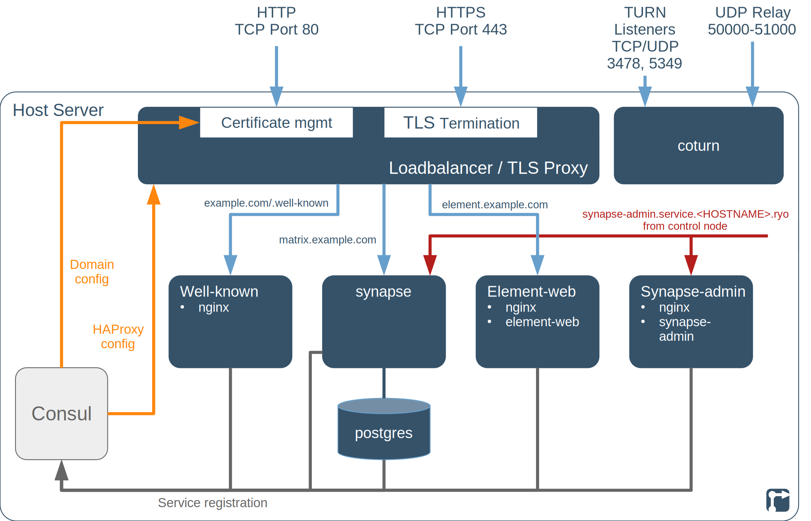
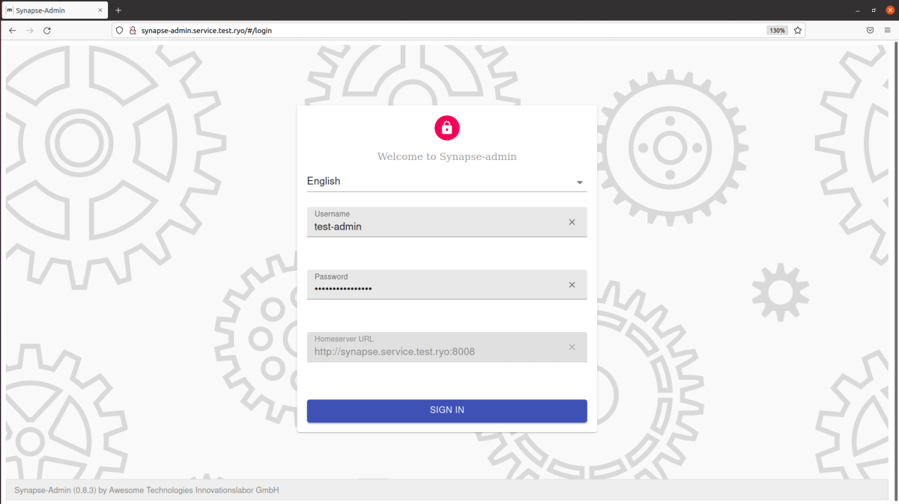
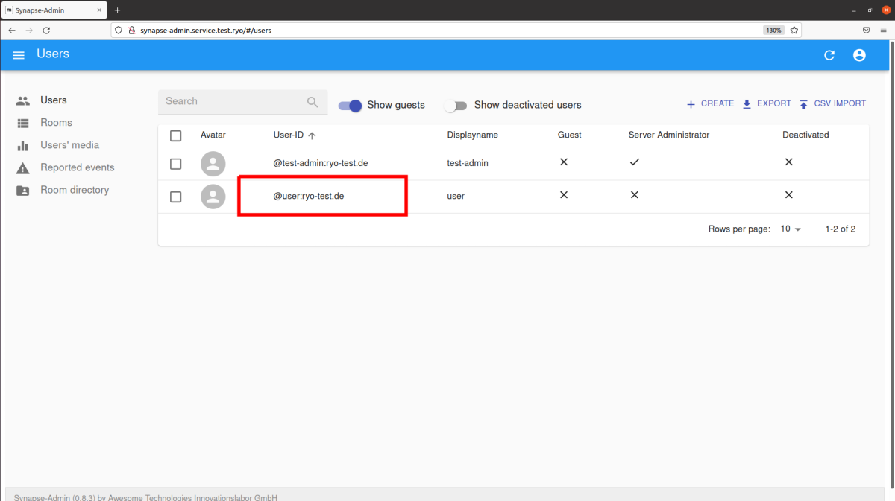
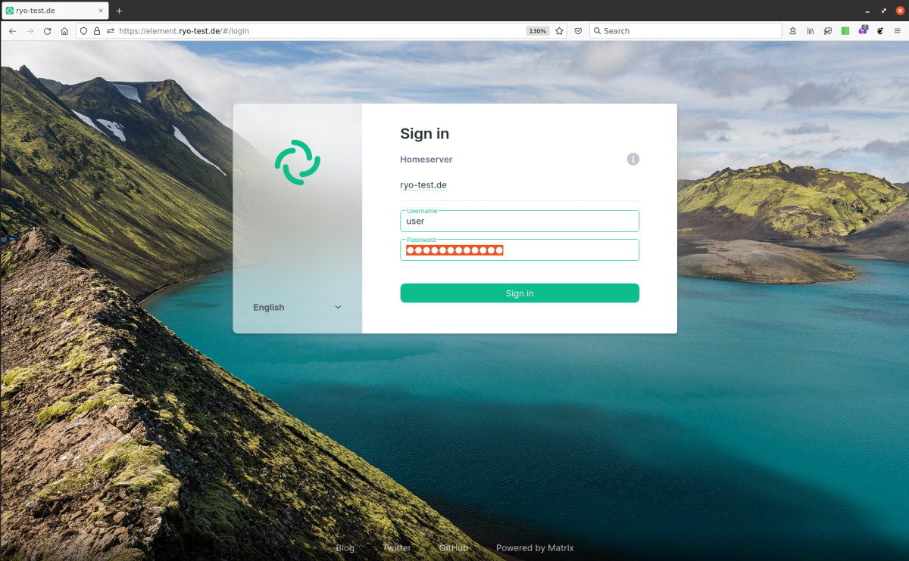
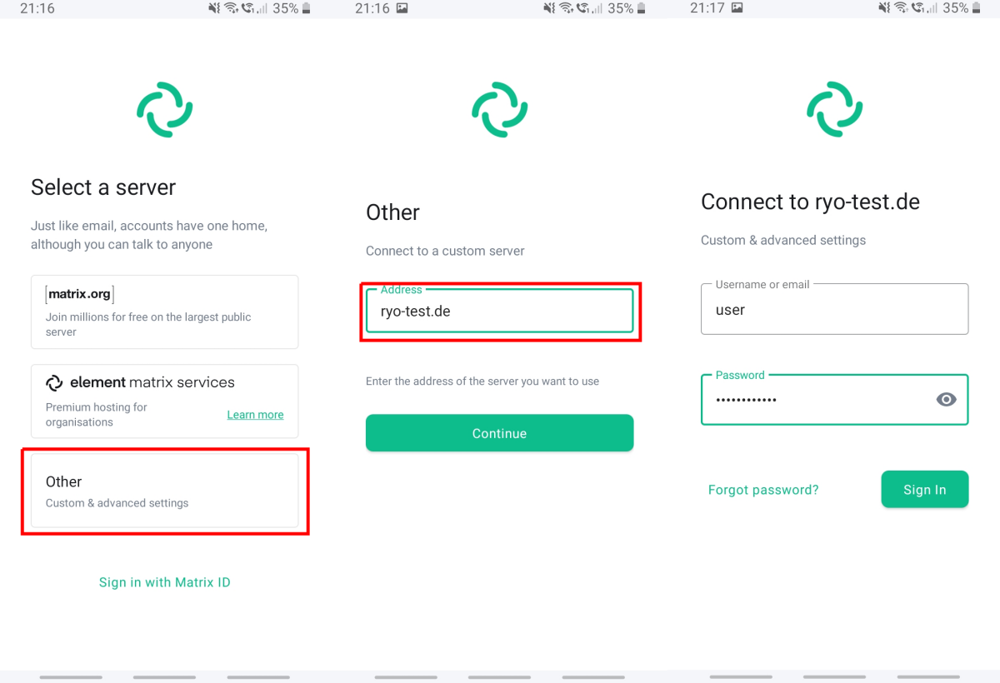
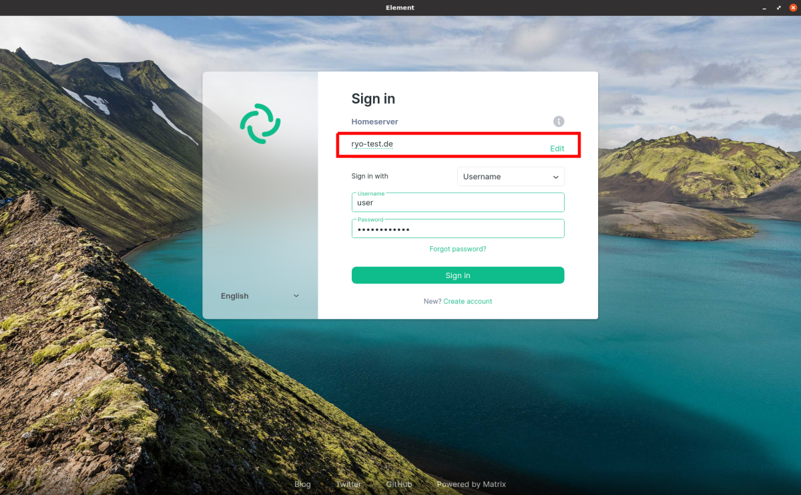
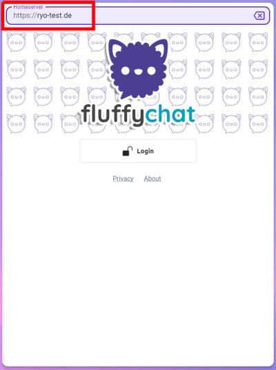

This project deploys a [Synapse](https://github.com/matrix-org/synapse) [matrix](https://matrix.org/) homeserver, an [Element](https://github.com/vector-im/element-web/) web-based front-end and the [synapse-admin](https://github.com/Awesome-Technologies/synapse-admin) application for managing the homeserver.

In addition, the project deploys a number of additional modules: [Certbot](https://certbot.eff.org/) and [HAProxy](https://www.haproxy.org/) for [Let's Encrypt](https://letsencrypt.org/) certificate management and TLS/SSL termination, a [PostgreSQL](https://www.postgresql.org/) database as backend for synapse, a [Coturn](https://github.com/coturn/coturn) TURN server to enable VoIP and a [Well-known server](/rollyourown/project_modules/ryo-wellknown/) for client service discovery and delegation.

<!--more-->

## TODOs on this page



- [ ] Links on the page



## Matrix homeserver project introduction

[Matrix](https://matrix.org/) is an open source, decentralized, federated, end-to-end encrypted messaging and communications system managed by the non-profit [Matrix.org Foundation](https://matrix.org/foundation/).

Similar to email, anybody can run a matrix homeserver and participate in the federated communications network and there is no central point of control of the network. This enables a choice of homeserver providers and the ability to host your own homeserver while still being able to communicate with any other matrix user in the federation.

The matrix communications system enables real-time chat, VoIP, media sharing and other use-cases in a system of public and private "rooms". A room with 2 participants provides a 1-1 chat experience, whereas a multi-participant room provides a collaboration and group communication space.

When a room is created, the room creator may choose to enable end-to-end encryption for the room (with 2-person, 1-1 chat rooms, this is set by default). In a private group chat, end-to-end encryption makes sense, whereas in large public community rooms, it is largely unnecessary. Encryption in the Matrix system is implemented by [olm and megolm](https://gitlab.matrix.org/matrix-org/olm), which are based on the [double ratchet algorithm](https://signal.org/docs/specifications/doubleratchet/) developed for the [Signal messenger](https://signal.org/).


A [control node](/rollyourown/projects/control_node/) with a graphical desktop UI is necessary for this project, since synapse administration endpoints and the synapse-admin web-based administration interface are **not** reachable via the public internet. Users of the matrix homeserver can only be managed via web-browser from the control node.


## Repository links

The [Github](https://github.com/) mirror repository for this project is here: [https://github.com/rollyourown-xyz/ryo-matrix-standalone](https://github.com/rollyourown-xyz/ryo-matrix-standalone)

The [rollyourown.xyz](https://rollyourown.xyz/) repository for this project is here: [https://git.rollyourown.xyz/ryo-projects/ryo-matrix-standalone](https://git.rollyourown.xyz/ryo-projects/ryo-matrix-standalone)

## Dependencies

This project depends on and deploys the following [rollyourown.xyz](https://rollyourown.xyz) modules:

- The [Service Proxy module](/rollyourown/project_modules/ryo-service-proxy/) to provide certificate management by [Certbot](https://certbot.eff.org/) and HTTPS proxying by the [HAProxy](https://www.haproxy.org/) load balancer / TLS proxy

- The [PostgreSQL Database module](/rollyourown/project_modules/ryo-postgres) to provide a performant database backend for the matrix homeserver

- The [Well-known Server module](/rollyourown/project_modules/ryo-wellknown) to support homeserver [discovery](https://github.com/matrix-org/synapse/blob/develop/docs/setup/installation.md#client-well-known-uri) and [delegation](https://github.com/matrix-org/synapse/blob/develop/docs/delegate.md)

- The [STUN/TURN Server module](/rollyourown/project_modules/ryo-coturn) to provide [STUN](https://en.wikipedia.org/wiki/STUN), [TURN](https://en.wikipedia.org/wiki/Traversal_Using_Relays_around_NAT) and [ICE](https://en.wikipedia.org/wiki/Interactive_Connectivity_Establishment) enabling peer-to-peer communication for devices behind a [NAT](https://en.wikipedia.org/wiki/Network_address_translation)

## Project components

The components deployed in this project are shown in the following diagram:

### Host server

The [host server](/rollyourown/projects/host_server/) is controlled from your control machine via a [Wireguard](https://www.wireguard.com/) tunnel and is configured to run a [Consul server](https://www.consul.io/) and the [LXD container runtime](https://linuxcontainers.org/lxd/). Each container deployed performs a specific task in the installation.

Further details about the host server can be found [here](/rollyourown/projects/host_server/).

### Containers

The project installation consists of a number of containers deployed on the host server.

#### Loadbalancer / TLS proxy container

The load balancer / TLS proxy container terminates HTTP and HTTPS connections and distributes traffic to other containers. This component is provided by the [rollyourown.xyz](https://rollyourown.xyz) Service Proxy module and is a key building block for rollyourown.xyz projects. Further details can be found [here](/rollyourown/project_modules/ryo-service-proxy/).

#### Coturn container

The Coturn container provides a STUN/TURN server for enabling peer-to-peer communication between devices behind a NAT gateway. This component is provided by the [rollyourown.xyz](https://rollyourown.xyz) STUN/TURN Server module. Further details can be found [here](/rollyourown/project_modules/ryo-coturn).

#### Well-known container

The well-known container responds to the well-known URIs `https://example.com/.well-known/matrix/client` and `https://example.com/.well-known/matrix/server` to support Matrix homeserver [discovery](https://github.com/matrix-org/synapse/blob/develop/docs/setup/installation.md#client-well-known-uri) and [delegation](https://github.com/matrix-org/synapse/blob/develop/docs/delegate.md). This enables the synapse homeserver to be hosted at `matrix.example.com` while the homeserver name is `example.com` and users can have matrix user IDs `@user:example.com`. This component is provided by the [rollyourown.xyz](https://rollyourown.xyz) Well-known Server module. Further details can be found [here](/rollyourown/project_modules/ryo-wellknown).

#### Postgres container

The Postgres container provides a PostgreSQL relational database as backend for the synapse homeserver container. This component is provided by the [rollyourown.xyz](https://rollyourown.xyz) PostgreSQL Database module. Further details can be found [here](/rollyourown/project_modules/ryo-postgres).

#### Synapse container

The Synapse container provides the Matrix homeserver for the project. [Synapse](https://github.com/matrix-org/synapse) is the de-facto standard open source matrix homeserver implementation. The matrix homeserver serves [client applications](https://matrix.org/clients/) and [federates](https://matrix.org/faq/#what-does-federated-mean%3F) with other matrix homeservers in the distributed Matrix communication system.

#### Element-Web container

The Element-web container hosts a [nginx](https://nginx.org/) web server and the open source [element-web](https://github.com/vector-im/element-web) web-based matrix client application. This provides a web-based client for the matrix service, at the URL `https://element.example.com`, as an alternative front-end to desktop or mobile apps.

#### Synapse-Admin container

The Synapse admin container hosts a [nginx](https://nginx.org/) web server and the open source [synapse-admin](https://github.com/Awesome-Technologies/synapse-admin/) administration front-end for the synapse homeserver. This provides a web-based interface for administering the homeserver (e.g. for managing user accounts).

## How to use this project

### Deploying the project

To deploy the project, follow the generic [project deployment instructions](/rollyourown/projects/how_to_deploy/), using the project's Github mirror repository at [https://github.com/rollyourown-xyz/ryo-matrix-standalone/](https://github.com/rollyourown-xyz/ryo-matrix-standalone/).

### After deployment

#### Creating user accounts

Your first step after deployment will be to create user accounts for using the matrix service.

From the control node, log in to the synapse-admin administration front-end at `http://synapse-admin.service.<HOSTNAME>.ryo` where `<HOSTNAME>` is the name chosen for your host server [during setup](/rollyourown/projects/host_server/). This link will **only work from the control-node**, as the administration front-end is **not** available via the public internet. The administrator username and password were defined in your configuration file during project deployment (as the variables `project_admin_username` and `project_admin_password`).

After login, user accounts can be created from the "+CREATE" button in the "Users" section of synapse-admin. A new user's Matrix ID is of the form `@user:example.com` if the username is `user` and your project domain is `example.com`.

#### Using the web-based front-end

Once user accounts have been created, users can interact with the service via the web-based element-web front-end. If your project domain is `example.com` (specified in your configuration file during project deployment as the variable `project_domain_name`), then the element-web front-end is available at `https://element.example.com`.

#### Using mobile client apps

Users can also interact with the service via various mobile apps. The reference mobile app for matrix is Element, available from [f-droid](https://f-droid.org/app/im.vector.app) or the [Google Play Store](https://play.google.com/store/apps/details?id=im.vector.app) for Android and from the [Apple App Store](https://apps.apple.com/us/app/element/id1083446067) for iOS. Other [clients](https://matrix.org/clients/) are available, with a good alternative being [FluffyChat](https://fluffychat.im/), which provides a user interface more similar to other mobile messaging apps.

Users logging in via a mobile app **must enter your homeserver name** (e.g. `example.com`) before entering their username and password.

#### Using desktop apps

Users can also interact with the service via various [desktop apps](https://matrix.org/clients/). The reference desktop app, supported on Windows, Mac and Linux is [Element Desktop](https://element.io/get-started). Other desktop clients are available, with [FluffyChat](https://fluffychat.im/) being another cross-platform app.

Users logging in via a desktop app **must enter your homeserver name** (e.g. `example.com`) before entering their username and password.

### Maintaining the installation

After deploying the project, the installation needs to be maintained over time as, for example, new versions of the project's components are released.

Maintenance is automated via the rollyourown.xyz project scripts. See [here](/rollyourown/projects/how_to_maintain/) for details.

## Project requirements

Depending on the number of users to be supported, synapse can be quite resource intensive. From experience, a (virtual) server with at least 2 cores, 4GB RAM and 40GB storage is recommended, even for a smaller deployment.

In future, we plan to include [synapse workers](https://matrix-org.github.io/synapse/develop/workers.html) in the project, to enable better resource utilisation.

## Software deployed

The open source components used in this project are:



| Project | What is it? | Homepage | Licence |
| :------ | :---------- | :------- | :------ |
| Certbot | [Let's Encrypt](https://letsencrypt.org/) certificate manager, deployed by the [Service Proxy module](/rollyourown/project_modules/ryo-service-proxy/) | [https://certbot.eff.org/](https://certbot.eff.org/) | [Apache 2.0](https://raw.githubusercontent.com/certbot/certbot/master/LICENSE.txt) |
| Consul | Service registry and key-value store | [https://www.consul.io/](https://www.consul.io/) | [Mozilla Public Licence 2.0](https://github.com/hashicorp/consul/blob/master/LICENSE) |
| Consul-Template | Tool to create dynamic configuration files based on Consul Key-Value store or service registry queries | [https://github.com/hashicorp/consul-template/](https://github.com/hashicorp/consul-template/) | [Mozilla Public Licence 2.0](https://github.com/hashicorp/consul-template/blob/master/LICENSE) |
| Coturn  | [STUN](https://en.wikipedia.org/wiki/STUN) and [TURN](https://en.wikipedia.org/wiki/Traversal_Using_Relays_around_NAT) server, deployed by the [STUN/TURN Server module](/rollyourown/project_modules/ryo-coturn/) | [https://github.com/coturn/coturn](https://github.com/coturn/coturn) | [https://github.com/coturn/coturn/blob/master/LICENSE](https://github.com/coturn/coturn/blob/master/LICENSE) |
| Element-Web | Web-based Matrix client | [https://element.io/](https://element.io/) | [Apache 2.0](https://github.com/vector-im/element-web/blob/develop/LICENSE) |
| HAProxy | Load balancer, TCP and HTTP proxy, deployed by the [Service Proxy module](/rollyourown/project_modules/ryo-service-proxy/) | [https://www.haproxy.org/](https://www.haproxy.org/) | [GPL / LGPL](https://github.com/haproxy/haproxy/blob/master/LICENSE) |
| nginx | Open source webserver for the Element-Web installation | [https://nginx.org/](https://nginx.org/) | [2-clause BSD Licence](http://nginx.org/LICENSE) |
| PostgreSQL | Relational database server, deployed by the [PostgreSQL Database module](/rollyourown/project_modules/ryo-postgres/) | [https://www.postgresql.org/](https://www.postgresql.org/) | [PostgreSQL Licence](https://www.postgresql.org/about/licence/) |
| Synapse | Reference Matrix homeserver implementation by [matrix.org](https://matrix.org/) | [https://matrix-org.github.io/synapse/](https://matrix-org.github.io/synapse/) | [Apache 2.0](https://github.com/matrix-org/synapse/blob/develop/LICENSE) |
| Synapse-Admin | Administration front-end for a Synapse installation | [https://github.com/Awesome-Technologies/synapse-admin/](https://github.com/Awesome-Technologies/synapse-admin/) | [Apache 2.0](https://github.com/Awesome-Technologies/synapse-admin/blob/master/LICENSE) |
| Webhook | Light-weight, general purpose webhook server, deployed by the [Service Proxy module](/rollyourown/project_modules/service_proxy/) | [https://github.com/adnanh/webhook](https://github.com/adnanh/webhook) | [MIT](https://github.com/adnanh/webhook/blob/master/LICENSE) |


