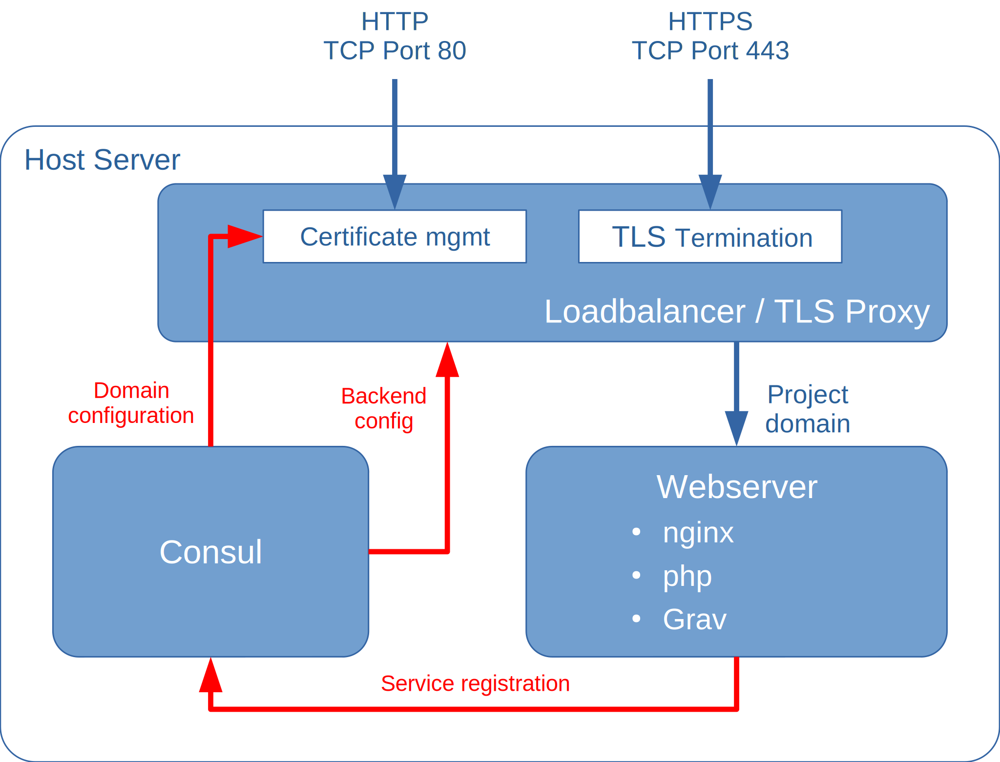

This project deploys a [Grav](https://getgrav.org) flat-file content management system on an [nginx](https://nginx.org/) web server, with [HAProxy](https://www.haproxy.org/) for TLS/SSL termination and [Certbot](https://certbot.eff.org/) for managing your letsencrypt certificate.

<!--more-->

[Grav](https://getgrav.org) is an open source flat-file content management system (CMS), based on PHP, that uses only files and folders and no database for managing content. Grav provides a fast, more lightweight alternative to database-driven CMSs like [Wordpress](https://wordpress.org/) or [Drupal](https://www.drupal.org/), especially for simpler websites and blogs. Content can either be written directly in [Markdown](https://daringfireball.net/projects/markdown/) format and uploaded to the web server or via Grav's [web-based editor](https://learn.getgrav.org/17/admin-panel/page/editor).


A terminal-based [control machine](/rollyourown/tech_building_blocks/control_machine/) is sufficient for this project, as the Grav admin interface is reachable via the public internet.


## TODOs on this page



- [ ] Add screenshots
- [ ] CHECK: Creation of grav user(s) with editor permissions
- [ ] CHECK: Grav web front-end for editing / managing content
- [ ] CHECK: Grav backups
- [ ] Syling for graphic (with shortcode?)



## Repository links

The [rollyourown.xyz](https://rollyourown.xyz/) repository for this project is here: [https://git.rollyourown.xyz/ryo-projects/ryo-grav-cms.git](https://git.rollyourown.xyz/ryo-projects/ryo-grav-cms.git)

The [github](https://github.com/) mirror repository for this project is here: [https://github.com/rollyourown-xyz/ryo-grav-cms.git](https://github.com/rollyourown-xyz/ryo-grav-cms.git)

## Project components

The components deployed in this project are shown in the following diagram:

### Host server

The host server is configured to run [LXD containers](https://linuxcontainers.org/lxd/) and is controlled from your control machine via a [wireguard](https://www.wireguard.com/) tunnel. Each container deployed performs a specific task in the installation.

Further details about the host server building block can be found [here](/rollyourown/tech_building_blocks/host_server/).

### Containers

The project installation consists of a number of containers deployed on the host server.

#### HAProxy and Certbot containers

The HAProxy container terminates HTTP and HTTPS connections and distributes traffic to other containers. For [letsencrypt](https://letsencrypt.org/) TLS/SSL certificate management, traffic is routed to the certbot container. Any other traffic to the project domain is routed to the webserver container.

The certbot container uses the [ACME protocol](https://tools.ietf.org/html/rfc8555) to request and renew [letsencrypt](https://letsencrypt.org/) certificates for the project domain. Certificates are then made available to the HAProxy container to terminate HTTPS requests for the project.

The combination of HAProxy and Certbot containers is a key building block for rollyourown.xyz projects. Further details can be found [here](/rollyourown/tech_building_blocks/load_balancer_tls_proxy/).

#### Webserver container

The webserver container hosts an [nginx](https://nginx.org/) web server, configured according to the [best practices](https://learn.getgrav.org/17/webservers-hosting/servers/nginx) recommended for Grav. Additionally, the [PHP modules](https://learn.getgrav.org/17/basics/requirements#php-requirements) and dependencies required for the Grav CMS and the code for [Grav](https://getgrav.org/) itself are installed with a basic Grav configuration including a pre-provisioned administrator account.

## How to use this project

### Deploying the project

To deploy the project, follow the generic [project deployment instructions](/rollyourown/tech_projects/how_to_deploy/), using the [project's github mirror repository](https://github.com/rollyourown-xyz/ryo-grav-cms/)

### After deployment

For a full overview of how to use [Grav](https://getgrav.org), see the excellent documentation at [https://learn.getgrav.org/](https://learn.getgrav.org/).

For example, your first steps after deployment could be:

- Log in as admin at `https://<your_domain>/admin`

- **TODO:** Create one or more user(s) with editor permissions

- **TODO:** [Add and manage content](https://learn.getgrav.org/17/admin-panel/page), either via the Grav web front-end or manually by adding directories and markdown documents to the host server directory `/var/container-directories/website/` (which is mounted to the webserver as the `/var/www/grav-admin/user/` directory)

- Use Grav's admin interface to change the [theme](https://learn.getgrav.org/17/admin-panel/themes) of the site and add additional [plugins](https://learn.getgrav.org/17/admin-panel/plugins) from the [grav plugin libarary](https://getgrav.org/downloads/plugins).

- **TODO:** Manage site backups, either using Grav's built-in [backup tools](https://learn.getgrav.org/17/advanced/backups) or backing up the host server directory `/var/container-directories/website/` directly

### Maintaining the installation

After deploying the project, the installation needs to be maintained over time as, for example, new versions of the project's components are released.

Maintentance is automated via the rollyourown.xyz project scripts. See [here](/rollyourown/single_server_projects/how_to_maintain/) for details.

## Project requirements

As a flat-file CMS, [Grav](https://getgrav.org) does not need huge resources to run, so that this project can be deployed on smaller, cheaper entry-level virtual servers or home servers.

For example, this project has been successfully deployed on a €2,69/m entry-level Linux VPS with 1 vCore CPU, 2GB RAM and a 20GB SSD. Of course, if you plan to build a larger website or expect to serve large amounts of traffic, a higher-spec VPS would be needed.

## Software deployed

The open source software deployed by the project is:



| Project | What is it? | Homepage | License |
| :------ | :---------- | :------- | :------ |
| Certbot | Open source [letsencrypt](https://letsencrypt.org/) certificate manager | [https://certbot.eff.org/](https://certbot.eff.org/) | [Apache 2.0](https://raw.githubusercontent.com/certbot/certbot/master/LICENSE.txt) |
| Grav | Open source flat-file CMS | [https://getgrav.org/](https://getgrav.org/) | [MIT](https://github.com/getgrav/grav/blob/develop/LICENSE.txt) |
| HAProxy | Open source load balancer, TCP and HTTP proxy | [https://www.haproxy.org/](https://www.haproxy.org/) | [GPL/LGPL](https://github.com/haproxy/haproxy/blob/master/LICENSE) |
| nginx | Open source webserver for the [Grav](https://getgrav.org/) installation | [https://nginx.org/](https://nginx.org/) | [2-clause BSD license](http://nginx.org/LICENSE) |
| Webhook | Open source, light-weight, general purpose webhook server | [https://github.com/adnanh/webhook](https://github.com/adnanh/webhook) | [MIT](https://github.com/adnanh/webhook/blob/master/LICENSE) |


