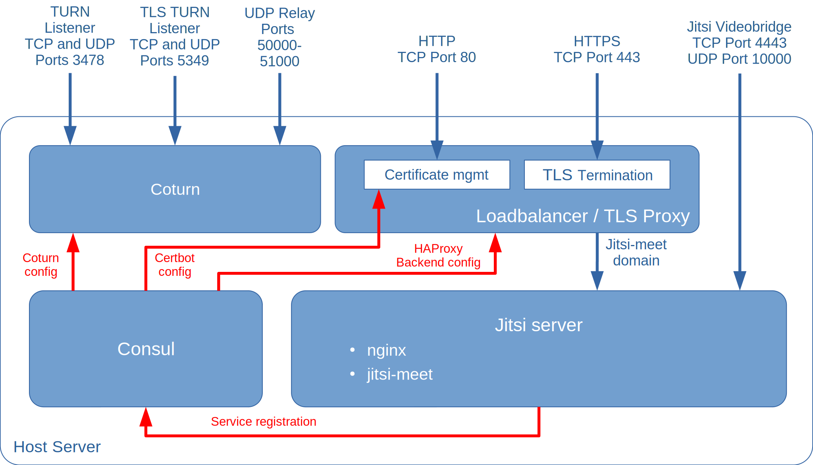

This project deploys a [jitsi](https://jitsi.org/) video conferencing server, together with a [coturn](https://github.com/coturn/coturn) TURN-server, and with [HAProxy](https://www.haproxy.org/) for TLS/SSL termination and [Certbot](https://certbot.eff.org/) for managing your letsencrypt certificates.

<!--more-->

## TODOs on this page



- [ ] Links on the page
- [ ] Add screenshots



[Jitsi](https://jitsi.org/) is set of open source components that together provide a web-based video conferencing solution. The components of a jitsi server are described in the [jitsi documentation](https://jitsi.github.io/handbook/docs/architecture). This project installs an [nginx](https://nginx.org/) web server and uses the [jitsi-meet installer](https://jitsi.github.io/handbook/docs/devops-guide/devops-guide-quickstart#install-jitsi-meet) to install the different jitsi components:

- A [Prosody XMPP server](https://prosody.im/) that jitsi uses for inter-component signalling
- The [jitsi-meet](https://github.com/jitsi/jitsi-meet) WebRTC front-end web application, providing the conference user interface
- The [jitsi videobridge](https://github.com/jitsi/jitsi-videobridge) video stream router
- The [jicofo](https://github.com/jitsi/jicofo) conference focus server, that manages sessions within conferences

Components **not** installed by this project are:

- The [jigasi](https://github.com/jitsi/jigasi) SIP gateway
- The [jibri](https://github.com/jitsi/jibri) broadcasting server

In additiona to the components of the jitsi video conferencing system, the project deploys the [rollyourown.xyz coturn module](/rollyourown/project_modules/turn_server/) to enable [NAT traversal](https://en.wikipedia.org/wiki/NAT_traversal) for conference participants and the [rollyourown.xyz service proxy module](/rollyourown/project_modules/service_proxy/) to provide TLS termination and certificate management.


A terminal-based [control machine](/rollyourown/tech_building_blocks/control_machine/) is sufficient for this project, as the jitsi conferencing server is configurable only via command line.


## Repository links

The [github](https://github.com/) mirror repository for this project is here: [https://github.com/rollyourown-xyz/ryo-jitsi](https://github.com/rollyourown-xyz/ryo-jitsi)

The [rollyourown.xyz](https://rollyourown.xyz/) repository for this project is here: [https://git.rollyourown.xyz/ryo-projects/ryo-jitsi](https://git.rollyourown.xyz/ryo-projects/ryo-jitsi)

## Project components

The components deployed in this project are shown in the following diagram:



### Host server

The host server is configured to run [LXD containers](https://linuxcontainers.org/lxd/) and is controlled from your control machine via a [wireguard](https://www.wireguard.com/) tunnel. Each container deployed performs a specific task in the installation.

Further details about the host server building block can be found [here](/rollyourown/tech_building_blocks/host_server/).

### Containers

The project installation consists of a number of containers deployed on the host server.

#### A

ABC

#### B

ABC

## How to use this project

### Deploying the project

To deploy the project, follow the generic [project deployment instructions](/rollyourown/tech_projects/how_to_deploy/), using the [project's github mirror repository](https://github.com/rollyourown-xyz/ryo-jitsi/)

### After deployment

For a full overview of how to use ... , see the excellent documentation at ....

For example, your first steps after deployment could be:

- A

- B

- C

#### User Management in Jitsi

Jitsi not open for anyone on internet.
User accounts necessary to start conferences.
Use accounts can be configured via the command line from the control node:

Add user:

```bash
lxc exec <HOST_ID>:<HOST_ID>-ryo-jitsi-jitsi -- prosodyctl register <USERNAME> <DOMAIN> <PASSWORD>
```

Delete user:

```bash
lxc exec <HOST_ID>:<HOST_ID>-ryo-jitsi-jitsi -- prosodyctl deluser <USERNAME>@<DOMAIN>
```

Change user's password:

```bash
lxc exec <HOST_ID>:<HOST_ID>-ryo-jitsi-jitsi -- prosodyctl passwd <USERNAME>@<DOMAIN>
```

### Maintaining the installation

After deploying the project, the installation needs to be maintained over time as, for example, new versions of the project's components are released.

Maintentance is automated via the rollyourown.xyz project scripts. See [here](/rollyourown/single_server_projects/how_to_maintain/) for details.

## Project requirements

ABC

## Software deployed

The open source software deployed by the project is:



| Project | What is it? | Homepage | License |
| :------ | :---------- | :------- | :------ |
| TODO | TODO | TODO | TODO |
| TODO | TODO | TODO | TODO |


