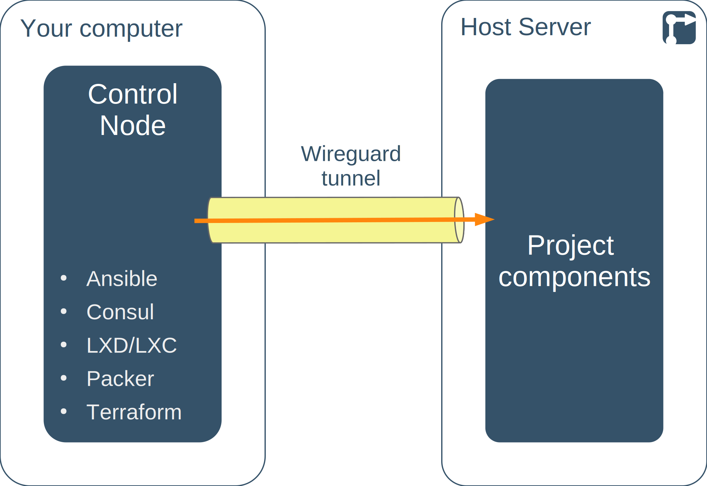

<!--
SPDX-FileCopyrightText: 2022 Wilfred Nicoll <xyzroller@rollyourown.xyz>
SPDX-License-Identifier: CC-BY-SA-4.0
-->

A control node is needed for executing automation scripts that set up a [host server](/rollyourown/how_to_use/host_server), build container images for the project and deploy the containers and services on the host server. A control node can be used to deploy multiple projects, or you can use a dedicated control node per project.

<!--more-->

## Control node introduction

To prevent the settings, software and configuration needed for the control node from interfering or otherwise conflicting with the software and configuration of your local computer, a rollyourown control node should be set up in a [virtual machine](https://en.wikipedia.org/wiki/Virtual_machine) on your computer, or on a completely separate, dedicated computer (such as an Intel [NUC](https://en.wikipedia.org/wiki/Next_Unit_of_Computing), an old laptop or a desktop computer). This keeps the rollyourown configuration separate from other software installed on your computer and also ensures that automation scripts and configuration of the control node are not affected by system upgrades or other software installed on the host computer. This also allows us to develop and test the rollyourown configuration scripts and guides for a single operating system (currently Ubuntu 22.04 LTS).

Except for the very first configuration steps for the host server, which are carried out over a plain SSH connection to the host server's public IP address, the control node interacts with the host server via a [wireguard](https://www.wireguard.com/) tunnel. This tunnel provides a permanent, encrypted connection to the host server and enables all communication between control node and host server to run via private IP address ranges.



Other than SSH and wireguard, the following software is installed on the control node:

- [Ansible](https://www.ansible.com/): For automating the configuration of control node, host server and of the container images used in a rollyourown project
- [Consul](https://www.consul.io/): To provide service discovery for accessing project component administrative interfaces after deployment
- [Pacḱer](https://www.packer.io/): For building the container images for each component of a rollyourown project
- [LXD/LXC](https://linuxcontainers.org/lxd/): The container runtime for building container images to be deployed on the host server
- [Terraform](https://www.terraform.io/): For automating the deployment of a rollyourown project

A single control node can manage multiple rollyourown project deployments on multiple host servers. Alternatively, a dedicated control node can be run for each host server, with the applicable control node started when the projects on a particular host server need to be managed or administered.

## Repository links

The [Codeberg](https://codeberg.org/) mirror repository for the control node automation scripts is here: [https://codeberg.org/rollyourown-xyz/ryo-control-node](https://codeberg.org/rollyourown-xyz/ryo-control-node)

The [Github](https://github.com/) mirror repository for the control node automation scripts is here: [https://github.com/rollyourown-xyz/ryo-control-node](https://github.com/rollyourown-xyz/ryo-control-node)

The rollyourown repository for the control node automation scripts is here: [https://git.rollyourown.xyz/ryo-projects/ryo-control-node](https://git.rollyourown.xyz/ryo-projects/ryo-control-node) (not publicly accessible)

## Control node system requirements

A control node needs only a basic operating system installed and the software installed by our automation code is lightweight. Therefore, the minimum system requirements for a control node match the minimum system requirements for a Ubuntu 22.04 LTS based distribution.

For example, for [xubuntu](https://xubuntu.org), the [recommended minimum system requirements](https://xubuntu.org/requirements/) are a 1.5GHz dual-core Intel or AMD 64-bit processor with 2GB memory and 20GB hard disk space.

For the standard [Ubuntu desktop](https://ubuntu.com/download/desktop), the [recommended minimum system requirements](https://help.ubuntu.com/community/Installation/SystemRequirements) are a 2 GHz dual core processor with 4 GB RAM and 25 GB hard-drive space.



For most rollyourown projects, a control node with a graphical desktop is needed. Project component administrative interfaces, typically accessible via web browser, are only accessible via the wireguard tunnel between control node and host server, ensuring that these interfaces are not exposed on the public internet.

Even if the first project deployed does not require a control node with a graphical desktop, it is recommended to choose one so that the control node can later be used for other projects that do require a graphical interface. Alternatively, each project can be managed from a separate control node.



## Control node setup

The steps for setting up a control node depend on your computer's operating system. The following sections describe the setup for [Windows](#control-node-setup-windows), [Linux](#control-node-setup-linux) and [MacOS](#control-node-setup-macos).

Once you have chosen and installed your virtual machine environment, install Ubuntu 22.04 LTS (desktop version is recommended) in a virtual machine as described in the relevant hypervisor documentation.

### Control node setup: Linux

A control node can be run in a virtual machine on a Linux computer. There are a number of ways to run virtual machines on Linux, such as:

- [KVM](https://www.linux-kvm.org/), the native Linux kernel hypervisor, which can be managed with
  - [Multipass](https://multipass.run/), a lightweight, command-line VM launcher, **only for terminal-based control nodes with no graphical interface**
  - [Gnome Boxes](https://wiki.gnome.org/Apps/Boxes), a simple desktop GUI VM manager
  - [virt-manager](https://virt-manager.org/), a more advanced desktop GUI VM manager
- [VirtualBox](https://www.virtualbox.org/)
- [VMware Workstation Player](https://www.vmware.com/products/workstation-player/workstation-player-evaluation.html) - free only for non-commercial, personal and home use

### Control node setup: Windows

A control node can be run in a virtual machine on a Windows computer. There are a number of ways to run virtual machines on Windows, depending on your Windows version, such as:

- [Hyper-V](https://docs.microsoft.com/en-us/virtualization/hyper-v-on-windows/), available in Windows 10 Enterprise, Pro, or Education versions, which can be managed from the Windows UI or, for **terminal-based control nodes with no graphical interface** using [Multipass](https://multipass.run/), a lightweight, command-line VM launcher
- [VirtualBox](https://www.virtualbox.org/)



On Windows 10, testing has shown that the free, personal, non-commercial use version of [VMware Workstation Player](https://www.vmware.com/products/workstation-player/workstation-player-evaluation.html) **does not work** with rollyourown due to networking issues for containers within a virtual machine preventing the image build process from succeeding. These problems *may* be solved with the VMWare Player Pro version by setting promiscuous mode on virtual network bridge, but we have been unable to test this. If you can verify this and provide step-by-step instructions how to solve these issues, please [contribute](/collaborate).



### Control node setup: MacOS



We have currently been unable to test any of the macOS-based virtual machine options for compatibility with a rollyourown control node and scripts. [Please consider contributing](/collaborate) if you can help us with this.



A control node can be run in a virtual machine on an Apple computer. There are a number of ways to run virtual machines on macOS, such as:

- [Multipass](https://multipass.run/), a lightweight, command-line VM launcher using the macOS native hypervisor, **only for terminal-based control nodes with no graphical interface**
- [VirtualBox](https://www.virtualbox.org/)
- [VMware Fusion](https://www.vmware.com/products/fusion.html) - free only for non-commercial, personal and home use

### Control node setup on a dedicated machine



Currently, only the x86 or amd64 architectures are supported (for control machine and host server). This means, for example, that a Raspberry Pi cannot be used as a control node. Even though all control node software can be installed, container images built on an ARM architecture will not run on an x86/amd64 host server.



A control node can be run on a dedicated computer running Ubuntu 22.04 LTS. This could, for example, be an old Laptop or desktop computer, an [Intel NUC](https://www.intel.com/content/www/us/en/products/boards-kits/nuc.html) or other mini PC or barebones computer. Prerequisite is that the computer is running a Ubuntu 22.04 based desktop environment or, **for terminal-based control nodes with no graphical interface**, [Ubuntu 22.04 server](https://ubuntu.com/download/server).

## Automated control node configuration

Once a [control node is up and running with Ubuntu 22.04 LTS](#control-node-setup), the control node needs to be configured and software needs to be installed to run your rollyourown project automation scripts. This software installation and configuration is itself automated.



During setup of Ubuntu 22.04 LTS, you will typically have been asked to specify a username and password for a non-root user. In some cases, Ubuntu is already pre-setup with the non-root user `ubuntu`, typically with password `ubuntu`. This non-root user account should be used for executing the rollyourown scripts. The user-name and password need to be entered in the "Local user configuration" section of the `configuration.yml` file (Step 5 below) for the control-node configuration scripts to run.



### Step-by-step control node setup

1. Log in to the control node as the non-root user, upgrade the system and then reboot to apply any system changes:

    ```bash
    sudo apt update && sudo apt upgrade -y
    sudo reboot -n
    ```

2. Log back in to the control node as the non-root user and install `ansible`, `ansible-core`, `python3-packaging`, `python3-distutils`, `git` and `nano`:

    ```bash
    sudo apt install software-properties-common
    sudo apt-add-repository --yes --update ppa:ansible/ansible
    sudo apt install ansible ansible-core python3-packaging python3-distutils git nano -y
    ```

3. Log in to the control node as the non-root user, create a working directory, enter the directory and clone the **control node repository** to your control node:

    ```bash
    mkdir ~/ryo-projects
    cd ~/ryo-projects
    git clone https://github.com/rollyourown-xyz/ryo-control-node
    ```

4. In the `ryo-control-node` directory, copy the file `configuration/configuration_TEMPLATE.yml` to a new file `configuration/configuration.yml`

    ```bash
    cd ~/ryo-projects/ryo-control-node
    cp configuration/configuration_TEMPLATE.yml configuration/configuration.yml
    ```

5. Edit the new file `configuration.yml` and add the non-root username and password on the control node. If you aren't familiar with a different linux editor, use nano to edit the file:

    ```bash
    cd ~/ryo-projects/ryo-control-node
    nano configuration/configuration.yml
    ```

6. Run the control node setup automation script `local-setup.sh` from the `ryo-control-node` directory to prepare the control node and its secure connection to the host server:

    ```bash
    cd ~/ryo-projects/ryo-control-node/
    ./local-setup.sh
    ```

7. After running the local-setup script, **reboot the control node**. This is a prerequisite for running the project automation scrips.

After setting up the control node, you are ready to clone the project repository and run the automation scrips to set up the host server, build images and deploy the project.



The `local-setup.sh` script prepares the control node for managing project deployments. This script simply calls an [Ansible](https://www.ansible.com/) playbook that executes tasks on the control node itself.

In detail, the following tasks are performed by the local-setup playbook:

- SSH keys are generated on the control node so that [Ansible](https://www.ansible.com/) can log in securely to the host server and execute the commands triggered in the `host-setup-sh` step

- A Certificate authority is set up on the Control Node for signing host SSL certificates in later steps

- [Wireguard](https://www.wireguard.com/) is installed on the control node. A wireguard tunnel is used for the majority of the provisioning commands triggered in the `host-setup.sh` step as well as for uploading container images to the host (in the `build-images.sh` step) and deploying the project (in the `deploy-project.sh` step). The wireguard tunnel is also be used for admin access from the control node to various remote project components, so that admin interfaces do not need to be exposed on the open internet

- [LXD](https://linuxcontainers.org/lxd/) is installed on the control node to support the build process for LXD container images (in the `build-images.sh` step) and provide the mechanism for uploading them to the host server. Snapd channel pinning is used to avoid unexpected upgrading in a running project

- [Packer](https://www.packer.io/) is installed on the control node to build the container images for each project component (in the `build-images.sh` step) and upload them to the host server

- [Terraform](https://www.terraform.io/) is installed on the control node to deploy the project to the host server

- [Consul](https://www.consul.io/) is installed to support service discovery of project component administration interfaces after deployment



## Control node maintenance

The `local-setup.sh` control node setup automation script can also be used to upgrade a control node and the software installed on it. To upgrade a control node, run the script again from the `ryo-control-node` directory:

```bash
cd ~/ryo-projects/ryo-control-node/
./local-setup.sh
```

Always **reboot the control node** after upgrading.

## Control node backup

It is recommended to back up your control node. With a control node in a virtual machine, use the snapshot / backup features of your chosen virtualisation technology.

## Control node deletion



After a project is deployed, the control node for the project is used to keep the project's applications up to date. Therefore, the control node may be shut down but **should not be deleted** until all projects on a host server are no longer needed. It is recommended to back up the control node VM (see the relevant online documentation for the hypervisor technology you are using for the control node) at least after deployment or after updates to the deployed project.



## Control node using WSL or container technology on Linux



If you consider running a control node on [Windows Subsystem for Linux (WSL)](https://docs.microsoft.com/en-us/windows/wsl/about) or as an [LXD container](https://linuxcontainers.org/lxd/) on Linux, please be aware that **this is currently unsupported**, due to limitations of the two technologies:

- In WSL, missing systemd functionality prevents the wireguard interface from starting automatically and prevents snapd from working which in turn prevents the installation of LXD via snap
- With LXD containers, container nesting prevents the control node from working correctly for some projects. One of the roles of a control node is to build container images, which is done on the control node using LXD containers. The rollyourown image building playbooks do not always work reliably with nested containers

It is our goal to eventually support a control node running as a WSL app on Windows or as an LXD container on Linux, to provide a simple and fast setup of a control node. We will revisit this if and when the technologies have been updated to resolve these problems.

If you have successfully used rollyourown automation code on either of these two technologies, please [contact us](/about/contact).


