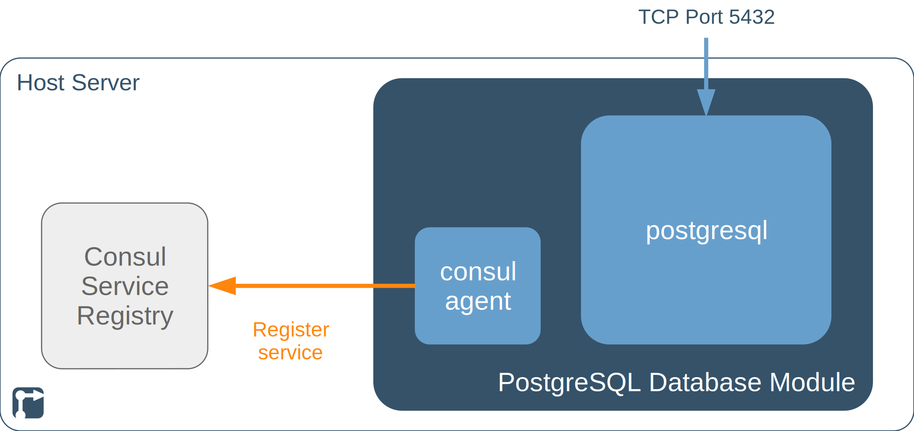

The PostgreSQL Database module is a re-usable module for other [rollyourown.xyz](https://rollyourown.xyz) projects. The module provides a PostgreSQL relational database server.

<!--more-->

## TODOs on this page



- [ ] Links in text



## Introduction

This module deploys [PostgreSQL](https://www.postgresql.org/). [PostgreSQL](https://www.postgresql.org/) is an open source, object-relational database system.

## Repository links

The [Codeberg](https://codeberg.org/) mirror repository for this module is here: [https://codeberg.org/rollyourown-xyz/ryo-postgres](https://codeberg.org/rollyourown-xyz/ryo-postgres)

The [Github](https://github.com/) mirror repository for this module is here: [https://github.com/rollyourown-xyz/ryo-postgres](https://github.com/rollyourown-xyz/ryo-postgres)

The [rollyourown.xyz](https://rollyourown.xyz/) repository for this project is here: [https://git.rollyourown.xyz/ryo-projects/ryo-postgres](https://git.rollyourown.xyz/ryo-projects/ryo-postgres) (not publicly accessible)

## Dependencies

This module has no dependencies.

## Module components

This project module deploys a container with multiple services as shown in the following diagram:



The PostgreSQL database module contains two applications, together providing a postgresql database server to be used in other [rollyourown.xyz](https://rollyourown.xyz) projects.

### PostgreSQL

The postgresql application is deployed from the [postgresql.org](https://www.postgresql.org/) repositories, a postgres user password is set and the database server configured to accept connections from the internal network on the host server. Furthermore, log in from the control node is enabled so that further databases and users can be provisioned by terraform scripts from the control node as part of [rollyourown.xyz](https://rollyourown.xyz) project deployment.

### Consul

A Consul agent is deployed on the PostgreSQL database module and joins the Consul server on the host in client mode. The Consul agent registers postgres as a service in the Consul service registry, so that other containers can discover its internal network IP address.

## How to deploy this module in a project or module

The [repository for this module](https://github.com/rollyourown-xyz/ryo-postgres) contains a number of resources for including the module in a [rollyourown.xyz](https://rollyourown.xyz) project. The steps for including the module are:

1. Add the PostgreSQL Database module to the `get-modules.sh` script in the project:

    ```bash
    # PostgreSQL Database module
    if [ -d "../ryo-postgres" ]
    then
       echo "Module ryo-postgres already cloned to this control node"
    else
       echo "Cloning ryo-postgres repository. Executing 'git clone' for ryo-postgres repository"
       git clone https://github.com/rollyourown-xyz/ryo-postgres ../ryo-postgres 
    fi
    ```

2. Add the PostgreSQL Database module to the project's `host-setup.sh` script:

    ```bash
    # Module-specific host setup for ryo-postgres
    if [ -f ""$SCRIPT_DIR"/../ryo-postgres/configuration/"$hostname"_playbooks_executed" ]
    then
       echo "Host setup for ryo-postgres module has already been done on "$hostname""
       echo ""
    else
       echo "Running module-specific host setup script for ryo-postgres on "$hostname""
       echo ""
       "$SCRIPT_DIR"/../ryo-postgres/host-setup.sh -n "$hostname"
    fi
    ```

3. Add the PostgreSQL Database module to the project's `build-images.sh` script:

    ```bash
    # Build ryo-postgres module images if -m flag is present
    if [ $build_modules == 'true' ]
    then
       echo "Running build-images script for ryo-postgres module on "$hostname""
       echo ""
       "$SCRIPT_DIR"/../ryo-postgres/build-images.sh -n "$hostname" -v "$version"
    else
       echo "Skipping image build for modules"
       echo ""
    fi
    ```

4. Add the PostgreSQL Database module to the `deploy-project.sh` script in the project:

    ```bash
    # Deploy ryo-postgres if -m flag is present
    if [ $deploy_modules == 'true' ]
    then
       echo "Deploying ryo-postgres module on "$hostname" using images with version "$version""
       echo ""
       "$SCRIPT_DIR"/../ryo-postgres/deploy-module.sh -n "$hostname" -v "$version"
       echo ""
    else
       echo "Skipping modules deployment"
       echo ""
    fi
    ```

## How to use this module in a project

A project component needing a PostgreSQL database needs to be configured to discover and access the postgresql database provided by this module.

### Image configuration

To connect to the PostgreSQL database server, an application needs to be able to communicate with the server. The database server is registered in the Consul service registry with the name `postgres` and the (dynamic, private) IP address of the server is available to the connecting application via the DNS name `postgres.service.ryo` via a Consul agent deployed with the application.

The [ryo-project-template repository](https://github.com/rollyourown-xyz/ryo-project-template) includes Ansible roles for deploying and configuring the Consul agent:

- The role `install-consul` installs the consul agent
- The role `set-up-consul` configures the consul agent to join the Consul server running on the host and enable local application name resolution via Consul
- The role `set-up-firewall` configures IP tables rules to map DNS port 53 to the local Consul listening port

The project application configuration can then include the DNS name `postgres.service.ryo` in its database configuration.



As an example, the database configuration for the matrix-synapse service component in the [ryo-matrix-standalone](https://github.com/rollyourown-xyz/ryo-matrix-standalone) project includes the configuration:

```yaml
database:
  ...
  args:
    ...
    host: "postgres.service.ryo"
    port: "5432"
    ...
```



### General deployment configuration

Configuration of postgresql databases and database users is done during the project deployment step.

#### Terraform configuration for provisioning PostgreSQL

During a rollyourown.xyz project deployment, the terraform [postgresql provider](https://registry.terraform.io/providers/cyrilgdn/postgresql/latest/) is used to provision databases and database users to the postgresql module.

To enable this, the postgresql container's IP address must be made available within the project's terraform code. This is done by adding a remote data source for the module and a Terraform variable for the postgresql container's IP address on the host:

```tf
data "terraform_remote_state" "ryo-postgres" {
  backend = "local"
  config = {
    path = join("", ["${abspath(path.root)}/../../ryo-postgres/module-deployment/terraform.tfstate.d/", var.host_id, "/terraform.tfstate"])
  }
}

locals {
  postgres_ip_address = data.terraform_remote_state.ryo-postgres.outputs.postgres_ip_address
}
```

The PostgreSQL Database module uses the 'postgres' user to provision databases and users to the postgresql database for use by project components. The 'postgres' user password for the PostgreSQL database is generated when building the postgresql container image and is stored in the file `/ryo-projects/ryo-postgres/configuration/postgres_user_password_<HOST_ID>.yml` on the control node.

To use this secret in configuring the postgresql provider, the user password needs to be added as a terraform variable. This is done by adding the following to the project's terraform files:

```tf
# PostgreSQL module variables
locals {
  postgres_user_password_file = join("", [ "${abspath(path.root)}/../../ryo-postgres/configuration/postgres_user_password_", var.host_id, ".yml" ])
  postgres_user_password      = sensitive(yamldecode(file(local.postgres_user_password_file))["postgres_user_password"])
}
```

Then the postgresql provider is added to the project's terraform configuration:

```tf
terraform {
  required_version = ">= 0.15"
  required_providers {
    lxd = {
      source  = "terraform-lxd/lxd"
      version = "~> 1.5.0"
    }
    postgresql = {
      source = "cyrilgdn/postgresql"
      version = ">= 1.14.0"
    }
  }
}
```

Finally, the IP address variable and `postgres_user_password` variable are used to configure the provider:

```tf
provider "postgresql" {
  host            = local.postgres_ip_address
  port            = 5432
  database        = "postgres"
  username        = "postgres"
  password        = local.postgres_user_password
  sslmode         = "disable"
  connect_timeout = 15
}
```

#### Terraform modules for provisioning PostgreSQL

The PostgreSQL module repository includes a terraform module `deploy-postgres-db-and-user` for provisioning databases and database users to the postgresql server.

For example:

```tf
module "deploy-COMPONENT-database-and-user" {
  source = "../../ryo-postgres/module-deployment/modules/deploy-postgres-db-and-user"

  postgres_db_name           = "COMPONENT"
  postgres_db_owner          = "COMPONENT_user"
  postgres_db_owner_password = local.postgres_COMPONENT_user_password
  postgres_db_template       = "template0"
  postgres_db_encoding       = "UTF8"
  postgres_db_lc_collate     = "C"
  postgres_db_lc_type        = "C"
}
```

## Software deployed

The open source components deployed by this module are:



| Project | What is it? | Homepage | License |
| :------ | :---------- | :------- | :------ |
| Consul | Service registry and key-value store | [https://www.consul.io/](https://www.consul.io/) | [MPL 2.0](https://github.com/hashicorp/consul/blob/master/LICENSE) |
| PostgreSQL | Relational database system | [https://www.postgresql.org/](https://www.postgresql.org/) | [PostgreSQL License](https://www.postgresql.org/about/licence/) |


