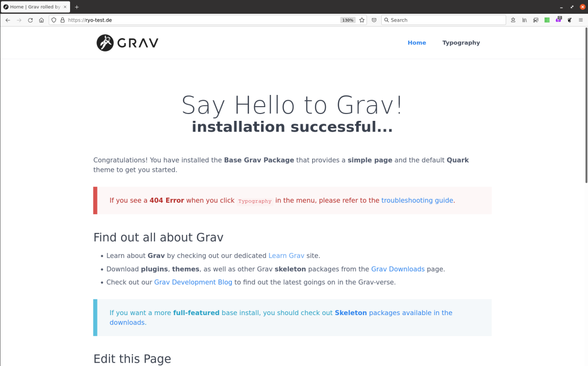
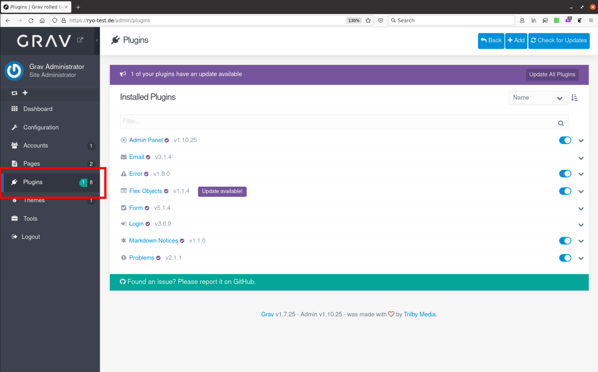
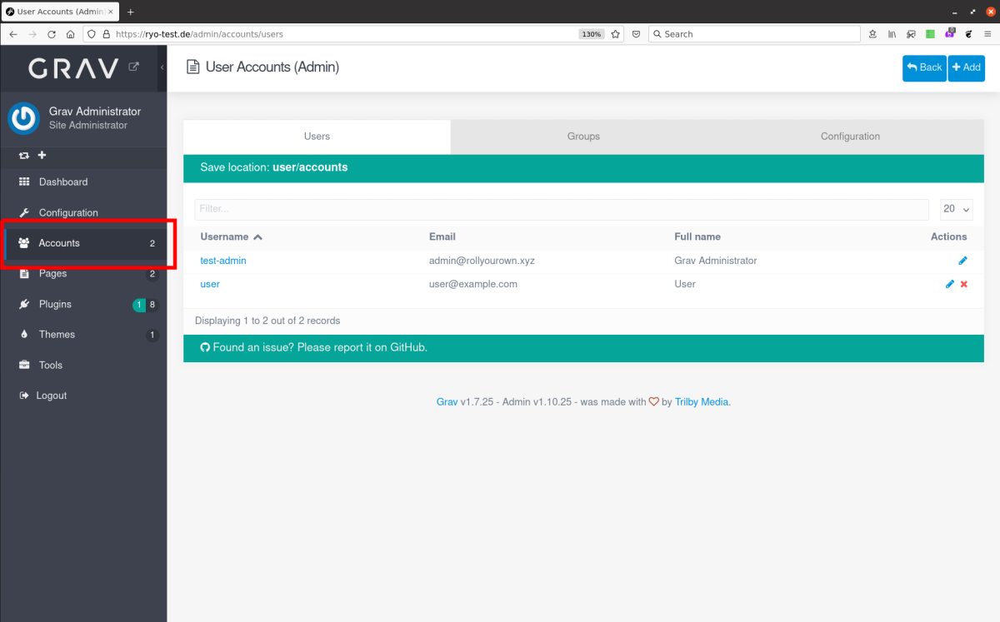
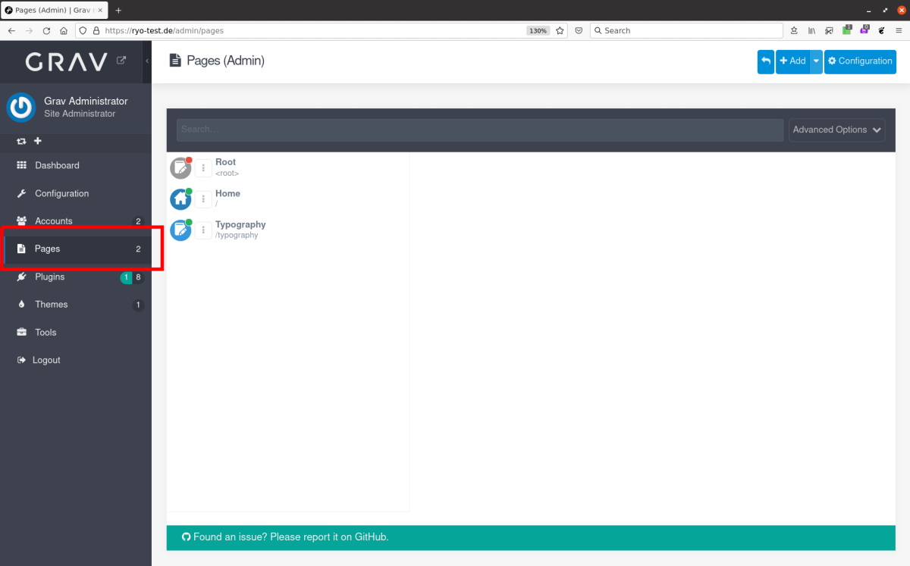
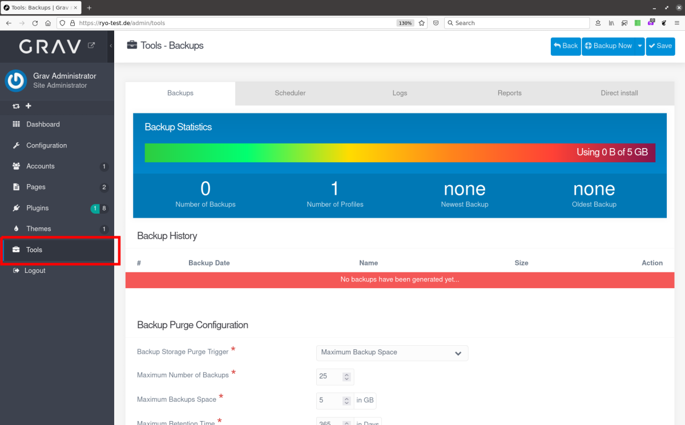

<!--
SPDX-FileCopyrightText: 2022 Wilfred Nicoll <xyzroller@rollyourown.xyz>
SPDX-License-Identifier: CC-BY-SA-4.0
-->

This project deploys a [Grav](https://getgrav.org) flat-file content management system on an [nginx](https://nginx.org/) web server, with [HAProxy](https://www.haproxy.org/) for TLS/SSL termination and [Certbot](https://certbot.eff.org/) for managing your [Let's Encrypt](https://letsencrypt.org/) certificate.

<!--more-->

## Grav CMS project introduction

[Grav](https://getgrav.org) is an open source flat-file content management system (CMS), based on PHP, that uses only files and folders for managing content and no database. Grav provides a fast, more lightweight alternative to database-driven CMSs like [Wordpress](https://wordpress.org/) or [Drupal](https://www.drupal.org/), especially for simpler websites and blogs. Content is written in [Markdown](https://daringfireball.net/projects/markdown/) format and can be created/edited via Grav's [web-based editor](https://learn.getgrav.org/17/admin-panel/page/editor), uploaded to the server (e.g. via [SFTP](https://en.wikipedia.org/wiki/SSH_File_Transfer_Protocol)) or [synchronised from a git repository](#synchronise-with-a-git-repository).


A [control node](/rollyourown/projects/control_node/) without a graphical desktop UI is sufficient for this project, as the Grav admin interface is reachable via the public internet.


## Repository links

The [Codeberg](https://codeberg.org/) mirror repository for this project is here: [https://codeberg.org/rollyourown-xyz/ryo-grav-cms](https://codeberg.org/rollyourown-xyz/ryo-grav-cms)

The [Github](https://github.com/) mirror repository for this project is here: [https://github.com/rollyourown-xyz/ryo-grav-cms](https://github.com/rollyourown-xyz/ryo-grav-cms)

The [rollyourown.xyz](https://rollyourown.xyz/) repository for this project is here: [https://git.rollyourown.xyz/ryo-projects/ryo-grav-cms](https://git.rollyourown.xyz/ryo-projects/ryo-grav-cms) (not publicly accessible)

## Dependencies

This project depends on and deploys the [rollyourown.xyz](https://rollyourown.xyz) [Ingress Proxy](/rollyourown/project_modules/ryo-ingress-proxy/) module to provide certificate management by [Certbot](https://certbot.eff.org/) and HTTPS proxying by the [HAProxy](https://www.haproxy.org/) loadbalancer / TLS proxy.

## Project components

The components deployed in this project are shown in the following diagram:



### Host server

The [host server](/rollyourown/projects/host_server/) is controlled from your control machine via a [Wireguard](https://www.wireguard.com/) tunnel and is configured to run a [Consul server](https://www.consul.io/) and the [LXD container runtime](https://linuxcontainers.org/lxd/). Each container deployed performs a specific task in the installation.

Further details about the host server building block can be found [here](/rollyourown/projects/host_server/).

### Containers

The project installation consists of a number of containers deployed on the host server.

#### Ingress proxy container

The ingress proxy container terminates HTTP and HTTPS connections and distributes traffic to other containers. This component is provided by the [rollyourown.xyz](https://rollyourown.xyz) Ingress Proxy module and is a key building block for rollyourown.xyz projects. Further details can be found [here](/rollyourown/project_modules/ryo-ingress-proxy/).

#### Webserver container

The webserver container hosts an [nginx](https://nginx.org/) web server, configured according to the [best practices](https://learn.getgrav.org/17/webservers-hosting/servers/nginx) recommended for Grav. Additionally, the [PHP modules](https://learn.getgrav.org/17/basics/requirements#php-requirements) and dependencies required for the Grav CMS, and the code for [Grav](https://getgrav.org/) itself, are installed with a basic Grav configuration including a pre-provisioned administrator account.

## How to use this project

### Deploying the project

To deploy the project, follow the generic [project deployment instructions](/rollyourown/projects/how_to_deploy/), using the project's [mirror repositories](#repository-links).

### After deployment

For a full overview of how to use [Grav](https://getgrav.org), see the excellent documentation at [https://learn.getgrav.org/](https://learn.getgrav.org/).

After first-time deployment, the standard Grav welcome page will be available at the domain configured in the project's configuration file.

After deployment, next steps are described in the following sections.

#### Log in as administrator and configure the site

Log in using the pre-configured project administrator account at `https://<your_domain>/admin`. The administrator account's username and password are defined in your configuration file (as the variables `project_admin_username` and `project_admin_password`).

After login, the site can be configured from the "Configuration" option on the admin [dashboard](https://learn.getgrav.org/admin-panel/dashboard).

#### Install themes

The site's [theme](https://learn.getgrav.org/admin-panel/themes) can be changed from the "Themes" option on the admin dashboard. New themes can be downloaded from the [Grav theme repository](https://getgrav.org/downloads/themes) by clicking on the "+Add" button.

#### Install plugins

Grav's functionality can be extended by downloading [plugins](https://learn.getgrav.org/admin-panel/plugins) from the [grav plugin library](https://getgrav.org/downloads/plugins). Plugins are managed from the "Plugins" option on the admin dashboard with new plugins installed via the "+Add" button.

#### Create users with editor permissions

Users and user groups for the site are managed from the "Accounts" option on the admin dashboard. New users and groups are added via the "+Add" button.

#### Add and manage content

Content can be [added and managed](https://learn.getgrav.org/admin-panel/page) via the "Pages" option on the admin dashboard.

#### Synchronise with a git repository

As a version-controlled backup for your content, or as an alternative method for managing content creation, Grav can be synchronised with a git repository. This could, for example, be a repository [on your own git server](/rollyourown/projects/single_server_projects/ryo-grav-cms/) or a repository at [Codeberg](https://codeberg.org/), [GitHub](https://github.com/), [GitLab](https://about.gitlab.com/), [Bitbucket](https://bitbucket.org/) or any other online git service.

To do this, create an empty repository on your git service. Then [install](#install-plugins) the [Grav git-sync plugin](https://github.com/trilbymedia/grav-plugin-git-sync). After installation, the plugin includes a wizard to walk you through the process of connecting to your repository.

After connecting your Grav server with your repository, changes made via the Grav editor front-end are committed to your git repository and commits made via your git repository are synchronised to your Grav site.

#### Manage site backups

The site can be backed up using Grav's built-in backup tool. This can be found via the "Tools" option on the admin dashboard.

### Maintaining the installation

After deploying the project, the installation needs to be maintained over time as, for example, new versions of the project's components are released.

Maintenance is automated via the rollyourown.xyz project scripts. See [here](/rollyourown/projects/how_to_maintain/) for details.

## Project requirements

As a flat-file CMS, [Grav](https://getgrav.org) does not need huge resources to run. This project can be deployed on smaller, cheaper entry-level virtual servers or home servers.

For example, this project has been successfully deployed on a €2,69/m entry-level Linux VPS with 1 vCore CPU, 2GB RAM and a 20GB SSD. Of course, if you plan to build a larger website or expect to serve large amounts of traffic, a higher-spec VPS or server would be needed.

## Software deployed

The open source components deployed by this project are:



| Project | What is it? | Homepage | License |
| :------ | :---------- | :------- | :------ |
| Certbot | [Let's Encrypt](https://letsencrypt.org/) certificate manager, deployed by the [Ingress Proxy module](/rollyourown/project_modules/ryo-ingress-proxy/) | [https://certbot.eff.org/](https://certbot.eff.org/) | [Apache 2.0](https://raw.githubusercontent.com/certbot/certbot/master/LICENSE.txt) |
| Consul | Service registry and key-value store | [https://www.consul.io/](https://www.consul.io/) | [MPL 2.0](https://github.com/hashicorp/consul/blob/master/LICENSE) |
| Consul-Template | Tool to create dynamic configuration files based on Consul Key-Value store or service registry queries, deployed by the [Ingress Proxy module](/rollyourown/project_modules/ryo-ingress-proxy/) | [https://github.com/hashicorp/consul-template/](https://github.com/hashicorp/consul-template/) | [MPL 2.0](https://github.com/hashicorp/consul-template/blob/master/LICENSE) |
| Grav | Flat-file Content Management System | [https://getgrav.org/](https://getgrav.org/) | [MIT](https://github.com/getgrav/grav/blob/develop/LICENSE.txt) |
| HAProxy | Load balancer, TCP and HTTP proxy, deployed by the [Ingress Proxy module](/rollyourown/project_modules/ryo-ingress-proxy/) | [https://www.haproxy.org/](https://www.haproxy.org/) | [GPL / LGPL](https://github.com/haproxy/haproxy/blob/master/LICENSE) |
| nginx | Web server for the [Grav](https://getgrav.org/) installation | [https://nginx.org/](https://nginx.org/) | [2-clause BSD license](http://nginx.org/LICENSE) |
| Webhook | Light-weight, general purpose webhook server, deployed by the [Ingress Proxy module](/rollyourown/project_modules/ryo-ingress-proxy/) | [https://github.com/adnanh/webhook](https://github.com/adnanh/webhook) | [MIT](https://github.com/adnanh/webhook/blob/master/LICENSE) |


