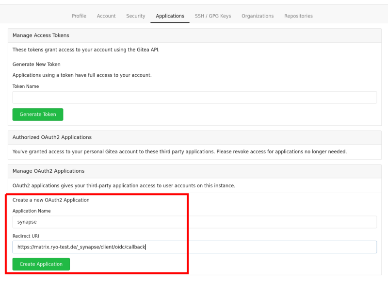
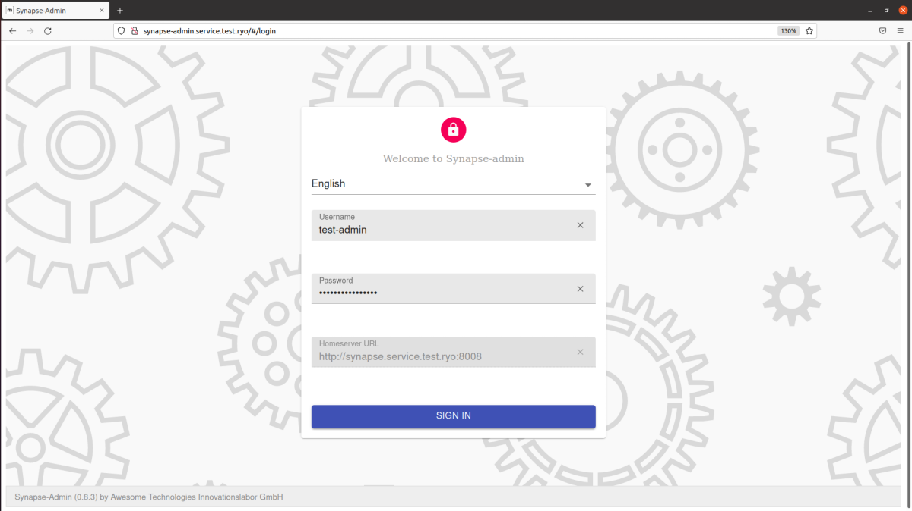
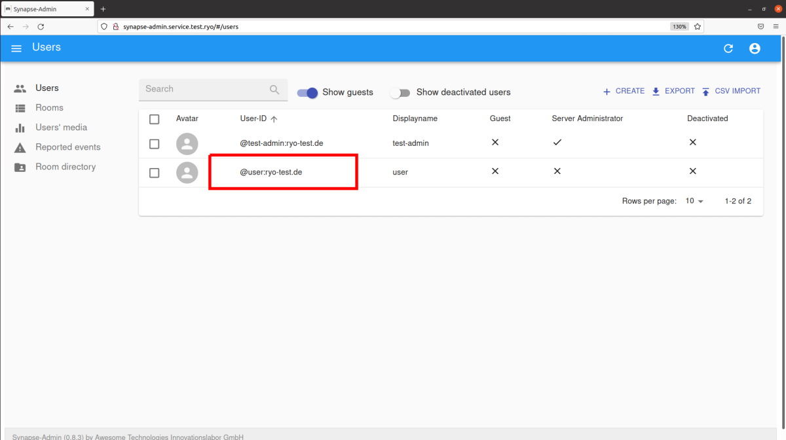
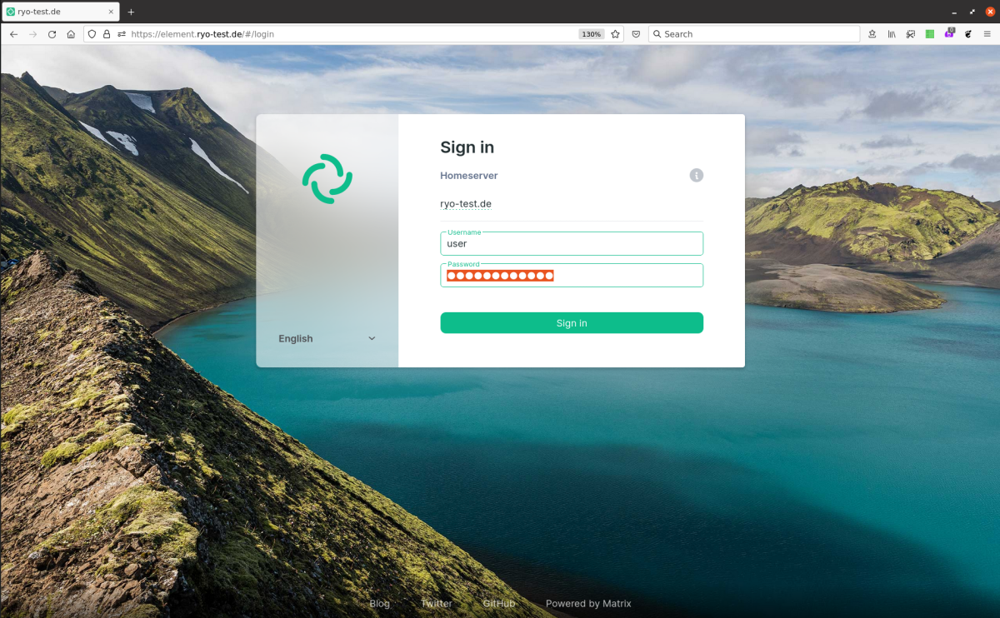
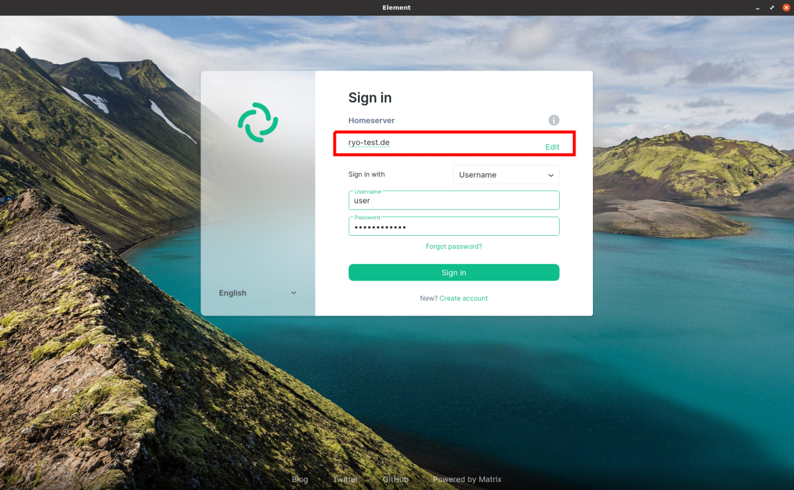
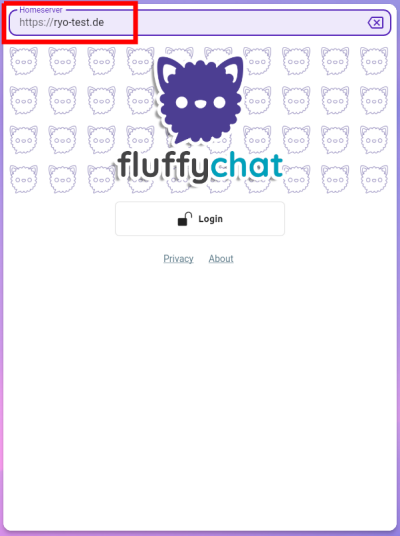

<!--
SPDX-FileCopyrightText: 2022 Wilfred Nicoll <xyzroller@rollyourown.xyz>
SPDX-License-Identifier: CC-BY-SA-4.0
-->

This project deploys a [Synapse](https://github.com/matrix-org/synapse) [matrix](https://matrix.org/) homeserver and an [Element](https://github.com/vector-im/element-web/) web-based front-end. In [standalone IdP mode](#standalone-idp-mode), the project also deploys the [synapse-admin](https://github.com/Awesome-Technologies/synapse-admin) application for managing user accounts on the homeserver.

<!--more-->

In addition, the project deploys a number of additional modules: [Certbot](https://certbot.eff.org/) and [HAProxy](https://www.haproxy.org/) for [Let's Encrypt](https://letsencrypt.org/) certificate management and TLS/SSL termination, a [PostgreSQL](https://www.postgresql.org/) database as backend for synapse, a [Coturn](https://github.com/coturn/coturn) TURN server to enable VoIP and a [.well-known server](/rollyourown/project_modules/ryo-wellknown/) for client service discovery and delegation.

## Matrix homeserver project introduction

[Matrix](https://matrix.org/) is an open source, decentralized, [federated](https://en.wikipedia.org/wiki/Federation_(information_technology)), [end-to-end encrypted](https://en.wikipedia.org/wiki/End-to-end_encryption) messaging and communications protocol managed by the non-profit [Matrix.org Foundation](https://matrix.org/foundation/).

Similar to email, anybody can run a matrix homeserver and participate in the federated communications network and there is no central point of control of the network. This enables a choice of homeserver providers and the ability to host your own homeserver while still being able to communicate with any other matrix user in the federation.

The matrix communications system enables real-time chat, VoIP, media sharing and other use-cases in a system of public and private "rooms". A room with 2 participants provides a 1-1 chat experience, whereas a multi-participant room provides a collaboration and group communication space.

When a room is created, the room creator may choose to enable end-to-end encryption for the room -- with 2-person, 1-1 chat rooms, this is on by default. In a private group chat, end-to-end encryption makes sense, whereas in large public community rooms, it is largely unnecessary. Encryption in the Matrix system is implemented using [olm and megolm](https://gitlab.matrix.org/matrix-org/olm), which are based on the [double ratchet algorithm](https://signal.org/docs/specifications/doubleratchet/) developed for the [Signal messenger](https://signal.org/).


In [standalone IdP mode](#standalone-idp-mode), a [control node](/rollyourown/how_to_use/control_node/) with a graphical desktop UI is necessary for this project, since synapse administration endpoints and the synapse-admin web-based administration interface are **not** reachable via the public internet. Users of the matrix homeserver can only be managed via web-browser from the control node.

In [gitea IdP mode](#gitea-idp-mode), matrix homeserver users are managed on a previously-deployed [Gitea Git repository server](/rollyourown/projects/ryo-gitea). As the administrative user can log in to the Gitea server via the internet and manages matrix user accounts on the Gitea server, a [control node](/rollyourown/how_to_use/control_node/) with a graphical desktop UI is not necessary in this case.



## Repository links

The [Codeberg](https://codeberg.org/) mirror repository for this project is here: [https://codeberg.org/rollyourown-xyz/ryo-matrix](https://codeberg.org/rollyourown-xyz/ryo-matrix)

The [Github](https://github.com/) mirror repository for this project is here: [https://github.com/rollyourown-xyz/ryo-matrix](https://github.com/rollyourown-xyz/ryo-matrix)

The rollyourown repository for this project is here: [https://git.rollyourown.xyz/ryo-projects/ryo-matrix](https://git.rollyourown.xyz/ryo-projects/ryo-matrix) (not publicly accessible)

## Dependencies

This project depends on and deploys the following rollyourown modules:

- The [Ingress Proxy module](/rollyourown/project_modules/ryo-ingress-proxy/) to provide certificate management by [Certbot](https://certbot.eff.org/) and HTTPS proxying by the [HAProxy](https://www.haproxy.org/) load balancer / TLS proxy

- The [PostgreSQL Database module](/rollyourown/project_modules/ryo-postgres) to provide a performant database backend for the matrix homeserver

- The [Well-known Server module](/rollyourown/project_modules/ryo-wellknown) to support homeserver [discovery](https://github.com/matrix-org/synapse/blob/develop/docs/setup/installation.md#client-well-known-uri) and [delegation](https://github.com/matrix-org/synapse/blob/develop/docs/delegate.md)

- The [STUN/TURN Server module](/rollyourown/project_modules/ryo-coturn) to provide [STUN](https://en.wikipedia.org/wiki/STUN), [TURN](https://en.wikipedia.org/wiki/Traversal_Using_Relays_around_NAT) and [ICE](https://en.wikipedia.org/wiki/Interactive_Connectivity_Establishment) enabling peer-to-peer communication for devices behind a [NAT](https://en.wikipedia.org/wiki/Network_address_translation)

In "standalone" IdP mode, the project has no dependency to other rollyourown.xyz projects. In "gitea" IdP mode, the project depends on prior deployment of a [Gitea Git repository server](/rollyourown/projects/ryo-gitea) and the configuration of an [OAuth2](https://oauth.net/2/) application on the Gitea server before deployment of this project.

## Identity providers and single sign-on

This project supports multiple "IdP modes", which specify which system is the [Identity Provider (IdP)](https://en.wikipedia.org/wiki/Identity_provider) for users of the matrix service. Currently, two IdP modes are supported:

- [standalone IdP mode](#standalone-idp-mode)
- [gitea IdP mode](#gitea-idp-mode)

Further IdP modes may be added at a later date.

### Standalone IdP mode

In standalone IdP mode, user accounts are managed on the [Synapse homeserver](#synapse-container) that is deployed by this project. User accounts are managed via the [synapse-admin](#synapse-admin-container) web front-end.

### Gitea IdP mode

In Gitea IdP mode, the matrix service is deployed together with a [Gitea Git repository server](/rollyourown/projects/ryo-gitea) and the Gitea server is used for [single sign-on (SSO)](https://en.wikipedia.org/wiki/Single_sign-on). This means that a matrix user authenticates against the Gitea server via [OAuth2](https://oauth.net/2/) and only has a single username/password for both services.

In this mode, the [Gitea Git repository server](/rollyourown/projects/ryo-gitea) must be deployed and [an OAuth2 application configured](#before-deployment), before this project is deployed.



When configuring this project, the username entered for the parameter `project_admin_username` in the `configuration_<host_id>.yml` file should be **the same** as the administrator username entered for the Gitea server when deploying the `ryo-gitea` project. This user will also be given administration rights on the Synapse homeserver during the deployment of this project.



## Project components

The components deployed in this project are shown in the following diagram:



### Host server

The [host server](/rollyourown/how_to_use/host_server/) is controlled from your control machine via a [Wireguard](https://www.wireguard.com/) tunnel and is configured to run a [Consul server](https://www.consul.io/) and the [LXD container runtime](https://linuxcontainers.org/lxd/). Each container deployed performs a specific task in the installation.

Further details about the host server can be found [here](/rollyourown/how_to_use/host_server/).

### Containers

The project installation consists of a number of containers deployed on the host server.

#### Ingress proxy container

The ingress proxy container terminates HTTP and HTTPS connections and distributes traffic to other containers. This component is provided by the rollyourown Ingress Proxy module and is a key building block for rollyourown.xyz projects. Further details can be found [here](/rollyourown/project_modules/ryo-ingress-proxy/).

#### Coturn container

The Coturn container provides a STUN/TURN server for enabling peer-to-peer communication between devices behind a NAT gateway. This component is provided by the rollyourown STUN/TURN Server module. Further details can be found [here](/rollyourown/project_modules/ryo-coturn).

#### Well-known container

The well-known container responds to the well-known URIs `https://example.com/.well-known/matrix/client` and `https://example.com/.well-known/matrix/server` to support Matrix homeserver [discovery](https://github.com/matrix-org/synapse/blob/develop/docs/setup/installation.md#client-well-known-uri) and [delegation](https://github.com/matrix-org/synapse/blob/develop/docs/delegate.md). This enables the synapse homeserver to be hosted at `matrix.example.com` while the homeserver name is `example.com` and users can have matrix user IDs `@user:example.com`. This component is provided by the rollyourown Well-known Server module. Further details can be found [here](/rollyourown/project_modules/ryo-wellknown).

#### Postgres container

The Postgres container provides a PostgreSQL relational database as backend for the synapse homeserver container. This component is provided by the rollyourown PostgreSQL Database module. Further details can be found [here](/rollyourown/project_modules/ryo-postgres).

#### Synapse container

The Synapse container provides the Matrix homeserver for the project. [Synapse](https://github.com/matrix-org/synapse) is the de-facto standard open source matrix homeserver implementation. The matrix homeserver serves [client applications](https://matrix.org/clients/) and [federates](https://matrix.org/faq/#what-does-federated-mean%3F) with other matrix homeservers in the distributed Matrix communication system.

#### Element-Web container

The Element-web container hosts a [nginx](https://nginx.org/) web server and the open source [element-web](https://github.com/vector-im/element-web) web-based matrix client application. This provides a web-based client for the matrix service, at the URL `https://element.example.com`, as an alternative front-end to desktop or mobile apps.

#### Synapse-Admin container

The Synapse admin container hosts a [nginx](https://nginx.org/) web server and the open source [synapse-admin](https://github.com/Awesome-Technologies/synapse-admin/) administration front-end for the synapse homeserver. This provides a web-based interface for administering the homeserver (e.g. for managing user accounts) and is only deployed in "standalone" IdP mode.

## How to use this project

### Before deployment

If the project is to be deployed in [gitea IdP mode](#gitea-idp-mode), then a [Gitea Git repository server](/rollyourown/projects/ryo-gitea) should be deployed and configured **before** deploying this project.

After deployment, the Gitea server needs to be configured with an [OAuth2](https://oauth.net/2/) application, so that it can act as a single sign-on provider for the matrix service.

This configuration is done from a user's settings after [logging in on the Gitea server](/rollyourown/projects/ryo-gitea/#after-deployment):


Under _Applications -> Manage OAuth2 Application_ a new application is added and named, for example, "synapse". The "Redirect URL" should be entered as `https://matrix.<PROJECT DOMAIN NAME>/_synapse/client/oidc/callback` where `<PROJECT DOMAIN NAME>` is the domain you are configuring for this project:



Once the OAuth application has been created, Gitea will show a `Client ID` and `Client Secret`. Both of these should be noted down, as they are needed in the configuration for this project. The Client Secret will be shown **only once**, but can be regenerated later -- however, if the Client Secret is changed after configuring and deploying this project, then the project configuration will also need to be changed and [new container images built and deployed](/rollyourown/how_to_use/maintain).


After configuring the OAuth2 application, this project can be [configured](/rollyourown/how_to_use/deploy/#configuring-the-project) and [deployed](/rollyourown/how_to_use/deploy/#running-the-automation-scripts).

### Deploying the project

To deploy the project, follow the generic [project deployment instructions](/rollyourown/how_to_use/deploy/), using the project's [mirror repositories](#repository-links).

For example, clone the project from the project's GitHub repository with:

```bash
git clone https://github.com/rollyourown-xyz/ryo-matrix
```

### After deployment

#### Creating user accounts in standalone IdP mode

Your first step after deployment in [standalone IdP mode](#standalone-idp-mode) will be to create user accounts for using the matrix service.

From the control node, log in to the synapse-admin administration front-end at `http://synapse-admin.service.<HOSTNAME>.ryo` where `<HOSTNAME>` is the name chosen for your host server [during setup](/rollyourown/how_to_use/host_server/). This link will **only work from the control-node**, as the administration front-end is **not** available via the public internet. The administrator username and password were defined in your configuration file during project deployment (as the variables `project_admin_username` and `project_admin_password`).



After login, user accounts can be created from the "+CREATE" button in the "Users" section of synapse-admin. A new user's Matrix ID is of the form `@user:example.com` if the username is `user` and your project domain is `example.com`.



#### Creating user accounts in Gitea IdP mode

In [gitea IdP mode](#gitea-idp-mode), no specific user configuration needs to be carried out for the matrix service. All users with an account on the Gitea server can log in and use the matrix service, using their username and password from the Gitea server.

#### Using the web-based front-end

Once user accounts have been created, users can interact with the service via the web-based [Element](https://element.io/) client. If your project domain is `example.com` (specified in your configuration file during project deployment as the variable `project_domain_name`), then the Element web client is available at `https://element.example.com`.



#### Using mobile client apps

Users can also interact with the service via various mobile apps. The reference mobile app for matrix is [Element](https://element.io/), available from [f-droid](https://f-droid.org/app/im.vector.app) or the [Google Play Store](https://play.google.com/store/apps/details?id=im.vector.app) for Android and from the [Apple App Store](https://apps.apple.com/us/app/element/id1083446067) for iOS. Other [clients](https://matrix.org/clients/) are available, with a good alternative being [FluffyChat](https://fluffychat.im/), which provides a user interface more similar to other mobile messaging apps.

Users logging in via a mobile app **must enter your homeserver name** (e.g. `example.com`) before entering their username and password.


#### Using desktop apps

Users can also interact with the service via various [desktop apps](https://matrix.org/clients/). The reference desktop app, supported on Windows, Mac and Linux is [Element Desktop](https://element.io/get-started). Other desktop clients are available, with [FluffyChat](https://fluffychat.im/) being another cross-platform app.

Users logging in via a desktop app **must enter your homeserver name** (e.g. `example.com`) before entering their username and password.





### Administering the Synapse homeserver

In [standalone IdP mode](#standalone-idp-mode), the Synapse homeserver can be administered via the synapse-admin administration front-end. In [gitea IdP mode](#gitea-idp-mode), administration beyond adding user accounts via the Gitea server is currently not as straight-forward and the [Synaspe Admin API](https://matrix-org.github.io/synapse/latest/usage/administration/admin_api/index.html) must be used for any administration tasks.



In [gitea IdP mode](#gitea-idp-mode), administrative operations such as querying the rooms on the server or deleting rooms can be performed using the Synapse Admin API.

In order to use the Admin API, log in to the Element-Web front-end as the administrator and go to `Settings -> Help & About`. Under the drop-down "Access Token", you will find and access token which is needed to use the Admin API. Remain logged in to the Element-Web front-end while performing API calls.

From a terminal **on the control node**, use curl to call the admin APIs, for example:

#### List accounts on the homeserver

This API call lists all accounts of users from your Gitea server that have logged in to the matrix service at least once.

```bash
curl -X GET -H "Authorization: Bearer <ACCESS_TOKEN>" "http://synapse.service.<HOST_ID>.ryo:8008/_synapse/admin/v2/users"
```

#### List rooms on the homeserver

This API call lists all rooms that have been created on the homeserver.

```bash
curl -X GET -H "Authorization: Bearer <ACCESS_TOKEN>" "http://synapse.service.<HOST_ID>.ryo:8008/_synapse/admin/v1/rooms"
```

#### Show details of a single room

This API call shows the details of a specific room. The `<ROOM_ID>` is found in the [API call listing all rooms](#list-rooms-on-the-homeserver).

```bash
curl -X GET -H "Authorization: Bearer <ACCESS_TOKEN>" "http://synapse.service.<HOST_ID>.ryo:8008/_synapse/admin/v1/rooms/<ROOM_ID>"
```

Note that the `<ROOM_ID>` must be [URL encoded](https://www.w3schools.com/tags/ref_urlencode.asp) in the API call, which means substituting "!" with "%21", "." with "%2E" and ":" with "%3A".

#### Show members in a room

This API call shows the members of a specific room. The `<ROOM_ID>` is found in the [API call listing all rooms](#list-rooms-on-the-homeserver).

```bash
curl -X GET -H "Authorization: Bearer <ACCESS_TOKEN>" "http://synapse.service.<HOST_ID>.ryo:8008/_synapse/admin/v1/rooms/<ROOM_ID>/members"
```

Note that the `<ROOM_ID>` must be [URL encoded](https://www.w3schools.com/tags/ref_urlencode.asp) in the API call, which means substituting "!" with "%21", "." with "%2E" and ":" with "%3A".

#### Delete a room

This API call deletes a room from the homeserver. This is useful, for example, when all users have left a room. The `<ROOM_ID>` is found in the [API call listing all rooms](#list-rooms-on-the-homeserver).

```bash
curl -X DELETE -H "Authorization: Bearer <ACCESS_TOKEN>" -d '{"purge": true}' "http://synapse.service.<HOST_ID>.ryo:8008/_synapse/admin/v1/rooms/<ROOM_ID>"
```

Note that the `<ROOM_ID>` must be [URL encoded](https://www.w3schools.com/tags/ref_urlencode.asp) in the API call, which means substituting "!" with "%21", "." with "%2E" and ":" with "%3A".



### Maintaining the installation

After deploying the project, the installation needs to be maintained over time as, for example, new versions of the project's components are released.

Maintenance is automated via the rollyourown.xyz project scripts. See [here](/rollyourown/how_to_use/maintain/) for details.

## Project requirements

Depending on the number of users to be supported, synapse can be quite resource intensive. From experience, a (virtual) server with at least 2 cores, 4GB RAM and 40GB storage is recommended, even for a smaller deployment.

In future, we plan to include [synapse workers](https://matrix-org.github.io/synapse/develop/workers.html) in the project, to enable better resource utilisation.

## Software deployed

The open source components deployed by this project are:



| Project | What is it? | Homepage | Licence |
| :------ | :---------- | :------- | :------ |
| Certbot | [Let's Encrypt](https://letsencrypt.org/) certificate manager, deployed by the [Ingress Proxy module](/rollyourown/project_modules/ryo-ingress-proxy/) | [https://certbot.eff.org/](https://certbot.eff.org/) | [Apache 2.0](https://raw.githubusercontent.com/certbot/certbot/master/LICENSE.txt) |
| Consul | Service registry and key-value store | [https://www.consul.io/](https://www.consul.io/) | [MPL 2.0](https://github.com/hashicorp/consul/blob/master/LICENSE) |
| Consul-Template | Tool to create dynamic configuration files based on Consul Key-Value store or service registry queries | [https://github.com/hashicorp/consul-template/](https://github.com/hashicorp/consul-template/) | [MPL 2.0](https://github.com/hashicorp/consul-template/blob/master/LICENSE) |
| Coturn  | [STUN](https://en.wikipedia.org/wiki/STUN) and [TURN](https://en.wikipedia.org/wiki/Traversal_Using_Relays_around_NAT) server, deployed by the [STUN/TURN Server module](/rollyourown/project_modules/ryo-coturn/) | [https://github.com/coturn/coturn](https://github.com/coturn/coturn) | [https://github.com/coturn/coturn/blob/master/LICENSE](https://github.com/coturn/coturn/blob/master/LICENSE) |
| Element-Web | Web-based Matrix client | [https://element.io/](https://element.io/) | [Apache 2.0](https://github.com/vector-im/element-web/blob/develop/LICENSE) |
| HAProxy | Load balancer, TCP and HTTP proxy, deployed by the [Ingress Proxy module](/rollyourown/project_modules/ryo-ingress-proxy/) | [https://www.haproxy.org/](https://www.haproxy.org/) | [GPL / LGPL](https://github.com/haproxy/haproxy/blob/master/LICENSE) |
| nginx | Open source webserver for the Element-Web installation | [https://nginx.org/](https://nginx.org/) | [2-clause BSD Licence](http://nginx.org/LICENSE) |
| PostgreSQL | Relational database server, deployed by the [PostgreSQL Database module](/rollyourown/project_modules/ryo-postgres/) | [https://www.postgresql.org/](https://www.postgresql.org/) | [PostgreSQL Licence](https://www.postgresql.org/about/licence/) |
| Synapse | Reference Matrix homeserver implementation by [matrix.org](https://matrix.org/) | [https://matrix-org.github.io/synapse/](https://matrix-org.github.io/synapse/) | [Apache 2.0](https://github.com/matrix-org/synapse/blob/develop/LICENSE) |
| Synapse-Admin | Administration front-end for a Synapse installation | [https://github.com/Awesome-Technologies/synapse-admin/](https://github.com/Awesome-Technologies/synapse-admin/) | [Apache 2.0](https://github.com/Awesome-Technologies/synapse-admin/blob/master/LICENSE) |
| Webhook | Light-weight, general purpose webhook server, deployed by the [Ingress Proxy module](/rollyourown/project_modules/ryo-ingress-proxy/) | [https://github.com/adnanh/webhook](https://github.com/adnanh/webhook) | [MIT](https://github.com/adnanh/webhook/blob/master/LICENSE) |


