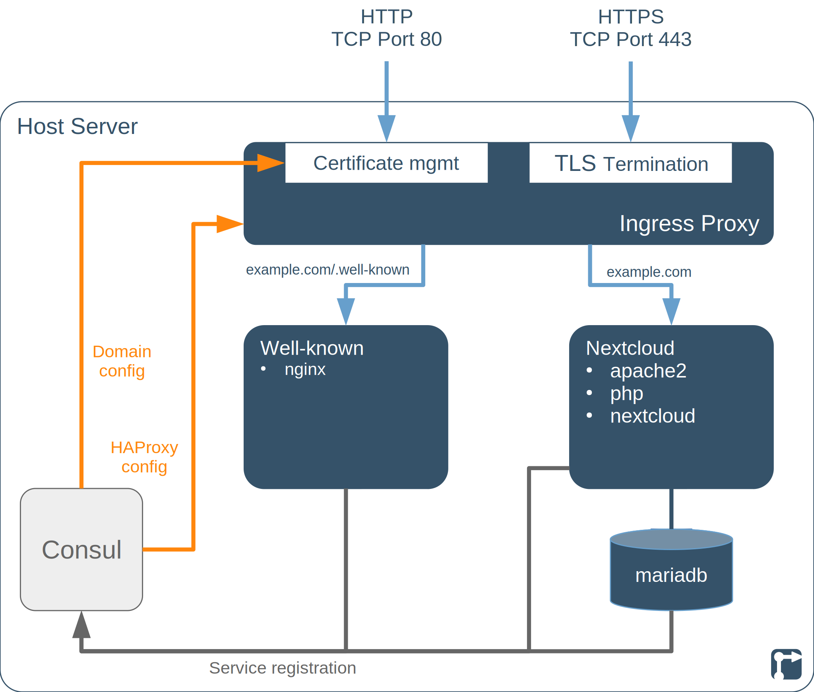
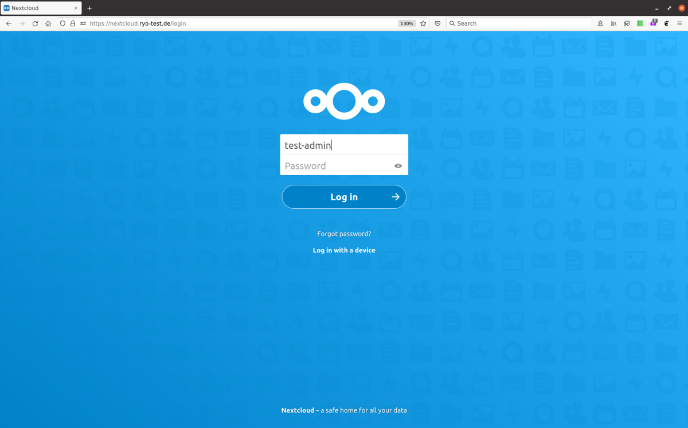
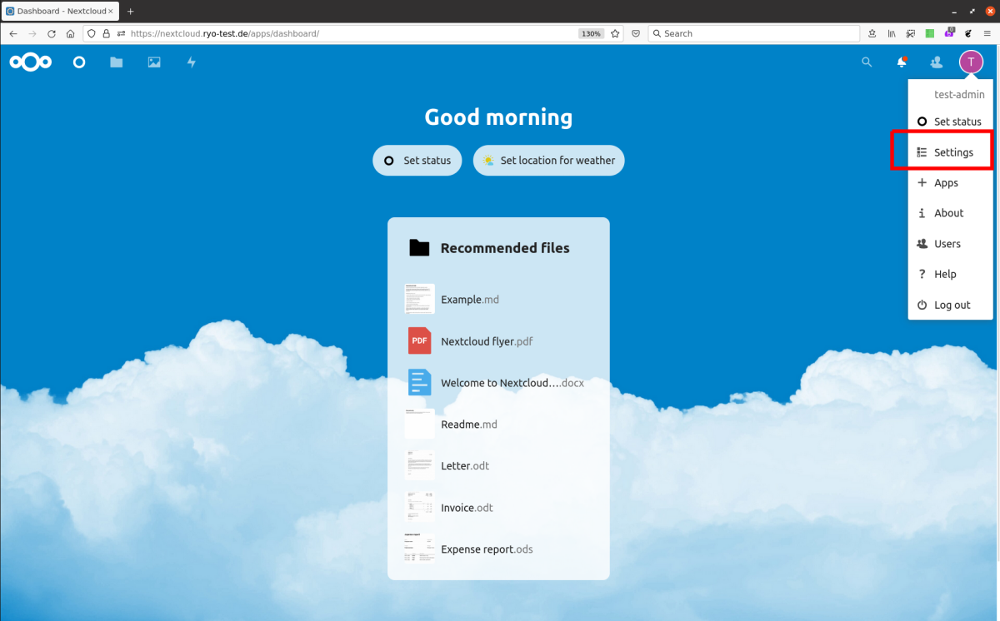
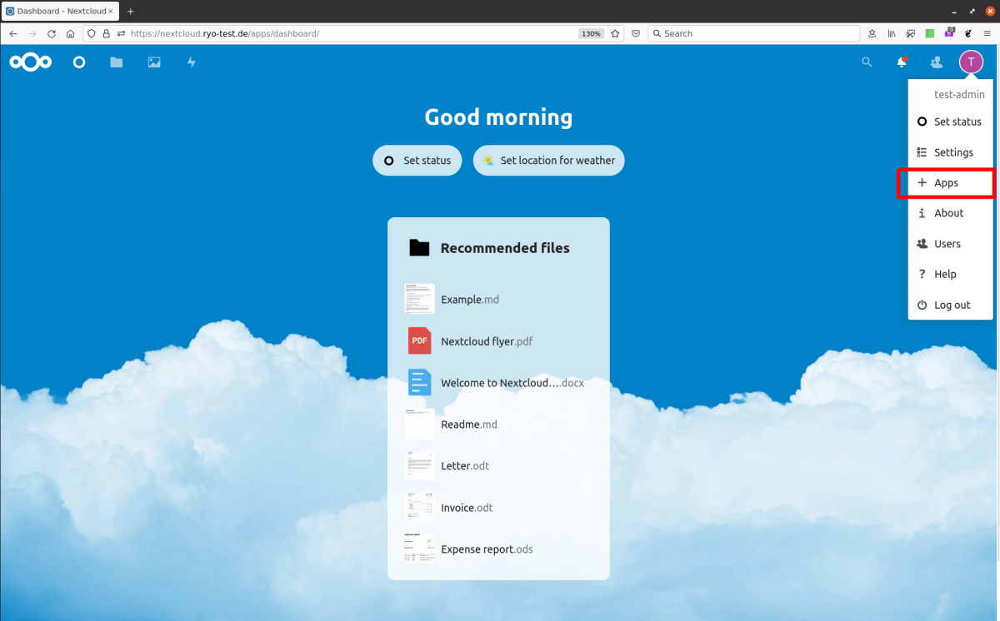
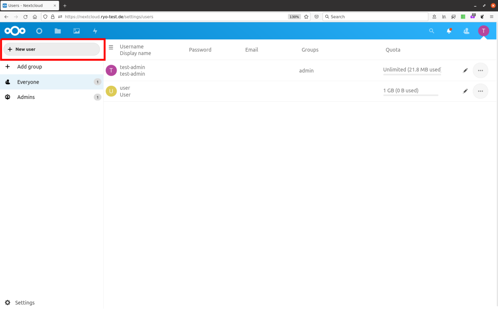

This project deploys a [Nextcloud](https://nextcloud.com/) server, with a [MariaDB](https://mariadb.org/) backend database, [HAProxy](https://www.haproxy.org/) for TLS/SSL termination and [Certbot](https://certbot.eff.org/) for managing your [Let's Encrypt](https://letsencrypt.org/) certificate.

<!--more-->

## TODOs on this page



- [ ] Links on the page
- [ ] Add nextcloud-gpodder to [Using the Nextcloud service](#using-the-nextcloud-service)



## Nextcloud project introduction

[Nextcloud](https://nextcloud.com/) is an open-source, self-hosted solution for file syncing and sharing via web and between [desktop and mobile apps](https://nextcloud.com/clients/). Through the [Nextcloud App Store](https://apps.nextcloud.com/), a Nextcloud server can be extended for many other online collaboration use-cases can be supported, for example:

- Address book / contact management and syncing
- Calendars and Tasks
- Online document editing
- Project management
- Forms and polls


A [control node](/rollyourown/projects/control_node/) without a graphical desktop UI is sufficient for this project, as the Nextcloud administration interface is reachable via the public internet.


## Repository links

The [Codeberg](https://codeberg.org/) mirror repository for this project is here: [https://codeberg.org/rollyourown-xyz/ryo-nextcloud](https://codeberg.org/rollyourown-xyz/ryo-nextcloud)

The [Github](https://github.com/) mirror repository for this project is here: [https://github.com/rollyourown-xyz/ryo-nextcloud](https://github.com/rollyourown-xyz/ryo-nextcloud)

The [rollyourown.xyz](https://rollyourown.xyz/) repository for this project is here: [https://git.rollyourown.xyz/ryo-projects/ryo-nextcloud](https://git.rollyourown.xyz/ryo-projects/ryo-nextcloud) (not publicly accessible)

## Dependencies

This project depends on and deploys the following [rollyourown.xyz](https://rollyourown.xyz) modules:

- The [Ingress Proxy module](/rollyourown/project_modules/ryo-ingress-proxy/) to provide certificate management by [Certbot](https://certbot.eff.org/) and HTTPS proxying by the [HAProxy](https://www.haproxy.org/) load balancer / TLS proxy

- The [MariaDB Database module](/rollyourown/project_modules/ryo-mariadb) to provide a performant database backend

- The [Well-known Server module](/rollyourown/project_modules/ryo-wellknown) to support [service discovery](https://docs.nextcloud.com/server/latest/admin_manual/issues/general_troubleshooting.html#service-discovery-label) for [CardDAV](https://en.wikipedia.org/wiki/CardDAV) and [CalDAV](https://en.wikipedia.org/wiki/CalDAV) clients.

## Project components

The components deployed in this project are shown in the following diagram:

### Host server

The [host server](/rollyourown/projects/host_server/) is controlled from your control machine via a [Wireguard](https://www.wireguard.com/) tunnel and is configured to run a [Consul server](https://www.consul.io/) and the [LXD container runtime](https://linuxcontainers.org/lxd/). Each container deployed performs a specific task in the installation.

Further details about the host server building block can be found [here](/rollyourown/projects/host_server/).

### Containers

The project installation consists of a number of containers deployed on the host server.

#### Ingress proxy container

The ingress proxy container terminates HTTP and HTTPS connections and distributes traffic to the Nextcloud and Well-known containers. This component is provided by the [rollyourown.xyz](https://rollyourown.xyz) Ingress Proxy module and is a key building block for rollyourown.xyz projects. Further details can be found [here](/rollyourown/project_modules/ryo-ingress-proxy/).

#### Well-known container

The well-known container redirects the well-known URIs `https://example.com/.well-known/carddav` and `https://example.com/.well-known/caldav` to the path `https://example.com/remote.php/dav` to enable [service discovery](https://docs.nextcloud.com/server/latest/admin_manual/issues/general_troubleshooting.html#service-discovery-label) for [CardDAV](https://en.wikipedia.org/wiki/CardDAV) and [CalDAV](https://en.wikipedia.org/wiki/CalDAV) clients. This component is provided by the [rollyourown.xyz](https://rollyourown.xyz) Well-known Server module. Further details can be found [here](/rollyourown/project_modules/ryo-wellknown).

#### MariaDB container

The MariaDB container provides a MariaDB relational database as backend for the Nextcloud application. This component is provided by the [rollyourown.xyz](https://rollyourown.xyz) MariaDB Database module. Further details can be found [here](/rollyourown/project_modules/ryo-mariadb).

#### Nextcloud container

The Nextcloud container provides the Nextcloud server for the project. [Nextcloud](https://nextcloud.com/) is an open-source, self-hosted solution for file syncing and sharing.

## How to use this project

### Deploying the project

To deploy the project, follow the generic [project deployment instructions](/rollyourown/projects/how_to_deploy/), using the project's [mirror repositories](#repository-links).

### After deployment

Your first steps after deployment will be to configure the Nextcloud service, optionally install apps and then create user accounts for using the service.

#### Logging in

Log in to the Nextcloud front-end at the domain name provided in your configuration file during project deployment (as the variable `project_nextcloud_domain_name`). The admin user's username and password were also defined in your configuration file (as the variables `project_admin_username` and `project_admin_password`).

#### Configuring the Nextcloud service

After logging in with the administrator account, the Nextcloud server can be configured from the "Settings" item in the admin account's drop-down menu:

#### Installing Nextcloud apps

Apps can be installed to the Nextcloud server, enabled and disabled from the "Apps" item in the administrator account's drop-down menu:

#### Creating and managing users

User accounts can be created from the "Users" item in the admin account's drop-down menu:

Each user is created from the "New user" button.

#### Using the Nextcloud service

Users can use the Nextcloud services via the web front-end, using the credentials configured by the administrator. In addition, [desktop and mobile apps](https://nextcloud.com/clients/) are available for interacting with the service and, for example, synchronising files.

Some individual [Nextcloud apps](#installing-nextcloud-apps) also have accompanying mobile apps, for example:

- Contacts, Calendar and Tasks can be synced to Android with [DAVx5](https://www.davx5.com/) and [OpenTasks](https://opentasks.app/) or to iOS via the [native iOS Calendar and Contacts apps](https://docs.nextcloud.com/server/latest/user_manual/en/pim/sync_ios.html)
- Notes can be edited and synced with [Nextcloud Notes](https://github.com/stefan-niedermann/nextcloud-notes) on Android or [CloudNotes](https://pbh.dev/cloudnotes/) on iOS
- Deck Kanban boards can be edited and synced with [Nextcloud Deck](https://github.com/stefan-niedermann/nextcloud-deck) on Android
- News can be read and synced with [Nextcloud News](https://github.com/nextcloud/news-android) on Android or with [CloudNews](https://pbh.dev/cloudnews/) or [NextNews](https://apps.apple.com/us/app/nextnews/id1573041539) on iOS

Various desktop operating systems can sync natively or via desktop applications - details can be found [here](https://docs.nextcloud.com/server/latest/user_manual/en/pim/index.html).

### Maintaining the installation

After deploying the project, the installation needs to be maintained over time as, for example, new versions of the project's components are released.

Maintenance is automated via the rollyourown.xyz project scripts. See [here](/rollyourown/projects/how_to_maintain/) for details.

## Project requirements

For small projects with a few users, [Nextcloud](https://nextcloud.com/) [does not need huge resources to run](https://docs.nextcloud.com/server/latest/admin_manual/installation/system_requirements.html). This project can be deployed on smaller, cheaper entry-level virtual servers or home servers.

For example, this project has been successfully deployed on a €2,69/m entry-level Linux VPS with 1 vCore CPU, 2GB RAM and a 20GB SSD. Of course, for larger projects intended to support many users, a higher-spec VPS would be needed.

## Software deployed

The open source components deployed by this project are:



| Project | What is it? | Homepage | License |
| :------ | :---------- | :------- | :------ |
| Apache HTTP Server | Web server for the [Nextcloud](https://nextcloud.com/) installation | [https://httpd.apache.org/](https://httpd.apache.org/) | [Apache 2.0](https://www.apache.org/licenses/LICENSE-2.0) |
| Certbot | [Let's Encrypt](https://letsencrypt.org/) certificate manager, deployed by the [Ingress Proxy module](/rollyourown/project_modules/ryo-ingress-proxy/) | [https://certbot.eff.org/](https://certbot.eff.org/) | [Apache 2.0](https://raw.githubusercontent.com/certbot/certbot/master/LICENSE.txt) |
| Consul | Service registry and key-value store | [https://www.consul.io/](https://www.consul.io/) | [MPL 2.0](https://github.com/hashicorp/consul/blob/master/LICENSE) |
| Consul-Template | Tool to create dynamic configuration files based on Consul Key-Value store or service registry queries | [https://github.com/hashicorp/consul-template/](https://github.com/hashicorp/consul-template/) | [MPL 2.0](https://github.com/hashicorp/consul-template/blob/master/LICENSE) |
| HAProxy | Load balancer, TCP and HTTP proxy, deployed by the [Ingress Proxy module](/rollyourown/project_modules/ryo-ingress-proxy/) | [https://www.haproxy.org/](https://www.haproxy.org/) | [GPL / LGPL](https://github.com/haproxy/haproxy/blob/master/LICENSE) |
| MariaDB | Relational database system | [https://mariadb.org/](https://mariadb.org/) | [GPL v2 / LGPL](https://mariadb.com/kb/en/mariadb-license/) |
| Nextcloud | Self-hosted solution for file syncing and sharing | [https://nextcloud.com/](https://nextcloud.com/) | [AGPL](https://github.com/nextcloud/server/blob/master/COPYING) |


