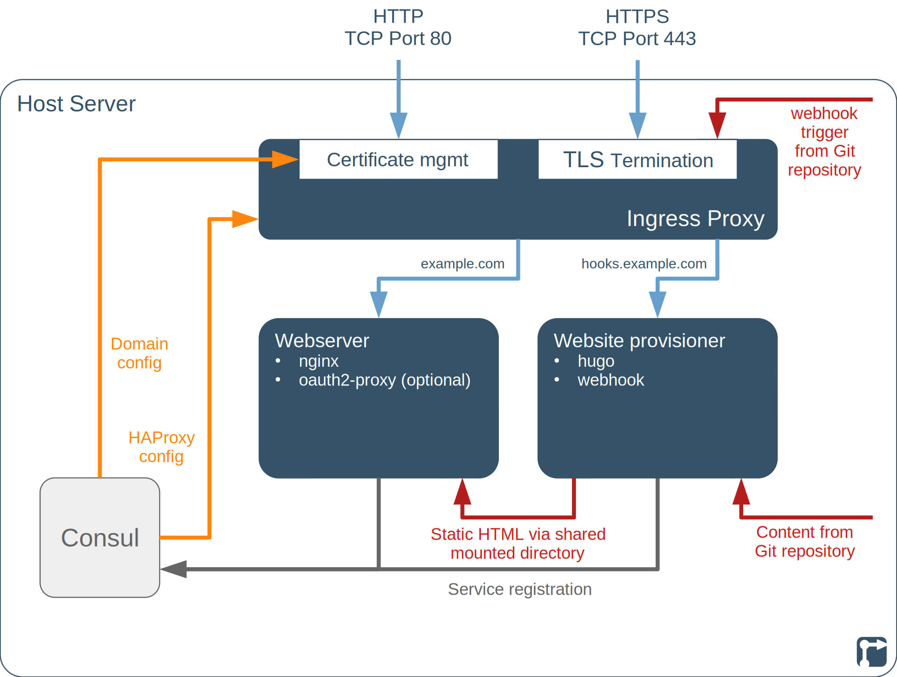
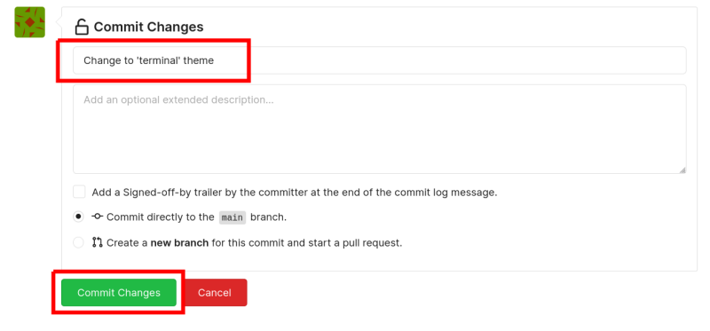

This project deploys an [nginx](https://nginx.org/) webserver to serve a static website along with [Hugo](https://gohugo.io/) to generate the static website from content stored in a version-controlled [Git](https://git-scm.com/) repository. The project also deploys a [webhook](https://github.com/adnanh/webhook) so that the Git repository can trigger a re-provisioning of the website whenever changes are made to the content.

In addition, the project deploys an Ingress Proxy, including [Certbot](https://certbot.eff.org/) and [HAProxy](https://www.haproxy.org/), for [Let's Encrypt](https://letsencrypt.org/) certificate management and TLS/SSL termination. If an [IdP mode is selected](#identity-providers-and-single-sign-one), then the project also deploys the [oauth2-proxy](https://oauth2-proxy.github.io/oauth2-proxy/) to restrict the website to logged-in users.

<!--more-->

## TODOs on this page



- [ ] Links on the page
- [ ] Section on using bare-bones theme repository, after creating this



## Hugo website project introduction

[Hugo](https://gohugo.io/) is a static site generator, written in [Go](https://go.dev/), that generates a static website from a set of files and folders. A static website is typically faster, needs fewer server-side resources and is more secure than a dynamic website. A static website is a good fit for websites (such as product sites, blogs or documentation) where the content is not personalised for the website user or dependent on dynamically-changing inputs. An introduction to static site generators and their advantages and disadvantages compared to other approaches can be found here: [An Introduction to Static Site Generators](https://davidwalsh.name/introduction-static-site-generators)

This project deploys a website with the content and theme stored in version-controlled [Git](https://git-scm.com/) repositories. The project takes this content, generates a static site and deploys it to a webserver.

After deployment, changes to the content or design of the website are made directly in the repositories. Whenever a change is committed to one of the repositories, Hugo is triggered to generate a new set of static website pages, which are then provisioned to the webserver. This process is triggered via a [Webhook](https://wikipedia.org/wiki/Webhook) and takes no more than a few seconds.

The deployment requires a **pre-existing** set of repositories. Three repositories need to be available:

- The content repository needs to be created in advance on your own [Git repository server](/rollyourown/projects/single_server_projects/ryo-gitea) or on another Git-based code-hosting platform such as [Codeberg](https://codeberg.org/) or [GitHub](https://github.com/)
- The theme repository can either be your own theme repository (if you want full control over the design of the website) or any publicly-available Hugo theme repository -- see, for example, [https://themes.gohugo.io/](https://themes.gohugo.io/)
- The scaffold repository can be our scaffold template repository and typically does not need to be changed. Alternatively, you can clone our template repository in case you need to change something for a more advanced configuration

More details are [below](#before-deployment).


A [control node](/rollyourown/projects/control_node/) without a graphical desktop UI is sufficient for this project, as your repositories are managed via an external Git repository service.


## Repository links

The [Codeberg](https://codeberg.org/) mirror repository for this project is here: [https://codeberg.org/rollyourown-xyz/ryo-hugo-website](https://codeberg.org/rollyourown-xyz/ryo-hugo-website)

The [Github](https://github.com/) mirror repository for this project is here: [https://github.com/rollyourown-xyz/ryo-hugo-website](https://github.com/rollyourown-xyz/ryo-hugo-website)

The [rollyourown.xyz](https://rollyourown.xyz/) repository for this project is here: [https://git.rollyourown.xyz/ryo-projects/ryo-hugo-website](https://git.rollyourown.xyz/ryo-projects/ryo-hugo-website) (not publicly accessible)

## Dependencies

This project depends on and deploys the [rollyourown.xyz](https://rollyourown.xyz) [Ingress Proxy](/rollyourown/project_modules/ryo-ingress-proxy/) module to provide certificate management by [Certbot](https://certbot.eff.org/) and HTTPS proxying by the [HAProxy](https://www.haproxy.org/) loadbalancer / TLS proxy.

## Identity providers and single sign-on

This project supports protecting your website with a login via an Identity Provider (IdP). This is useful for deploying a website that is only accessible to members of an organisation (for example, for accessing / testing draft content).

The "IdP mode" of the project is selected in the project configuration file:

- In the "public" mode (the default), your website is accessible to anyone without authorisation
- In the ["gitea" mode](#gitea-idp-mode), your website can only be accessed after logging in via a [Gitea Git repository server](/rollyourown/projects/single_server_projects/ryo-gitea)

Further IdP modes may be added at a later date.

### Gitea IdP mode

In "gitea" mode, the service is deployed together with a [Gitea Git repository server](/rollyourown/projects/single_server_projects/ryo-gitea) and the Gitea server is used as and Identity Provider for [single sign-on (SSO)](https://en.wikipedia.org/wiki/Single_sign-on). This means that a user authenticates against the Gitea server via [OAuth2](https://oauth.net/2/) and only has access to the website after logging in.

In this mode, the [Gitea Git repository server](/rollyourown/projects/single_server_projects/ryo-gitea) must be deployed and an OAuth2 application configured, before this project is deployed.

## Project components

The components deployed in this project are shown in the following diagram:



### Host server

The [host server](/rollyourown/projects/host_server/) is controlled from your control machine via a [Wireguard](https://www.wireguard.com/) tunnel and is configured to run a [Consul server](https://www.consul.io/) and the [LXD container runtime](https://linuxcontainers.org/lxd/). Each container deployed performs a specific task in the installation.

Further details about the host server building block can be found [here](/rollyourown/projects/host_server/).

### Containers

The project installation consists of a number of containers deployed on the host server.

#### Ingress proxy container

The ingress proxy container terminates HTTP and HTTPS connections and distributes traffic to other containers. This component is provided by the [rollyourown.xyz](https://rollyourown.xyz) Ingress Proxy module and is a key building block for rollyourown.xyz projects. Further details can be found [here](/rollyourown/project_modules/ryo-ingress-proxy/).

#### Website provisioner container

The website provisioner container hosts the [Hugo](https://gohugo.io/) static site generator and a [webhook server](https://github.com/adnanh/webhook) providing the API to trigger the fetching and processing of the website content. If an [IdP mode is selected](#identity-providers-and-single-sign-one), then the container also hosts the [oauth2-proxy](https://oauth2-proxy.github.io/oauth2-proxy/) to restrict the website to logged-in users.

The container shares a mounted directory from the host server with the [webserver container](#webserver-container), into which the generated static site content is provisioned.

#### Webserver container

The webserver container hosts an [nginx](https://nginx.org/) webserver.

The container shares a mounted directory from the host server with the [website provisioner container](#website-provisioner-container). This directory contains the static site content that nginx serves to the website user.

## How to use this project

### Before deployment

Before deploying the project, three [Git](https://git-scm.com/) repositories need to be available for storing your website content, theme and a scaffold for the [Hugo](https://gohugo.io/) site generator.

In your content repository (and theme or scaffold repositories if you are customising these), a webhook needs to be configured to trigger the reprovisioning of the website when changes are made.

In [gitea IDP mode](#gitea-idp-mode), your website will accessible only after logging in via a [Gitea Git repository server](/rollyourown/projects/single_server_projects/ryo-gitea), which must be deployed and an OAuth2 application configured, before this project is deployed.

#### Setting up the repository for your website content

A content repository needs to be created in advance on your own [Git repository server](/rollyourown/projects/single_server_projects/ryo-gitea) or on another Git-based code-hosting platform such as [Codeberg](https://codeberg.org/) or [GitHub](https://github.com/)

Clone our template repository [on Codeberg](https://codeberg.org/rollyourown-xyz/hugo-website-content-template) or [on GitHub](https://github.com/rollyourown-xyz/hugo-website-content-template) to obtain the basic structure for adding content to your Hugo website.



1. Log in to your Codeberg account

2. Go to the template content repository [https://codeberg.org/rollyourown-xyz/ryo-hugo-website-content-template](https://codeberg.org/rollyourown-xyz/ryo-hugo-website-content-template)

3. Click on the "Fork" button

    

4. Give the new repository a name (e.g. "my-hugo-content") and description and click on the "Fork Repository" button

    

You now have a new repository in your account that has been forked from the original template repository. As you explicitly want this to diverge from the original (it is your website content), you now also remove the "forked from" status. This needs to be done so that upstream changes (such as repository deletions) do not affect your content. To do this:

1. Go to the "Settings" for your new repository

    

2. Scroll to the bottom of the settings page and click on "Convert to Regular Repository" in the "Danger Zone"

    

3. You will be asked to confirm this by typing the name of your new repository into the confirmation field. Enter the repository name and click "Convert Repository"

    

Your content repository is now decoupled from the original template repository.





1. Log in to your GitHub account

2. Go to the template content repository [https://github.com/rollyourown-xyz/ryo-hugo-website-content-template](https://github.com/rollyourown-xyz/ryo-hugo-website-content-template)

3. Click on the "Use this template" button

    

4. Enter a new name for the repository (e.g. "my-hugo-content") and a description and click "Create repository from template"

    

You now have a new repository in your account that has been cloned from the original template repository and contains the template content.




After cloning, the HTTPS link to the repository can now be entered (minus the "https://" part) in your project configuration file, for example:

```yaml
...
project_content_repository: codeberg.org/xyztesting/test-hugo-content
...
```

For more information on how to structure your content repository and write content in the format needed for Hugo, see [Hugo's documentation](https://gohugo.io/content-management/).

#### Setting up the repository for your website theme

For a quick start, choose one of the many publicly-available Hugo themes -- see, for example, [https://themes.gohugo.io/](https://themes.gohugo.io/). Alternatively, create a theme from scratch by cloning our bare-bones theme template repository [on Codeberg](https://codeberg.org/rollyourown-xyz/hugo-website-theme-template) or [on GitHub](https://github.com/rollyourown-xyz/hugo-website-theme-template) for the basic structure.

The theme you choose may determine the file naming and directory structure in your content repository, depending on the content types supported by the theme. Check the documentation for the theme you choose.

If you are interested in creating your own theme, an introduction can be found [here](https://levelup.gitconnected.com/a-quick-tutorial-on-hugo-templates-creating-your-theme-a4102b42a85f?gi=1adcd183b670) or [here](https://retrolog.io/blog/creating-a-hugo-theme-from-scratch/).

Depending on the theme you choose, you will need to modify the `config.toml` file in your [content repository](#setting-up-the-repository-for-your-website-content).



Choose a theme from [https://themes.gohugo.io/](https://themes.gohugo.io/) or another public source and identify the public link to the theme's repository. In the below, we use the [Terminal theme](https://github.com/panr/hugo-theme-terminal) and a content repository on [Codeberg](https://codeberg.org) as an example. The procedure for using a different theme or a content repository on [GitHub](https://github.com) is similar.

So that the chosen theme is used, you need to modify the `config.toml` file in your content repository.

1. Log in to your Codeberg (or GitHub) account

2. Go to your content repository

3. Click on the config.toml file

    

4. Click on the "Edit" button

    

5. Read the documentation for your chosen theme and modify `config.toml` accordingly. For the [Terminal theme](https://github.com/panr/hugo-theme-terminal), for example, we copy in the sample from the [theme's README](https://github.com/panr/hugo-theme-terminal#how-to-configure).

6. Scroll down and commit the change, adding a short description of the purpose of your change

    





[**TODO -- SECTION ON USING BARE-BONES TEMPLATE -- WITH SCREENSHOTS HOW TO DO THIS**]



After preparing the `config.toml` file in your content repository, the parameters `project_theme_repository` and `project_hugo_theme_name` in your project configuration file need to be set to match the theme chosen, for example:

```yaml
...
project_theme_repository: github.com/panr/hugo-theme-terminal
...
project_hugo_theme_name: terminal
...
```

#### Setting up the repository for the scaffold

The scaffold repository provides the top-level directory structure that Hugo requires to generate a website, in which the content and theme will be incorporated.

Our scaffold template repository [on Codeberg](https://codeberg.org/rollyourown-xyz/hugo-website-content-template) or [on GitHub](https://github.com/rollyourown-xyz/hugo-website-content-template) can be used in your project or, if you prefer to control this or change it for a more advanced configuration, these can be cloned to your own repository.

The default setting in your project's configuration file is to use the GitHub mirror of our template:

```yaml
...
project_scaffold_repository: github.com/rollyourown-xyz/ryo-hugo-website-scaffold-template
...
```

#### Setting up a webhook for automatic website updates

So that your website is updated automatically whenever you change the content in your Git repository/ies, set up a [Webhook](https://wikipedia.org/wiki/Webhook) for your repository to trigger the update whenever a commit is pushed to the repository.

A webhook can only be set up for your own repository -- i.e. your website content repository or the theme or scaffold repositories if you have cloned these to your own repositories.



To set up a webhook for triggering website updates when changes are made in your Codeberg content repository, do the following:

1. Log in to your Codeberg account

2. Go to your content repository

3. In the repository settings, go to "Webhooks"

    

4. Click on "Add Webhook" and select "Gitea"

    

5. Add:

    - The target URL `https://<YOUR_HOOKS_DOMAIN>/<PROJECT_ID>/reploy-website` to match your project configuration (where the default for `project_id` is `ryo-hugo-website`)
    - A secret token (which is also added to your project configuration as the variable `project_webhook_secret`)

    

6. Scroll down and click "Add Webhook"

    

Now, whenever you commit a change to your Codeberg repository, the webhook will trigger your server to pull the repository and re-generate the Hugo website to reflect the changes made.





To set up a webhook for triggering website updates when changes are made in your GitHub content repository, do the following:

1. Log in to your GitHub account

2. Go to your content repository

3. In the repository settings, go to "Webhooks"

    

4. Click on "Add Webhook"

    

5. Add:

    - The Payload URL `https://<YOUR_HOOKS_DOMAIN>/<PROJECT_ID>/reploy-website` to match your project configuration (where the default for `project_id` is `ryo-hugo-website`)
    - A secret token (which is also added to your project configuration as the variable `project_webhook_secret`)

    

6. Scroll down and click "Add Webhook"

    

Now, whenever you commit a change to your GitHub repository, the webhook will trigger your server to pull the repository and re-generate the Hugo website to reflect the changes made.



After configuring a webhook, add the webhook secret token as the value of the variable `project_webhook_secret` in your project configuration file:

```yaml
...
project_webhook_secret: <SOME_SECRET_HERE>
...
```

#### Setting up an OAuth2 Application for login

If your website is to be public and accessible without login, then no OAuth2 application needs to be set up.

For deploying your project in "gitea" IdP mode, a [Gitea Git repository server](/rollyourown/projects/single_server_projects/ryo-gitea) is deployed first and an OAuth2 application configured.



After deployment of the [Gitea Git repository server](/rollyourown/projects/single_server_projects/ryo-gitea), the OAuth2 application is configured as follows:

1. [Log in to the Gitea server](/rollyourown/projects/single_server_projects/ryo-gitea/#after-deployment)

2. Go to the user's settings

    

3. Add a new application under _Applications -> Manage OAuth2 Application_. Give the application a name -- e.g. "website" -- and set the "Redirect URL" to `https://<PROJECT DOMAIN NAME>/oauth2/callback` where `<PROJECT DOMAIN NAME>` is the domain you are configuring for this project

    

Once the OAuth application has been created, Gitea will show a `Client ID` and `Client Secret`. Both of these should be noted down, as they are needed in the configuration for this project. The Client Secret will be shown **only once**, but can be regenerated later -- however, if the Client Secret is changed after configuring and deploying this project, then the project configuration will also need to be changed and [new container images built and deployed](/rollyourown/projects/how_to_maintain).




After configuring an OAuth2 application, set the variable `project_idp_mode` to "gitea" and add the `Client ID` and `Client Secret` as the values of the variables `project_idp_gitea_client_id` and `project_idp_gitea_client_secret` in your project configuration file:

```yaml
...
project_idp_mode: gitea
...
project_idp_gitea_client_id: <CLIENT_ID_HERE>
project_idp_gitea_client_secret: <CLIENT_SECRET_HERE>
...
```

### Deploying the project

To deploy the project, follow the generic [project deployment instructions](/rollyourown/projects/how_to_deploy/), using the project's [mirror repositories](#repository-links).

### After deployment

After deployment, your website will be updated automatically whenever content (or theme) is changed in the content (or theme) repository. Editing your content (or theme) is done via the repository and can be managed by any [Git-based workflow](/collaborate/working_with_git/what_is_git/#git-based-workflow) you choose.

## Project requirements

As a static website server, [nginx](https://nginx.org/) does not need huge resources to run. Nor does the [Hugo](https://gohugo.io/) static site generator. Therefore, this project can be deployed on smaller, cheaper entry-level virtual servers or home servers.

For example, this project has been successfully deployed on a €2,69/m entry-level Linux VPS with 1 vCore CPU, 2GB RAM and a 20GB SSD. Of course, if you plan to build a larger website or expect to serve large amounts of traffic, a higher-spec VPS or server would be needed.

## Software deployed

The open source components deployed by this project are:



| Project | What is it? | Homepage | Licence |
| :------ | :---------- | :------- | :------ |
| Certbot | [Let's Encrypt](https://letsencrypt.org/) certificate manager, deployed by the [Ingress Proxy module](/rollyourown/project_modules/ryo-ingress-proxy/) | [https://certbot.eff.org/](https://certbot.eff.org/) | [Apache 2.0](https://raw.githubusercontent.com/certbot/certbot/master/LICENSE.txt) |
| Consul | Service registry and key-value store | [https://www.consul.io/](https://www.consul.io/) | [MPL 2.0](https://github.com/hashicorp/consul/blob/master/LICENSE) |
| Git | Distributed version control system | [https://git-scm.com/](https://git-scm.com/) | [GPL v2](https://github.com/git/git/blob/master/COPYING) |
| HAProxy | Load balancer, TCP and HTTP proxy, deployed by the [Ingress Proxy module](/rollyourown/project_modules/ryo-ingress-proxy/) | [https://www.haproxy.org/](https://www.haproxy.org/) | [GPL / LGPL](https://github.com/haproxy/haproxy/blob/master/LICENSE) |
| Hugo | Static site generation for the [rollyourown.xyz](https://rollyourown.xyz) website | [https://gohugo.io/](https://gohugo.io/) | [Apache 2.0](https://github.com/gohugoio/hugo/blob/master/LICENSE) |
| nginx | Open source webserver for the Element-Web installation | [https://nginx.org/](https://nginx.org/) | [2-clause BSD Licence](http://nginx.org/LICENSE) |
| oauth2-proxy | Proxy for enabling OAuth2 login | [https://oauth2-proxy.github.io/oauth2-proxy/](https://oauth2-proxy.github.io/oauth2-proxy/) | [MIT](https://github.com/oauth2-proxy/oauth2-proxy/blob/master/LICENSE) |
| Webhook | Light-weight, general purpose webhook server, deployed by the [Ingress Proxy module](/rollyourown/project_modules/ryo-ingress-proxy/) | [https://github.com/adnanh/webhook](https://github.com/adnanh/webhook) | [MIT](https://github.com/adnanh/webhook/blob/master/LICENSE) |


